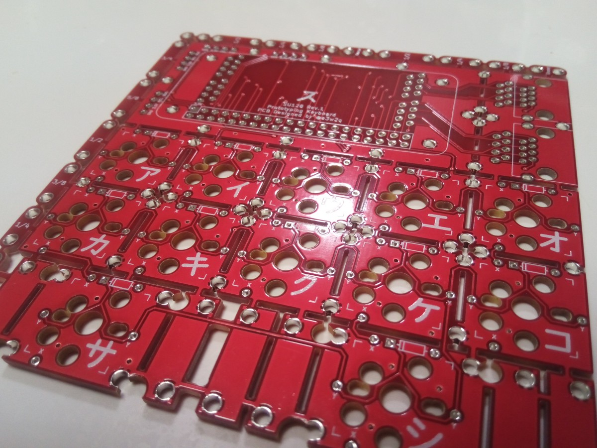
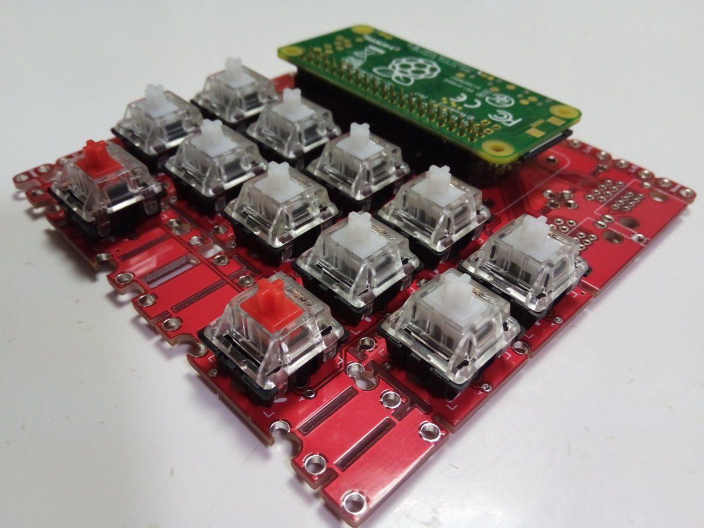
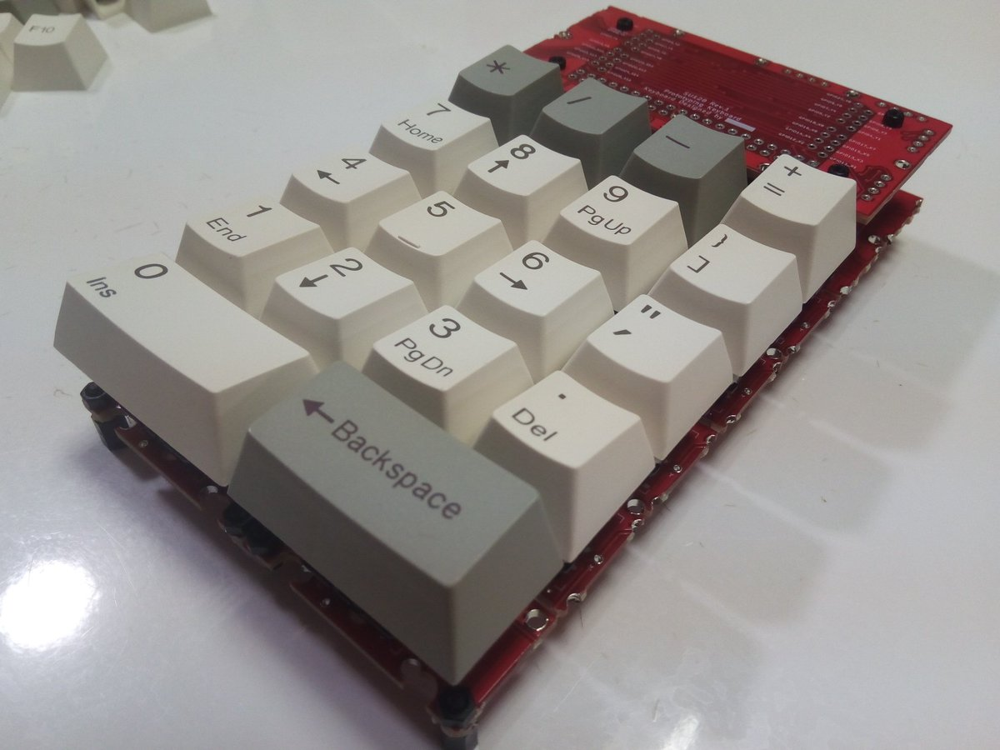
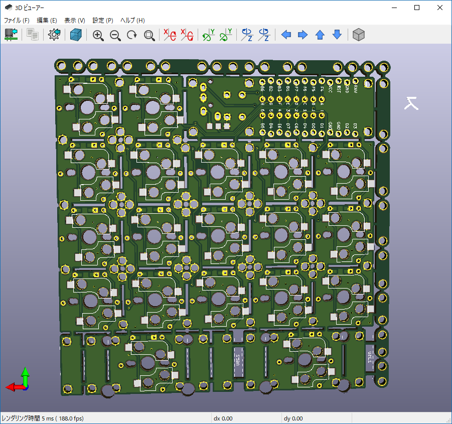

# 自作キーボードSU120の話
2019/05/23

## 概要
- JISレイアウトの自作キーボードの選択肢はまだ少ない
- 自分にあったキーボードレイアウトを手軽に試行錯誤したいので自作キーボードを設計した

## きっかけ
昨年秋、市販のメカニカルキーボードに手を出し、[自作キーボード Advent Calendar 2018](https://adventar.org/calendars/2954)で自作キーボードに魅了され、年末年始に分割型の自作キーボードキットを買って組み立てて使ってみたりしていました。

組み立てると素敵なデザインで、いろいろキーマップを変更してみて楽しんでいたのですが、使ってみて自分のほしいものが見えてきました。

## やりたいこと
- JISレイアウト（JISかな入力派なので）
- 分割型（一体型なら市販のJISキーボードをそのまま使うのとあまり差がないので）
- Row Staggeredのズレ具合を変えてみたりColumnar StaggerdやOrtholinearも試してみたい
- できればキーマップを簡単に変えられるようにしたい

JISレイアウトで使いたいというのが一番のネックで、2018年末に入手可能な自作キーボードキットでは「ー」「む」「ろ」あたりのキーが打てるものが見つりませんでした。

ないなら自分で作るしかない、けれども試したい配列ごとにその都度PCBを設計するのは労力的にもコスト的に厳しい、ということで、年明けからちまちまとブロックのように組み換えできる基板を作っていました。

## いわゆる「無限の可能性」について
フレキシブルなキーボード基板という着眼は先人が多く、まず有名なのは、しろとりさん作の[無限の可能性](https://swanmatch.booth.pm/items/1073225)。

プレ配線版の[ネクサス](https://swanmatch.booth.pm/items/1279346)、ソケット版の[アルタナ](https://swanmatch.booth.pm/items/1313334)もあります。

ogatatuさんの[Cherry-Mx-Bitboard](https://github.com/ogatatsu/Cherry-Mx-Bitboard)。

odさんの[ジグザグないわゆる”無限の可能性”](https://twitter.com/od_1969/status/1111613408221118464)。

直近ではしかみやさんの[無限の可能性 ソルダジャンパー版](https://shikamiya.booth.pm/items/1383145)。

組み換えできる基板を作ろうという発想は、これらに影響を受けています。

## 最初に作ったSU128（Raspberry Pi Zero W版）

PCBは[こちら](https://github.com/e3w2q/su128-rpi-keyboard)。

基板1枚をそのまま使うと12キーのキーパッドとして動作します。

基板を繋げることで、右手側8×8、左手側8×8の計128キーが最大で使えます。使える最大キー数からSU128と命名しました。

master側のコントローラーとしてRaspberry Pi Zero Wを付け、slave側とはLANケーブル2本で接続します。

キースイッチもいろいろ試したかったので、キースイッチをPCBに直接はんだ付けするのではなくKailh PCBソケットに差し込む方式としました。

基板端のビスケットとM2ネジで、格子配列、0.25Uズレ、0.5Uズレなどで組むことができます。ビスケットの長さはいろいろ用意したので、Aliceっぽいデザインもできそうです。

プログラムを用意できればキーマップを無線LAN経由で簡単に書き換えられるのがメリットです（プログラムさえ用意できれば）。

Raspberry Pi Zero WをUSBキーボードとして認識させ、Rubyでキーマトリクスの値を取得するところまでは確認しましたが、そこから手が止まっています。

いずれちゃんとしたプログラムを載せたいと思っています。

## 今作っているSU120（Pro Micro版）

コントローラーをPro Microに変更。

Raspberry Pi Zero Wよりも場所を取らないので、基板1枚あたりのキー数が増えました。

基板1枚をそのまま使うと19キーのキーパッドとして動作します。

基板を繋げることで、Pro Micro 1つあたり6×10の60キーが使え、Pro Microを2つ繋げると120キーまで使用可能です。

基板が届き次第、動作確認し、PCBをgithubに載せます。

## さいごに
個人的な希望としては、JISキーボードに近い配列の自作キーボードがもっと出てきてもらえるとうれしいです。ニーズがあるのかという問題はありますが……。
今は[Masahiko Sawadaさんの分割型キーボード](https://twitter.com/masahiko_sawada/status/1127462651573837827
)に期待しています。

[一覧へ](../)
