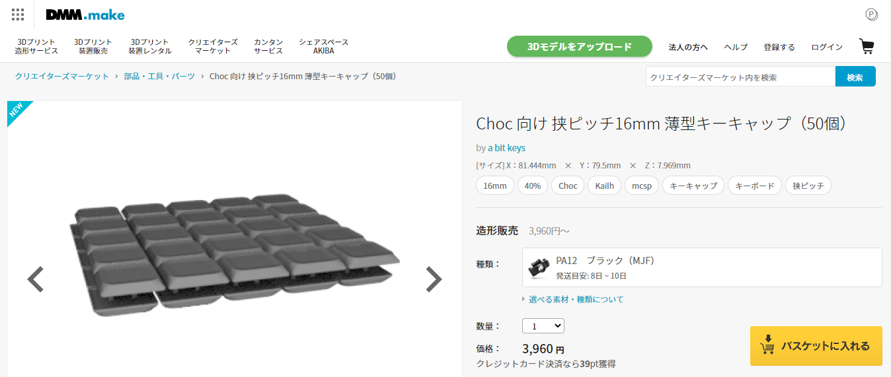
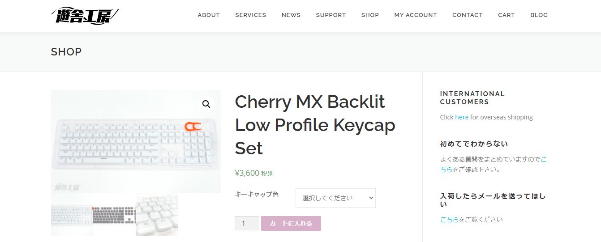
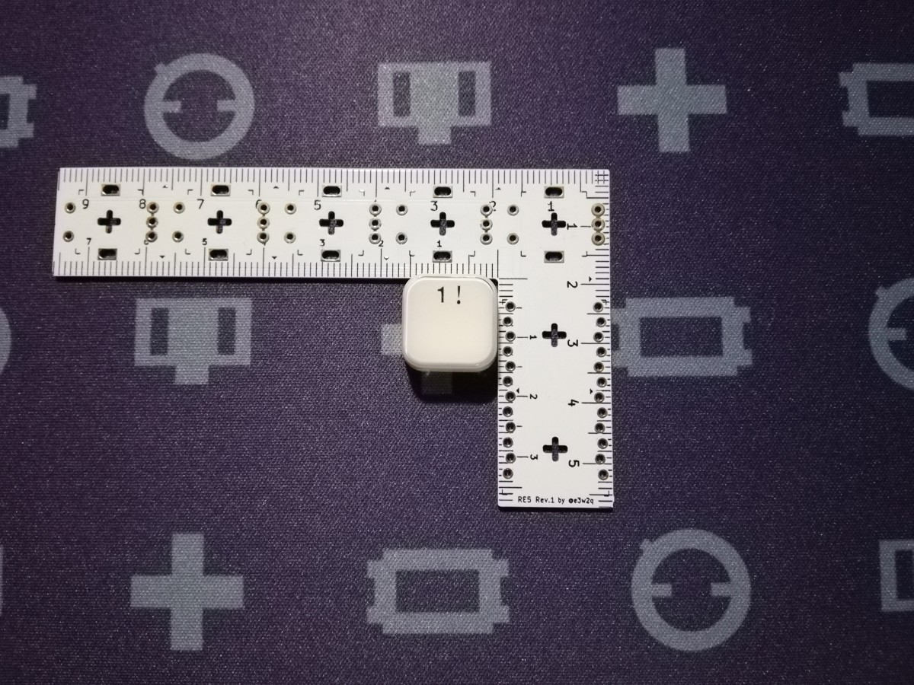
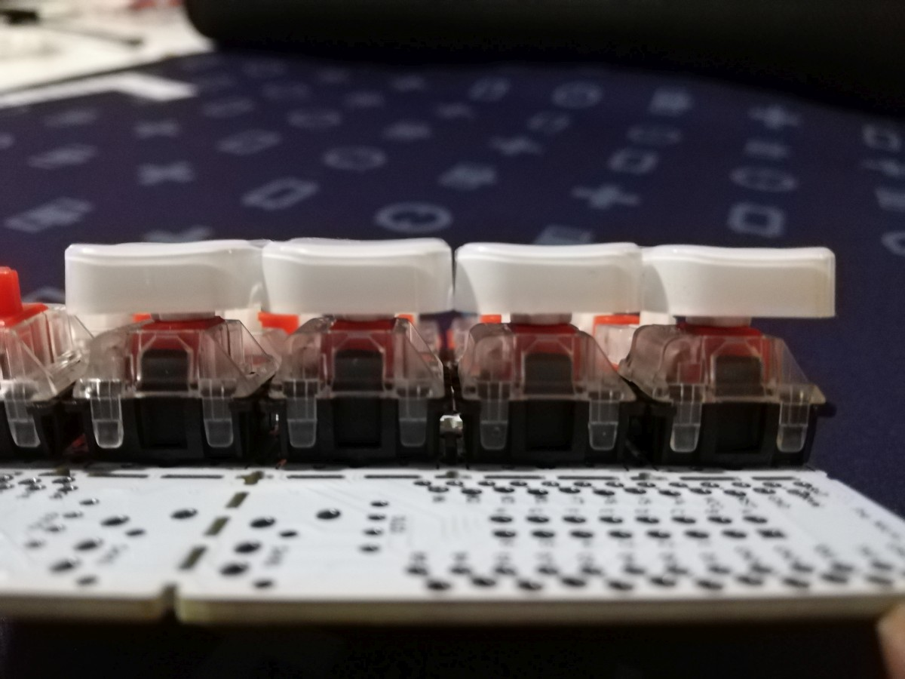
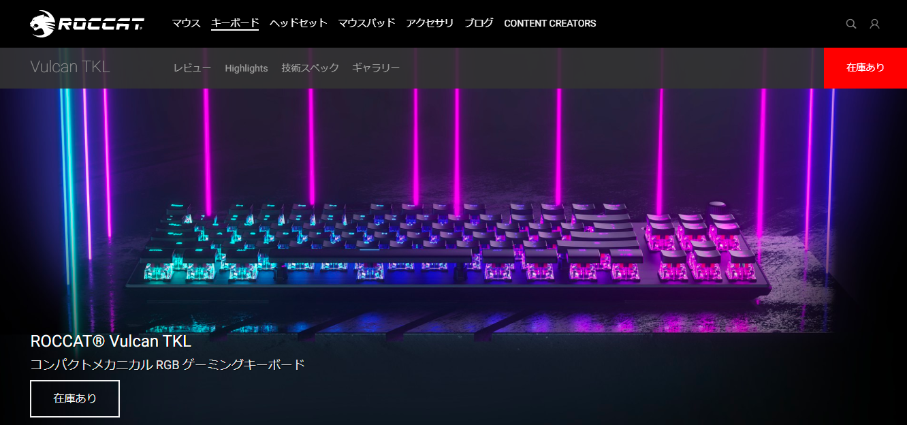

# 狭ピッチ対応キーキャップを求めて

2020/09/10

2020/01/24 Choc 向け 挟ピッチ16mm 薄型キーキャップ、Cherry MX Backlit Low Profile Keycap Setを追加

2020/03/02 ROCCAT Vulcanを追加　遊舎工房キーキャップレーザー刻印サービス情報を追加　YKN・OYKキーキャップの情報を更新

狹ピッチ自作キーボード基板 [te96](https://github.com/e3w2q/te96-keyboard) に使用可能なキーキャップを探す際に調べた、狹ピッチキーボードに使えるキーキャップの情報をまとめました。

<!-- TOC -->

- [狹ピッチ対応キーキャップを求めて](#狹ピッチ対応キーキャップを求めて)
    - [13～19mmキーピッチ](#1319mmキーピッチ)
        - [YKNキーキャップ・OYKキーキャップ](#yknキーキャップ・oykキーキャップ)
            - [YKNキーキャップ MX用](#yknキーキャップ-mx用)
            - [YKNキーキャップ Choc V2/MX用](#yknキーキャップ-choc-v2mx用)
            - [OYKキーキャップ Choc V2/MX用](#oykキーキャップ-choc-v2mx用)
    - [14mmキーピッチ](#14mmキーピッチ)
        - [ミニキーキャップ](#ミニキーキャップ)
    - [15×14mmキーピッチ](#15×14mmキーピッチ)
        - [1514C keycap](#1514c-keycap)
    - [15mmキーピッチ](#15mmキーピッチ)
        - [Datamancer Typewriter Keycaps](#datamancer-typewriter-keycaps)
    - [16mmキーピッチ](#16mmキーピッチ)
        - [TEX ADA ABS 0.8Uブランクキーキャップ](#tex-ada-abs-08uブランクキーキャップ)
        - [薙刀式3Dキーキャップ](#薙刀式3dキーキャップ)
        - [TL Split Keyboard用キーキャップ](#tl-split-keyboard用キーキャップ)
        - [Choc 向け 挟ピッチ16mm 薄型キーキャップ](#choc-向け-挟ピッチ16mm-薄型キーキャップ)
    - [16mm＋αキーピッチ](#16mm＋αキーピッチ)
        - [Cherry MX Backlit Low Profile Keycap Set](#cherry-mx-backlit-low-profile-keycap-set)
        - [ROCCAT Vulcanシリーズに搭載されているキーキャップ](#roccat-vulcanシリーズに搭載されているキーキャップ)
    - [17mmキーピッチ](#17mmキーピッチ)
        - [フローティングタイプ104 キートップセット英語版](#フローティングタイプ104-キートップセット英語版)
    - [18×17mmキーピッチ](#18×17mmキーピッチ)
        - [Kailhロープロファイルキーキャップ](#kailhロープロファイルキーキャップ)
        - [MBK Choc Low-Profile Keycaps](#mbk-choc-low-profile-keycaps)
    - [まとめ](#まとめ)

<!-- /TOC -->

## 13～19mmキーピッチ

### YKNキーキャップ・OYKキーキャップ

#### YKNキーキャップ MX用

#### YKNキーキャップ Choc V2/MX用

#### OYKキーキャップ Choc V2/MX用

[nekoka](https://make.dmm.com/shop/244759/)さんのキーキャップです。

YKNは普通の四角いキーキャップで、OYKはタイプライター風の丸いキーキャップです。

適合キースイッチはMX、Choc、Choc V2、MidHeightと、自作キーボードで主に使用されるスイッチが網羅されています。

もともと16mmキーピッチ用のみでしたが、拡充されて13mmキーピッチから19mmキーピッチまで網羅されました。ただし19mmキーピッチはChoc用のみです。横19mm×縦13mmなど、横長のキーキャップもあります。

一覧がGoogleスプレッドシートにまとめられているので、ここからのほうが探しやすいです。

[ねこや本店キーキャップまとめ - Google スプレッドシート](https://docs.google.com/spreadsheets/d/1MLsOpANqWQaCEL7-5pNiEV-Wywnlng4f-Qse8dGFAAk/)

セットの中にはバンプが2種類あったり、1.25Uから3U、ISOエンターキーなどの各種サイズが含まれており、汎用性が高くなっています。

凹みは浅めのスフェリカルです。

16mmキーピッチ用のナイロン（磨きなし）の実測値<a href="#foot1">[1]</a>は、14.9mm×15.2mmでした。

これに限らず、DMM.makeのナイロンで出力したキーキャップは縦と横の長さが微妙に異なっていました。ナイロンのデザインルールには「±0.30mm かつ 長軸方向に ±0.15%」と書いてあるので、ナイロン3Dプリント品の特性のようです。実物を注意して見ると正方形ではなく長方形ということがわかる場合もありますので、気になる場合は向きを揃えてキースイッチにはめるとよいです。

## 14mmキーピッチ

### ミニキーキャップ

[ミニキーキャップ 72個](https://make.dmm.com/item/1125390/)

[Mulgray](https://make.dmm.com/search/initSearch/u246832)さんが作成されたキーキャップセットです。見つけた中では最小のものです。値段も手頃で数が多いので使いやすいですが、使うキーピッチ次第ではちょっと小さく感じるかも。

サイズが小さいせいか凹みはやや深めに感じます。

サイトの説明では幅13mmとなっています。

ナイロン（磨きなし）の実測値は12.5mm×13.0mm

対応キースイッチ: MX

Choc V2スイッチにも押し込めばはまらないことはないですが、V2スイッチの円筒ステムが膨らむため、スイッチを押したあとに戻らなかったり戻りが悪かったりします。

## 15×14mmキーピッチ

### 1514C keycap

[1514C keycap 48個](https://make.dmm.com/item/1190156/)

[nashi](https://make.dmm.com/shop/init/242949/)さんのちょっと背の高めのかわいい感じのキーキャップです。DMM.makeの規約変更によりナイロン、MDF系の出力が不可になったとのことで、STLファイルがダウンロードできるようになっています。

対応キースイッチ: Choc

## 15mmキーピッチ

### Datamancer Typewriter Keycaps

Datamancerの高級感のあるタイプライター風のキーキャップです。[素敵なデザインのものがいろいろあります](https://datamancer.com/product-category/?catid=/keycaps/)ので、お財布に余裕があればよさそう。

1Uのサイズを問い合わせたところ、

> The 1u diameter is approximately 9/16" or just over 14 mm.

と返信をいただきました。9/16 inch = 14.2875 mmなので、15mmキーピッチ以上で使用可能と思われます。

19mmキーピッチより狭いキーピッチで1U以外のキーを使う場合は注意が必要です。

対応キースイッチ: MX

## 16mmキーピッチ

### TEX ADA ABS 0.8Uブランクキーキャップ

[TEX ADA ABS 0.8Uブランクキーキャップ (2個/ブラック) TALPKEYBOARD](https://talpkeyboard.stores.jp/items/5f5444c380933970d139e98c)

[TEX ADA Blank Keycaps (1個) 遊舎工房](https://yushakobo.jp/shop/tex-ada-blank-keycaps-1/) ※サイズ0.8Uのほうです。

待っていました。数少ない3Dプリント品ではない狹ピッチ対応キーキャップです。TEX社のキーボード(SHINOBI)でModifierキーで使われているものです。TALP KEYBOARDさんから販売されています。

スフェリカルで適度な凹みがあります。キートップが長方形なのが特徴です。

販売サイトにはサイズは15.5mm四方と書かれています。

実測値は15.7mm×15.7mmでした。

対応キースイッチ: MX

Choc V2 スイッチにも一応はまるのですが、キーキャップの外周の内側がキースイッチに当たってステムがわずかしかはまらないので、Choc V2スイッチでの使用はちょっと難があります。

### 薙刀式3Dキーキャップ

[大岡俊彦](https://make.dmm.com/shop/init/235111/)さんが作成されたキーキャップです。キーキャップ個数や形状にバリエーションがあり、選択肢が多いことが特徴です。

凹みは浅めで、サイトの説明によるとスフェリカルとシリンドリカルを組み合わせているそうです。

画像はMX用の平タイプです。いろいろな種類があるので【狭ピッチ16mm用】と書いてあるものを[薙刀式SHOP](https://make.dmm.com/shop/235111/)から探すとよいです。

ナイロン（磨きあり）の実測値は15.2mm×15.6mm

対応キースイッチ: MX、Choc

MX用はChoc V2 スイッチの円筒ステムにはまらないため、Choc V2スイッチには使えません。

### TL Split Keyboard用キーキャップ

[satromi](https://make.dmm.com/shop/init/240613/)さんが[TL Split Keyboard](https://satromi.booth.pm/items/2148952)用に設計されたキーキャップです。TL Split Keyboardに合わせて高さや形状が異なるキーキャップが含まれた[72キーのセット](https://make.dmm.com/item/1220832/)と、扇形のみの[8キーセット](https://make.dmm.com/item/1219024/)があります。画像は扇形のものです。

凹みはシリンドリカルです。

ナイロン（磨きなし）の実測値は14.8mm×15.0mm

対応キースイッチ: MXのみ

キーキャップの内側がChoc V2 スイッチにぶつかるので、Choc V2スイッチには使えません。

### Choc 向け 挟ピッチ16mm 薄型キーキャップ

[Choc 向け 挟ピッチ16mm 薄型キーキャップ](https://make.dmm.com/item/1273303/)

[a bit keys](https://make.dmm.com/shop/269848/)さんが、16mmキーピッチ分割型キーボード[mcsp lp](https://booth.pm/ja/items/2668919)のために設計されたキーキャップです。強度を保ちつつ可能な限り薄く設計したとのことです。

サイズは15.5mm角とのことです。

対応キースイッチ: Choc

## 16mm＋αキーピッチ

### Cherry MX Backlit Low Profile Keycap Set

[Cherry MX Backlit Low Profile Keycap Set](https://yushakobo.jp/shop/cherry-mx-backlit-low-profile-keycap-set/)

遊舎工房さんで販売されているお手頃価格のフローティングタイプのキーキャップです。

1Uがちょうど16mm角なので、16mmよりちょっと大きいキーピッチで使えます。

16mmキーピッチだと隣同士のキーが干渉します。

[Takeshi Nishio (@jpskenn)](https://twitter.com/jpskenn)さんがUnisonという縦16.4mm、横16.8mmピッチのキーボードで使われています。

<blockquote class="twitter-tweet">
GH60互換、60%ケースに収まる狭ピッチキーボード（試作） Keyboard: Unison（ユニゾン） Switch: Gateron Ink Yellow Keycap: Cherry MX Backlit Low Profile Keycap Set<a href="https://twitter.com/hashtag/%E4%BF%BA%E3%82%AD%E3%83%BC?src=hash&amp;ref_src=twsrc%5Etfw">#俺キー</a> <a href="https://twitter.com/hashtag/Unison_kbd?src=hash&amp;ref_src=twsrc%5Etfw">#Unison_kbd</a> <a href="https://t.co/LgIf3u4tpp">pic.twitter.com/LgIf3u4tpp</a>
&mdash; Takeshi Nishio (@jpskenn) <a href="https://twitter.com/jpskenn/status/1353173349640245248?ref_src=twsrc%5Etfw">January 24, 2021</a></blockquote> 
<blockquote class="twitter-tweet">
縦16.4mm、横16.8mmで普通に打鍵してる時の干渉はないです。でもキースイッチのグラつきが大きいと、もしかすると… 国内流通は、遊舎工房さんに白と黒があります。 Aliには黒がありますが、白はどこも品切れ。僕が注文していた白は違うキーキャップが送られてきて返金になりました…
&mdash; Takeshi Nishio (@jpskenn) <a href="https://twitter.com/jpskenn/status/1353312438033104898?ref_src=twsrc%5Etfw">January 24, 2021</a></blockquote> 
なお、19mmキーピッチより狭いキーピッチで1U以外のキーを使う場合は注意が必要です。例えば上のUnisonでは、1.5UのCapsLockキーが16.8mmキーピッチでは2U相当の幅になっています。

対応キースイッチ: MXとChoc V2

### ROCCAT Vulcanシリーズに搭載されているキーキャップ

ゲーミングキーボードのROCCAT Vulcanシリーズに搭載されているキーキャップは裾がないフローティングタイプですので、狭ピッチキーボードに使用できます。ただしキーキャップのみの単体販売はありません。

サイズ感はSumisoさんの以下の一連のツイートがわかりやすいです。縦16mm強、横14mm弱のようです。

<blockquote class="twitter-tweet">
嘘だと言ってよ <a href="https://t.co/GB4S92Cdmy">pic.twitter.com/GB4S92Cdmy</a>
&mdash; Sumiso (@kutsuhimo3) <a href="https://twitter.com/kutsuhimo3/status/1364782113061396485?ref_src=twsrc%5Etfw">February 25, 2021</a></blockquote> 
文字の印字もありますし、キーボードによってはISOエンターも入手可能ですが、19mmキーピッチより狭いキーピッチで1U以外のキーを使う場合は注意が必要です。

## 17mmキーピッチ

### フローティングタイプ104 キートップセット英語版

[フローティングタイプ104 キートップセット英語版](https://yushakobo.jp/shop/a0300bf/)

遊舎工房さんで販売されているお手頃価格のフローティングタイプのキーキャップです。

[かーくん (@kakunkb)](https://twitter.com/kakunkb)さんに測っていただいたところ16mm台でしたので、17mmキーピッチ以上で使用可能と思われます。

<blockquote class="twitter-tweet">
縦横共に16mmぐらいです <a href="https://t.co/nIDNzLRHWl">pic.twitter.com/nIDNzLRHWl</a>
&mdash; かーくん?? (@kakunkb) <a href="https://twitter.com/kakunkb/status/1294100150747422721?ref_src=twsrc%5Etfw">August 14, 2020</a></blockquote> 
対応キースイッチ: MXとChoc V2（たぶん）

## 18×17mmキーピッチ

### Kailhロープロファイルキーキャップ

[Kailhロープロ刻印キーキャップ 遊舎工房](https://yushakobo.jp/shop/pg1350cap-doubleshot/)

[Kailhロープロ無刻印キーキャップ 遊舎工房](https://yushakobo.jp/shop/pg1350cap-blank/)

[キーキャップレーザー刻印サービス 遊舎工房](https://yushakobo.jp/keycap-laser-marking/)

遊舎工房さんで販売されているKailh Chocスイッチ用のキーキャップです。入手しやすい狹ピッチキーキャップ（そこまで狹ピッチではないにしても）といえば、以前はこれ一択でした。なお、無刻印のキーキャップ色で選択できる「クリア」は19mmキーピッチ用と思われるのでご注意ください。

キーキャップレーザー刻印サービスでは、自由なデザインをレーザー刻印してもらうことができます。

対応キースイッチ: Choc

### MBK Choc Low-Profile Keycaps

[MBK Choc Low-Profile Keycaps 遊舎工房](https://yushakobo.jp/shop/mbk-choc-low-profile-keycaps/)

[MBK Choc Low Profile キーキャップ Kochi Keyboard](https://kochikeyboard.stores.jp/?category_id=5f7efd0a8f2ebd418089d997)

[キーキャップレーザー刻印サービス 遊舎工房](https://yushakobo.jp/keycap-laser-marking/)

以前遊舎工房さんでグループバイされていて、今は通常販売されているKailh Chocスイッチ用のキーキャップです。Kailhロープロファイルキーキャップと同じサイズ感ですが角が立っていない形状がいい感じです。

キーキャップレーザー刻印サービスでは、自由なデザインをレーザー刻印してもらうことができます。

2021/2/25まで、[遊舎工房さん](https://yushakobo.jp/shop/gb-mbk-legend/)と[Kochi Keyboardさん](https://kochikeyboard.stores.jp/?category_id=5f7efd0a8f2ebd418089d997)で、文字刻印が入ったMBK Legendキーキャップのグループバイが実施されていました。

対応キースイッチ: Choc

## まとめ

| 名称                                                         | 対応キーピッチ | MX   | Choc | Choc V2 | 刻印 | 数量※ | 価格※  | 単価※ |
| ------------------------------------------------------------ | -------------- | ---- | ---- | ------- | ---- | ----- | ------ | ----- |
| [YKNキーキャップセット](https://make.dmm.com/shop/244759/) | 13～19mm | ○ | ○ | ○ | なし | 86 | 4,840～6,930 | 56～81 |
| [OYKキーキャップセット](https://make.dmm.com/shop/244759/) | 13～19mm | ○ | ○ | ○ | なし | 86 | 4,730～6,270 | 55～73 |
| [ミニキーキャップ 72個](https://make.dmm.com/item/1125390/)  | 14mm           | ○    |      |         | なし | 72    | 4,847  | 67    |
| [1514C keycap 48個](https://make.dmm.com/item/1190156/)      | 15×14mm        |      | ○    |         | なし | 48    |        |       |
| [Datamancer Typewriter Keycaps](https://datamancer.com/product-category/?catid=/keycaps/) | 15mm           | ○    |      | 未確認  | あり | 104   | 13,280 | 128   |
| [TEX ADA ABS 0.8Uブランクキーキャップ（TALPKEYBOARD）](https://talpkeyboard.stores.jp/items/5f5444c380933970d139e98c) | 16mm           | ○    |      |         | なし | 2     | 150    | 75    |
| [TEX ADA ABS 0.8Uブランクキーキャップ（遊舎工房）](https://yushakobo.jp/shop/tex-ada-blank-keycaps-1/) | 16mm           | ○    |      |         | なし | 1     | 82.5    | 82.5    |
| [薙刀式3Dキーキャップ【MX】【狭ピッチ16mm用】標準36個セット](https://make.dmm.com/item/1126849/) | 16mm           | ○    |      |         | なし | 36    | 4,800  | 133   |
| [薙刀式3Dキーキャップ【choc】【狭ピッチ16mm用】標準54個セット](https://make.dmm.com/item/1136652/) | 16mm           |      | ○    |         | なし | 54    | 4,200  | 78    |
| [TL Split Keyboard用キーキャップ](https://make.dmm.com/item/1220832/) | 16mm           | ○    |      |         | なし | 72    | 7,700  | 107   |
| [YKNキーキャップセット(MX・16mmキーピッチ用) v1.1](https://make.dmm.com/item/1228592/) | 16mm           | ○    |      |         | なし | 72    | 5,170  | 72    |
| [YKNキーキャップセット(Choc・16mmキーピッチ用) v1.1](https://make.dmm.com/item/1228593/) | 16mm           |      | ○    |         | なし | 87    | 5,940  | 68    |
| [YKNキーキャップセット(Choc V2/MX・16mmキーピッチ用) v1.1](https://make.dmm.com/item/1229497/) | 16mm           | ○    |      | ○       | なし | 87    | 5,940  | 68    |
| [OYKキーキャップセット(Choc V2/MX・16mmキーピッチ用) v1.0](https://make.dmm.com/item/1229506/) | 16mm           | ○    |      | ○       | なし | 87    | 5,940  | 68    |
| [Choc 向け 挟ピッチ16mm 薄型キーキャップ](https://make.dmm.com/item/1273303/) | 16mm           |      | ○    |         | なし | 50    | 3,960  | 79    |
| [Cherry MX Backlit Low Profile Keycap Set](https://yushakobo.jp/shop/cherry-mx-backlit-low-profile-keycap-set/) | 16+αmm           | ○    |      | ○       | あり | 104   | 3,960  | 38    |
| [ROCCAT Vulcanシリーズ](https://ja.roccat.org/Keyboards)に搭載されているキーキャップ | 16+αmm | ○ | | 未確認 | あり | TKL～フル | 本体込約14,000～20,000 | 約150～200 |
| [フローティングタイプ104 キートップセット英語版](https://yushakobo.jp/shop/a0300bf/) | 17mm           | ○    |      | ○       | あり | 104   | 4,356  | 42    |
| [Kailhロープロ刻印キーキャップ](https://yushakobo.jp/shop/pg1350cap-doubleshot/) | 18×17mm        |      | ○    |         | あり | 104   | 3,630  | 35    |
| [Kailhロープロ無刻印キーキャップ](https://yushakobo.jp/shop/pg1350cap-blank/)（クリア除く） | 18×17mm        |      | ○    |         | なし | 10    | 363    | 36    |
| Kailhロープロ無刻印キーキャップ+[キーキャップレーザー刻印サービス](https://yushakobo.jp/keycap-laser-marking/) | 18×17mm | | ○ | | あり | 36 | 5,500 | 153 |
| [MBK Choc Low-Profile Keycaps（遊舎工房）](https://yushakobo.jp/shop/mbk-choc-low-profile-keycaps/) | 18×17mm        |      | ○    |         | なし | 10    | 550    | 55    |
| [MBK Choc Low-Profile Keycaps（Kochi Keyboard）](https://kochikeyboard.stores.jp/items/5f7efd334b08395643f28486) | 18×17mm        |      | ○    |         | なし | 5    | 275    | 55    |
| MBK Choc Low-Profile Keycaps+[キーキャップレーザー刻印サービス](https://yushakobo.jp/keycap-laser-marking/) | 18×17mm | | ○ | | あり | 36 | 6,050 | 168 |

※数量は1Uサイズ以外が含まれている場合もあるので、詳しくはリンク先をご確認ください

※価格は記事を書いている時点の日本円換算、送料抜き　3Dプリント品はナイロンブラック磨きの価格　ただしChoc 向け 挟ピッチ16mm 薄型キーキャップはMJFのみなので、MJFの価格

※単価は複数サイズが混じっている場合も一律総数で割っています

[1] シンワ測定のデジタルノギスで測定。最小読取値は0.01mmですが、複数個で測って0.1mm単位で記載。

[一覧へ](../)