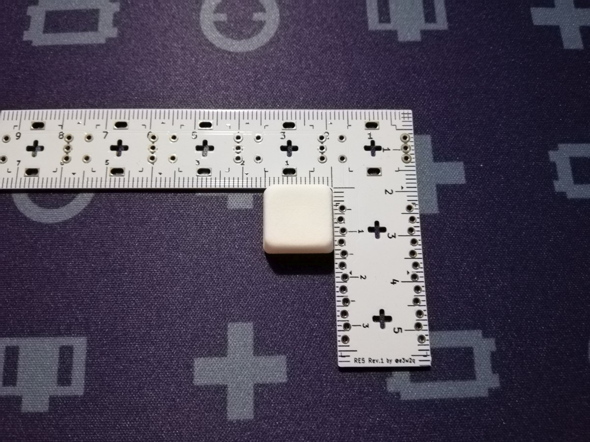

# 挟ピッチ対応キーキャップを求めて

2020/09/10

挟ピッチ自作キーボード基板 [te96](https://github.com/e3w2q/te96-keyboard) に使用可能なキーキャップを探す際に調べた、挟ピッチキーボードに使えるキーキャップの情報をまとめました。

- 目次
    - [14mmキーピッチ](#14mmキーピッチ)
        - [ミニキーキャップ](#ミニキーキャップ)
    - [15×14mmキーピッチ](#15×14mmキーピッチ)
        - [1514C keycap](#1514c-keycap)
    - [15mmキーピッチ](#15mmキーピッチ)
        - [Datamancer Typewriter Keycaps](#datamancer-typewriter-keycaps)
    - [16mmキーピッチ](#16mmキーピッチ)
        - [TEX ADA ABS 0.8Uブランクキーキャップ](#tex-ada-abs-08uブランクキーキャップ)
        - [薙刀式3Dキーキャップ](#薙刀式3dキーキャップ)
        - [TL Split Keyboard用キーキャップ](#tl-split-keyboard用キーキャップ)
        - [YKNキーキャップ](#yknキーキャップ)
        - [OYKキーキャップ](#oykキーキャップ)
    - [17mmキーピッチ](#17mmキーピッチ)
        - [フローティングタイプ104 キートップセット英語版](#フローティングタイプ104-キートップセット英語版)
    - [18×17mmキーピッチ](#18×17mmキーピッチ)
        - [Kailhロープロファイルキーキャップ](#kailhロープロファイルキーキャップ)
        - [MBK Choc Low-Profile Keycaps](#mbk-choc-low-profile-keycaps)
    - [まとめ](#まとめ)

## 14mmキーピッチ

### ミニキーキャップ

[ミニキーキャップ 72個](https://make.dmm.com/item/1125390/)

[Mulgray](https://make.dmm.com/search/initSearch/u246832)さんが作成されたキーキャップセットです。見つけた中では最小のものです。値段も手頃で数が多いので使いやすいですが、使うキーピッチ次第ではちょっと小さく感じるかも。

サイズが小さいせいか凹みはやや深めに感じます。

サイトの説明では幅13mmとなっています。

ナイロン（磨きなし）の実測値<a href="#foot1">[1]</a>は12.5mm×13mm

これに限らず、DMM.makeのナイロンで出力したキーキャップは縦と横の長さが微妙に異なっていました。ナイロンのデザインルールには「±0.30mm かつ 長軸方向に ±0.15%」と書いてあるので、ナイロン3Dプリント品の特性のようです。実物を注意して見ると正方形ではなく長方形ということがわかる場合もありますので、気になる場合は向きを揃えてキースイッチにはめるとよいです。

対応キースイッチ: MX

Choc V2スイッチにも押し込めばはまらないことはないですが、V2スイッチの円筒ステムが膨らむため、スイッチを押したあとに戻らなかったり戻りが悪かったりします。

## 15×14mmキーピッチ

### 1514C keycap

[1514C keycap 48個](https://make.dmm.com/item/1190156/)

[nashi](https://make.dmm.com/shop/init/242949/)さんのちょっと背の高めのかわいい感じのキーキャップです。DMM.makeの規約変更によりナイロン、MDF系の出力が不可になったとのことで、STLファイルがダウンロードできるようになっています。

対応キースイッチ: Choc

## 15mmキーピッチ

### Datamancer Typewriter Keycaps

Datamancerの高級感のあるタイプライター風のキーキャップです。[素敵なデザインのものがいろいろあります](https://datamancer.com/product-category/?catid=/keycaps/)ので、お財布に余裕があればよさそう。

1Uのサイズを問い合わせたところ、

> The 1u diameter is approximately 9/16" or just over 14 mm.

と返信をいただきました。9/16 inch = 14.2875 mmなので、15mmキーピッチ以上で使用可能と思われます。

対応キースイッチ: MX

## 16mmキーピッチ

### TEX ADA ABS 0.8Uブランクキーキャップ

[TEX ADA ABS 0.8Uブランクキーキャップ (2個/ブラック)](https://talpkeyboard.stores.jp/items/5f5444c380933970d139e98c)

待っていました。数少ない3Dプリント品ではない挟ピッチ対応キーキャップです。TEX社のキーボード(SHINOBI)でModifierキーで使われているものです。TALP KEYBOARDさんから販売されています。

スフェリカルで適度な凹みがあります。キートップが長方形なのが特徴です。

販売サイトにはサイズは15.5mm四方と書かれています。

実測値は15.7mm×15.7mmでした。

対応キースイッチ: MX

Choc V2 スイッチにも一応はまるのですが、キーキャップの外周の内側がキースイッチに当たってステムがわずかしかはまらないので、Choc V2スイッチでの使用はちょっと難があります。

### 薙刀式3Dキーキャップ

[大岡俊彦](https://make.dmm.com/shop/init/235111/)さんが作成されたキーキャップです。キーキャップ個数や形状にバリエーションがあり、選択肢が多いことが特徴です。

凹みは浅めで、サイトの説明によるとスフェリカルとシリンドリカルを組み合わせているそうです。

画像はMX用の平タイプです。いろいろな種類があるので【狭ピッチ16mm用】と書いてあるものを[薙刀式SHOP](https://make.dmm.com/shop/235111/)から探すとよいです。

ナイロン（磨きあり）の実測値は15.2mm×15.6mm

対応キースイッチ: MX、Choc

MX用はChoc V2 スイッチの円筒ステムにはまらないため、Choc V2スイッチには使えません。

### TL Split Keyboard用キーキャップ

[satromi](https://make.dmm.com/shop/init/240613/)さんが[TL Split Keyboard](https://satromi.booth.pm/items/2148952)用に設計されたキーキャップです。TL Split Keyboardに合わせて高さや形状が異なるキーキャップが含まれた[72キーのセット](https://make.dmm.com/item/1220832/)と、扇形のみの[8キーセット](https://make.dmm.com/item/1219024/)があります。画像は扇形のものです。

凹みはシリンドリカルです。

ナイロン（磨きなし）の実測値は14.8mm×15.0mm

対応キースイッチ: MXのみ

キーキャップの内側がChoc V2 スイッチにぶつかるので、Choc V2スイッチには使えません。

### YKNキーキャップ

#### MX用

#### Choc V2/MX用

[nekoka](https://make.dmm.com/search/initSearch/u244759)さんのキーキャップです。キースイッチに合わせて[MX用、Choc用、Choc V2/MX用](https://make.dmm.com/search/initSearch/u244759)の3種類があります。バンプが2種類あったり1.5U、2Uが含まれていたりと汎用性が高い印象。

凹みは浅めのスフェリカルです。

ナイロン（磨きなし）の実測値は、MX用、Choc V2/MX用どちらも14.9mm×15.2mm

対応キースイッチ: MX用はMXのみ、Choc用はChocのみ、Choc V2/MX用はChoc V2とMX両対応

### OYKキーキャップ

[OYKキーキャップ](https://make.dmm.com/item/1229506/)

[nekoka](https://make.dmm.com/search/initSearch/u244759)さんのキーキャップで、こちらは円盤型です。これもセットに1.5U、2Uが含まれているようです。

対応キースイッチ: MXとChoc V2

## 17mmキーピッチ

### フローティングタイプ104 キートップセット英語版

[フローティングタイプ104 キートップセット英語版](https://yushakobo.jp/shop/a0300bf/)

遊舎工房さんで販売されているお手頃価格のフローティングタイプのキーキャップです。

[かーくんさん (@kakunkb)](https://twitter.com/kakunkb)に測っていただいたところ16mm台でしたので、17mmキーピッチ以上で使用可能と思われます。

<blockquote class="twitter-tweet">
縦横共に16mmぐらいです <a href="https://t.co/nIDNzLRHWl">pic.twitter.com/nIDNzLRHWl</a>
&mdash; かーくん?? (@kakunkb) <a href="https://twitter.com/kakunkb/status/1294100150747422721?ref_src=twsrc%5Etfw">August 14, 2020</a></blockquote> 
対応キースイッチ: MXとChoc V2（たぶん）

## 18×17mmキーピッチ

### Kailhロープロファイルキーキャップ

[Kailhロープロ刻印キーキャップ](https://yushakobo.jp/shop/pg1350cap-doubleshot/)

[Kailhロープロ無刻印キーキャップ](https://yushakobo.jp/shop/pg1350cap-blank/)

遊舎工房さんで販売されているKailh Chocスイッチ用のキーキャップです。入手しやすい挟ピッチキーキャップ（そこまで挟ピッチではないにしても）といえば、以前はこれ一択でした。なお、無刻印のキーキャップ色で選択できる「クリア」は19mmキーピッチ用と思われるのでご注意ください。

対応キースイッチ: Choc

### MBK Choc Low-Profile Keycaps

[MBK Choc Low-Profile Keycaps](https://yushakobo.jp/shop/mbk-choc-low-profile-keycaps/)

以前遊舎工房さんでグループバイされていて、最近通常販売が始まったKailh Chocスイッチ用のキーキャップです。Kailhロープロファイルキーキャップと同じサイズ感ですが角が立っていない形状がいい感じです。

対応キースイッチ: Choc

## まとめ

| 名称                                                         | 対応キーピッチ | MX   | Choc | Choc V2 | 刻印 | 数量※ | 価格※  | 単価※ |
| ------------------------------------------------------------ | -------------- | ---- | ---- | ------- | ---- | ----- | ------ | ----- |
| [ミニキーキャップ 72個](https://make.dmm.com/item/1125390/)  | 14mm           | ○    |      |         | なし | 72    | 4,847  | 67    |
| [1514C keycap 48個](https://make.dmm.com/item/1190156/)      | 15×14mm        |      | ○    |         | なし | 48    |        |       |
| [Datamancer Typewriter Keycaps](https://datamancer.com/product-category/?catid=/keycaps/) | 15mm           | ○    |      | 未確認  | あり | 104   | 13,280 | 128   |
| [TEX ADA ABS 0.8Uブランクキーキャップ](https://talpkeyboard.stores.jp/items/5f5444c380933970d139e98c) | 16mm           | ○    |      |         | なし | 2     | 150    | 75    |
| [薙刀式3Dキーキャップ【MX】【狭ピッチ16mm用】標準36個セット](https://make.dmm.com/item/1126849/) | 16mm           | ○    |      |         | なし | 36    | 4,800  | 133   |
| [薙刀式3Dキーキャップ【choc】【狭ピッチ16mm用】標準54個セット](https://make.dmm.com/item/1136652/) | 16mm           |      | ○    |         | なし | 54    | 4,200  | 78    |
| [TL Split Keyboard用キーキャップ](https://make.dmm.com/item/1220832/) | 16mm           | ○    |      |         | なし | 72    | 7,700  | 107   |
| [YKNキーキャップセット(MX・16mmキーピッチ用) v1.1](https://make.dmm.com/item/1228592/) | 16mm           | ○    |      |         | なし | 72    | 5,170  | 72    |
| [YKNキーキャップセット(Choc・16mmキーピッチ用) v1.1](https://make.dmm.com/item/1228593/) | 16mm           |      | ○    |         | なし | 87    | 5,940  | 68    |
| [YKNキーキャップセット(Choc V2/MX・16mmキーピッチ用) v1.1](https://make.dmm.com/item/1229497/) | 16mm           | ○    |      | ○       | なし | 87    | 5,940  | 68    |
| [OYKキーキャップセット(Choc V2/MX・16mmキーピッチ用) v1.0](https://make.dmm.com/item/1229506/) | 16mm           | ○    |      | ○       | なし | 87    | 5,940  | 68    |
| [フローティングタイプ104 キートップセット英語版](https://yushakobo.jp/shop/a0300bf/) | 17mm           | ○    |      | ○       | あり | 104   | 3,960  | 38    |
| [Kailhロープロ刻印キーキャップ](https://yushakobo.jp/shop/pg1350cap-doubleshot/) | 18×17mm        |      | ○    |         | あり | 104   | 3,300  | 32    |
| [Kailhロープロ無刻印キーキャップ](https://yushakobo.jp/shop/pg1350cap-blank/)（クリア除く） | 18×17mm        |      | ○    |         | なし | 10    | 330    | 33    |
| [MBK Choc Low-Profile Keycaps](https://yushakobo.jp/shop/mbk-choc-low-profile-keycaps/) | 18×17mm        |      | ○    |         | なし | 10    | 550    | 55    |

※数量は1Uサイズ以外が含まれている場合もあるので、詳しくはリンク先をご確認ください

※価格は記事を書いている時点の日本円換算、送料抜き　3Dプリント品はナイロンブラック磨きの価格

※単価は複数サイズが混じっている場合も一律総数で割っています

[1] シンワ測定のデジタルノギスで測定。最小読取値は0.01mmですが、複数個で測って0.1mm単位で記載。

[一覧へ](../)