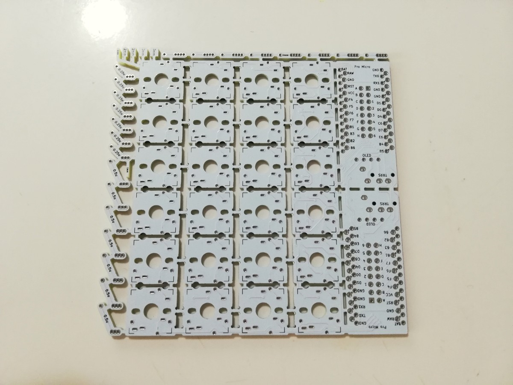
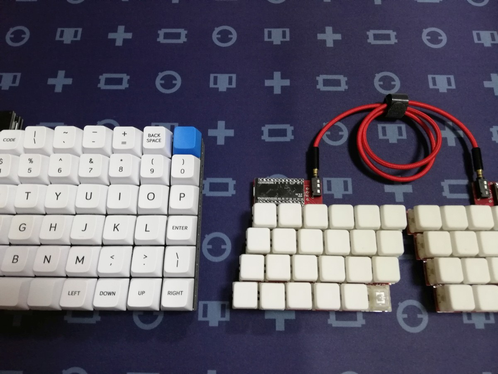
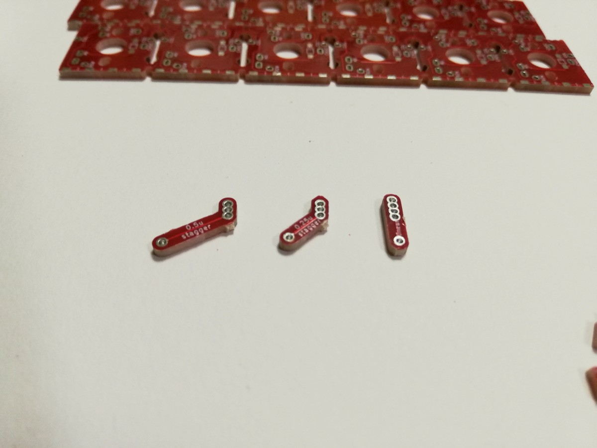
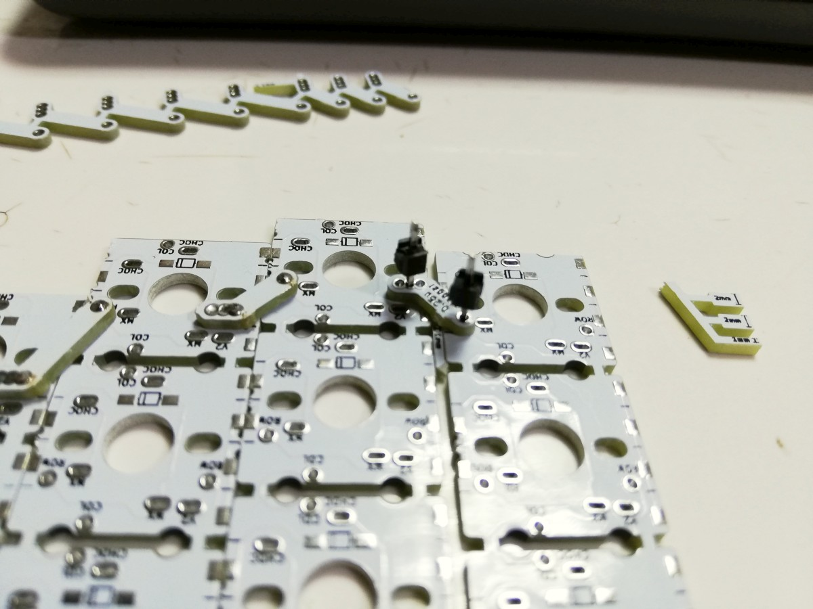
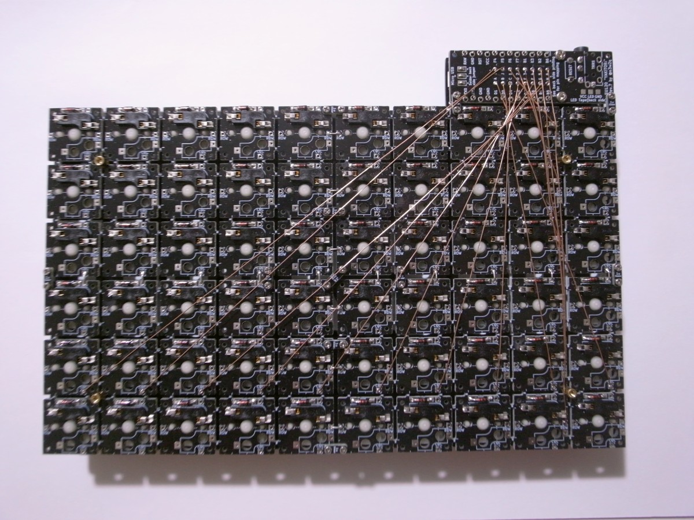
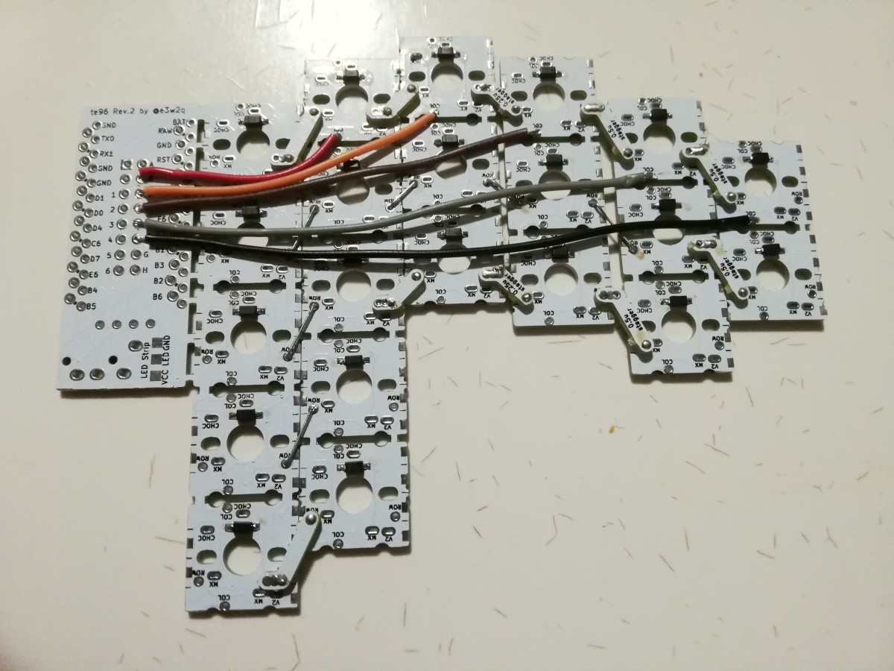
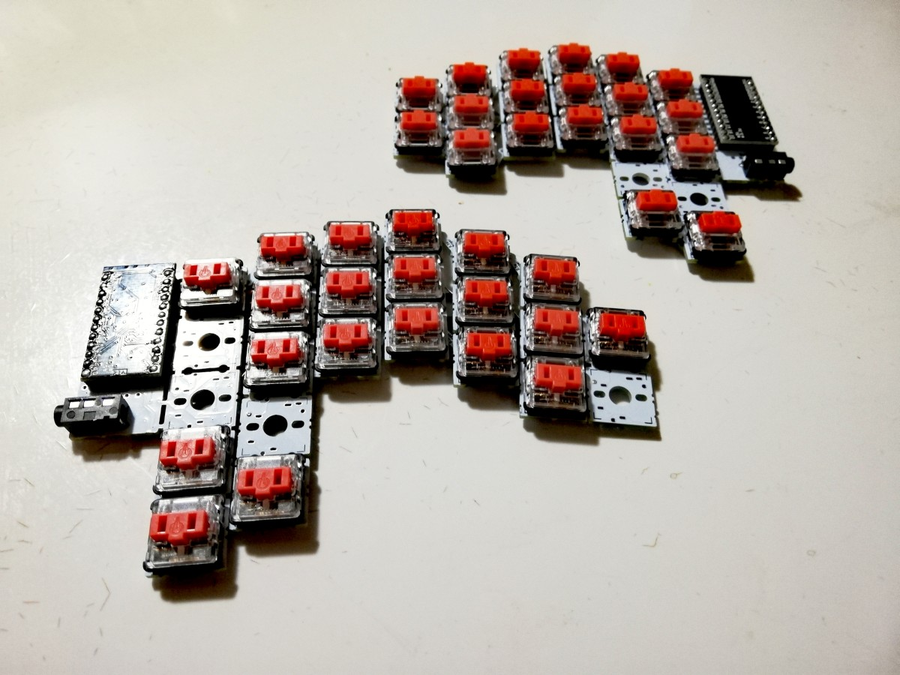

# 狭ピッチ自作キーボード基板te96を公開しました

2020/09/13

## 概要

te96は最大96キーまで拡張可能な自作キーボード基板です。

標準的なキーピッチである19mmよりも狹いキーピッチのキーボードを自作することができます。

プロジェクトページ: [https://github.com/e3w2q/te96-keyboard](https://github.com/e3w2q/te96-keyboard)

## 作ろうと思ったきっかけ

かな入力で数字列のキー、特に右上のキーを打つ際、ホームポジションからかなり手を動かさないといけないため、狹ピッチなキーボードがほしくて、KiCadで少しずつ設計を進めていました。

<blockquote class="twitter-tweet">
SU120の挟ピッチ版を作ると昨日ツイートするの忘れてた
&mdash; e3w2qஐ (@e3w2q) <a href="https://twitter.com/e3w2q/status/1245677867112869888?ref_src=twsrc%5Etfw">April 2, 2020</a></blockquote> 
ちまちま設計に取り掛かっていたところ、TEXの15.5mm角キーキャップがTALPKEYBOARDさんから販売予定と聞き、これから狹ピッチキーボードが組みやすくなるかも？と思って本腰を入れて設計を進めました。

<blockquote class="twitter-tweet">
TEXのADAブランクキーキャップです。小さいほうは今度出荷されるキーボードShinobiの一部に使われているものです。サイズは15.5mm。販売しようと思っていますが欲しい！と思う方はいいね！ください。いいね！の数により発注数を決めます🙆‍♂️ <a href="https://t.co/w1FSHPyVdD">pic.twitter.com/w1FSHPyVdD</a>
&mdash; TALP KEYBOARD (@TalpKeyboard) <a href="https://twitter.com/TalpKeyboard/status/1256117073840766976?ref_src=twsrc%5Etfw">May 1, 2020</a></blockquote> 
## te96の思想

コンセプトは、「いろいろ試せる狹ピッチキーボード」です。

- 自作キーボードで使われるいろいろなスイッチに対応
- どの程度のサイズ感が自分に合うのかを試せるように、複数のキーピッチに対応
- row-staggered、column-staggered、Ortholinearといったいろいろなレイアウトに対応

一言で狹ピッチキーボードといっても、設計思想によって様々なキーピッチのものがあります。

現時点で私が把握している狹ピッチキーボードは以下のとおりです。

| キーボード名                                          | 製作者（敬称略） | キーピッチ    | 対応キースイッチ                                                 |
| ----------------------------------------------------- | ---------------- | ------------- | ------------------------------------------------------------ |
| [tsubute](https://2-4kbd.booth.pm/items/2041699)      | 梨               | 横15mm 縦14mm | [Kailh Mini Choc switch (PG1232)](https://nashi-kbd.hatenablog.com/entry/2020/05/12/203906#Kailh-Mini-Choc-switch-PG1232-採用) |
| [Pico](https://kumaokobo.booth.pm/items/1707764)      | くまお工房       | 縦横16.4mm    | [Kailh Mid-height スイッチ](https://yushakobo.jp/shop/a0200km/) |
| [Angel64](https://yushakobo.jp/shop/consign_angel64/) | かーくん         | 横18mm 縦17mm | [Kailhロープロファイルスイッチ (choc)](https://yushakobo.jp/shop/pg1350/) |
| [Naked60BMP](https://booth.pm/ja/items/1360780)       | サリチル酸       | 横18mm 縦17mm | [Kailhロープロファイルスイッチ (choc)](https://yushakobo.jp/shop/pg1350/) |
| [Naked48LED](https://booth.pm/ja/items/1271568)       | サリチル酸       | 横18mm 縦17mm | [Kailhロープロファイルスイッチ (choc)](https://yushakobo.jp/shop/pg1350/) |
| [HelixPico](https://yushakobo.jp/shop/helixpico/)     | ないん           | 横18mm 縦17mm | [Kailhロープロファイルスイッチ (choc)](https://yushakobo.jp/shop/pg1350/) |
| [lunchbox](https://egg-dsp.booth.pm/items/2056173)    | lixs             | 横19mm 縦17mm | [Kailhロープロファイルスイッチ (choc)](https://yushakobo.jp/shop/pg1350/)またはMXスイッチ |

これらの狭ピッチキーボードが既にあるなかで、自分がほしい狹ピッチのポイントは以下の3点でした。

1. せっかくならいろいろなスイッチを使いたい
2. row-staggered、column-staggered、Ortholinearなどのいろいろなレイアウトを試したい
3. 狹ピッチといってもどの程度のサイズ感が自分に合うのかいろいろ変えて試してみたい

まず、1つ目のいろいろなスイッチへの対応です。スイッチについては、自作キーボードでよく使われる

- Cherry MXタイプのスイッチ（縦横16mm MXタイプのキースイッチは縦横15.6mmですが、でっぱりがあるので16mmサイズと捉えています。）

- Kailhロープロファイルスイッチ（Choc、Choc V2）（縦横15mm）

- Kailh Mid-Heightスイッチ（縦横13mm）

のどれでも使えるように、最も大きいMXスイッチの16mmを、対応する最小キーピッチと設定しました。

2つ目のいろいろなレイアウトに対応するために、以前設計した[SU120](../9/)と同じようにビスケットで接続する方式で、ある程度自由にレイアウトができるようにしました。ビスケットの固定はSU120と異なり、ピンヘッダとはんだを用います。

3つ目のピッチ幅の変更については、ビスケットに複数の穴を設けました。これにより一方向は16mmピッチ固定ですが、もう一方向は1mm間隔で幅を調整できるようになっています。

## ビスケットの固定

SU120をベースにして設計に取り掛かりましたが、問題となったのは1U基板を接続する方式です。

SU120は1Uの四隅にネジ穴を設け、M1.4ネジとビスケットで接続する方式ですが、これは19mmピッチだからこそギリギリ収まったものです。

今回1Uを16mm角としたので、1Uの四隅にネジの先が出るとスイッチにぶつかります。

<blockquote class="twitter-tweet">
狭ピッチは配線引けたとしてもビスケットのネジ穴の確保が相当厳しいのでもしやるなら根本的に考え直さないといけない
&mdash; e3w2q (@e3w2q) <a href="https://twitter.com/e3w2q/status/1245723117604835336?ref_src=twsrc%5Etfw">April 2, 2020</a></blockquote> 
このため、ネジ方式は早々に断念し、ビスケットをはんだで固定する方式としました。ただ、はんだだけでは位置合わせが難しく、はんだを当てるときの力の入れ加減により、すぐずれてしまいます。このため、固定用のピンとしてピンヘッダを使うことにしました。

はんだだけだと基板に力を入れたときに銅箔ごとはがれやすいですが、ピンが入ることで強度も上がりました。

## 自由度と作りやすさのバランス

SU120は基板の連結と配線は別です。

19mmピッチのキーボードは、キーサイズも1U以外に0.25U刻みでいろいろありますし、レイアウトも様々なので、これらに対応するために、いろいろなサイズのビスケットを付けました。

この代償として結構な配線を別途行う必要があります。

どうにかして配線を楽にしたいな、と以前から考えていて、te96ではビスケットに配線を仕込んで、接続と配線を兼ねるようにしました。これによりSU120のようなフルな自由さは無くなりましたが、必要な配線は減っています。

自由さと作りやすさのバランスをどう取るかかなり悩みましたが、どちらも考慮した設計ができたと思っています（が、中途半端になっていたらごめんなさい）。

## おわりに

今後、作例や組み方のポイントをドキュメントとして[GitHubのプロジェクトページ](https://github.com/e3w2q/te96-keyboard)にまとめていきます。

狹ピッチな自作キーボードは、19mmピッチという普通にキーピッチからほんの数ミリ違うだけなのですが、数ミリ違うだけで結構コンパクトなキーボードが作れたり、より手の形に合わせたレイアウトを作れたりと、とても楽しいです。

最近、[いろいろな挟ピッチキーキャップが入手できるようになってきました（別の記事）](../10/)ので、試しやすい環境が整ってきています。

興味がありましたら作ってみてください！

[一覧へ](../)