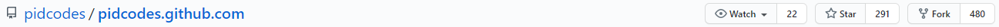
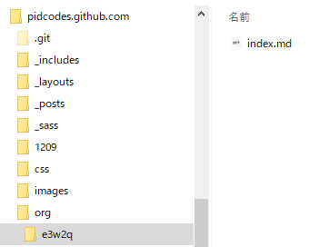
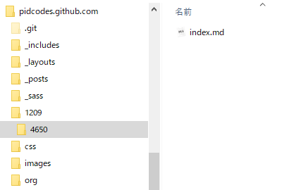
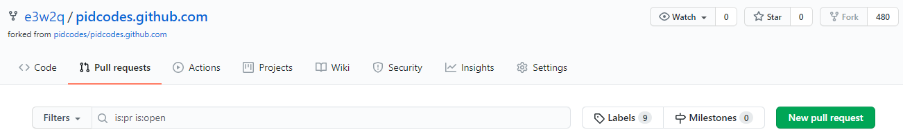
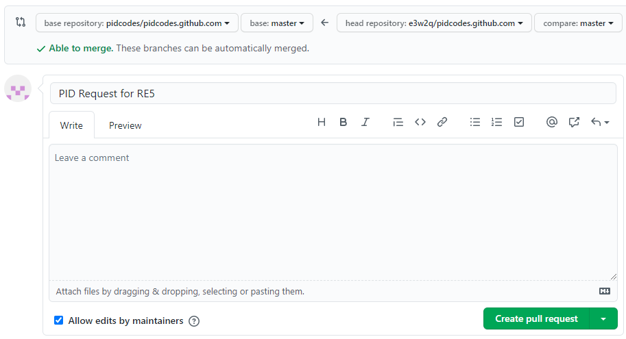

# pid.codesからUSBデバイスのVID、PIDの割り当てを受ける方法

2020/10/23

## 概要

オープンソースのハードウェアの場合、pid.codesからUSBデバイスのVID、PIDの割り当てを受けることができます。

参考記事:[USBのベンダーIDとプロダクトIDの話 - Qiita](https://qiita.com/gpsnmeajp/items/8eb8ecf0541032f6de0e)

## Disclaimer

この記事ではpid.codesから割り当てを受ける手順のみを解説します。割り当てを受けたVID、PIDの使用により生じたいかなる損害についても筆者は責任を負いません。

pid.codesのスタンスは以下をご覧ください。

[Welcome to pid.codes ? pid.codes](http://pid.codes/pidcodes/2015/04/03/welcome/)

なお、pid.codesが取得したとしているVIDの0x1209は、USB-IFの文書に廃止されたVIDとして挙げられています。詳しくは以下をご覧ください。

[Issues ・ pidcodes/pidcodes.github.com](https://github.com/pidcodes/pidcodes.github.com/issues/480)

## 割り当てを受けるまでの手順

以下に私が割り当てを受けたときの手順を記載します。

といっても、丁寧な説明が[How to get a PID code ? pid.codes](http://pid.codes/howto/)に掲載されていますので、そのとおりに実施すれば大丈夫です。

以下の情報は最新の情報とは限らないので、[How to get a PID code ? pid.codes](http://pid.codes/howto/)と合わせてご覧ください。

[pidcodes/pidcodes.github.com](https://github.com/pidcodes/pidcodes.github.com)の「Fork」というボタンを押してフォークします。



[リポジトリをクローンする - GitHub Docs](https://docs.github.com/ja/github/creating-cloning-and-archiving-repositories/cloning-a-repository)を参考にするなどして、フォークしたプロジェクトをローカル環境にクローンします。

ローカルのpidcodes.github.com/orgに組織名のフォルダを作成し、[指定された書式](http://pid.codes/howto/#2-set-up-your-organisation-page)で組織ページを作成します。



```
---
layout: org
title: e3w2q
site: https://github.com/e3w2q/
---
I am designing open source keyboards.
```

[VID 1209 ? pid.codes](http://pid.codes/1209/)に掲載されていない好きなPIDでローカルのpidcodes.github.com/1209にPIDのフォルダを作成し、[指定された書式](http://pid.codes/howto/#3-find-a-vid-and-pid)でプロジェクトのページを作成します。

```
---
layout: pid
title: RE5
owner: e3w2q
license: MIT
site: https://github.com/e3w2q/re5-macropad
source: https://github.com/e3w2q/re5-macropad
---
Macropad with 5 push button rotary encoders.
```
source:に記載したURLから、PCBの設計データとファームウェアにアクセスできるようにしておきます。また、ライセンスが分かるようにしておきます。

私の場合を参考に記載します。

- source:のURLはGitHubのプロジェクトページを設定
- GitHubのプロジェクトページにLICENSEファイルを配置
  - 他の設計者のフットプリントを使っている場合、そのライセンスを確認してライセンスを決める
- GitHubのプロジェクトページにQMK Firmwareの自キーボードへのリンクを載せておく
  - 最近のプルリクエストを見た限りでは、今はQMK Firmwareの自キーボードディレクトリにLICENSEファイルを配置しなくてもよくなった？license:にはPCBデータのライセンスだけ書けばいいのかも

追加したファイルを[コミット](https://docs.github.com/ja/desktop/contributing-and-collaborating-using-github-desktop/committing-and-reviewing-changes-to-your-project)してから[GitHubにプッシュ](https://docs.github.com/ja/desktop/contributing-and-collaborating-using-github-desktop/pushing-changes-to-github)します。

GitHubの自分がフォークしたpidcodes.github.comのプロジェクトページのPull requestsの「New pull request」をクリックします。



内容をよく確認し、問題が無ければ「Create pull request」をクリック。


件名を入れて「Create pull request」



あとは気長に待ちます。ここ数ヶ月、リクエストへの対応が滞っていましたが、最近まとめて対応されました。

[一覧へ](../)