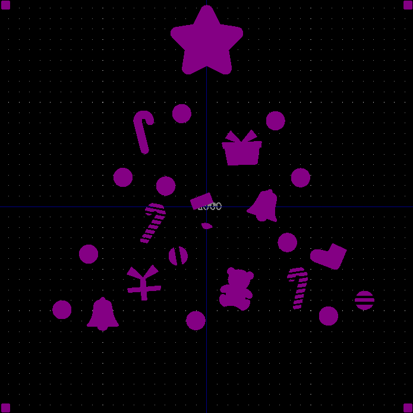

# PCBでの多色表現の解説と2UキーマクロパッドMX2U!を作った話
2020/12/05

この記事は[キーボード #1 Advent Calendar 2020](https://adventar.org/calendars/5279)の5日目の記事です。

昨日の記事は今村勇輔さんの「[なるべく百均で始めるキーキャップ作り](https://ima.hatenablog.jp/entry/2020/12/04/000000)」でした。明日の記事はhsgwさんの「casasagiの基板について」です。

## はじめに

PCBにはシルク印刷で文字を入れたり絵を描けたりしますが、銅箔などでも絵を描くことができます。

シルク以外で絵を描いているケースとして真っ先に思い浮かぶのは[サリチル酸さんのNakedシリーズ](https://salicylic-acid3.hatenablog.com/entry/naked-series-introduction)ですね。

サリチル酸さんはシルクとマスクでデザインするためのわかりやすい解説記事も書かれています。

[PCBのマスクとシルクでオリジナルプレートを作ろう！ - 自作キーボード温泉街の歩き方](https://salicylic-acid3.hatenablog.com/entry/introduction_to_pcb_design)

ほかにもかーくんさんが[Angel17のバックプレート](https://kakunpc.booth.pm/items/2305367)でデザインを選べるようにされていたりします。

あと私の印象に強く残っているのは銅箔でバックプレートに文字が入っているhsgwさんの[Tartan](https://5z6p.com/products/tartan/)ですね。このかっこよさはすごいと思います。

私もシルク以外で絵を描いたりしてみたい、と思って、[SU120](https://github.com/e3w2q/su120-keyboard)の汎用トッププレートに模様を入れたり


[浮葉](https://github.com/e3w2q/ukiha-keyboard)のボトムプレートにロゴを入れたりしてきました。


これらの設計を通じて基板でのお絵かきのノウハウが蓄積されたので、この記事で解説します。

## 完成図

最初に、どのようなものができるかの完成図です。

実物がこちら。


JLCPCBのガーバービューアで見るとこのようになっています。


以降で、具体的な手順を解説します。

なお、最終ベクターデータが飛んでしまったので、以降の画像は一部最終版と異なっているところがあります。説明の本筋には影響しません。

## グラフィックソフト上でのデザイン

最初にお好きなグラフィックソフトで仕上がりイメージを作ります。

以下の機能があるソフトを使うとよいです。

- ピクセル単位ではなくmm単位が使える
- レイヤーを使える
- 色の置換ができる

デザインに使える色は、以下の5色です。

1. シルクの色（緑基板なら普通は白色）
2. レジスト色（緑基板なら緑色）
3. 銅箔の上のレジスト色（緑基板ならちょっと薄い緑色）
4. 銅箔の上のメッキの色（普通は銀色、追加料金を出すと金色）
5. 基盤の色（淡黄色）

これら5色を使って絵を描きます。

今回の画像は100mm×100mmサイズで描きました。


画像には四隅に印を付けておくとよいです。複数のフットプリントを重ねることになるので位置合わせに使いますし、KiCadにデータを移した際に、想定どおりのサイズで出力されているか確認するためにも使います。

## KiCad用の画像出力

KiCadの各レイヤーに取り込んで色を反映させるには、基板の重なり具合を理解し、必要な色が出てくるようにすることが必要となります。

結論を書くと、完成した画像から、以下の画像の一番下の表の色を抽出した5種類の画像を用意します。


画像を出力する際にdpiを指定できる場合は、何dpiで出力したかメモしておくとよいです。今回の作例は1000dpiで出力しました。

## KiCadフットプリントの作成

### 表側シルク用フットプリント

シルク印刷部分のフットプリントを作成します。

白色とガイド用の赤だけを残した画像を使います。


これをKiCadの「インポート ビットマップ」で取り込みます。

このあたりのことは[サリチル酸さんの記事](https://salicylic-acid3.hatenablog.com/entry/introduction_to_pcb_design#%E3%82%A4%E3%83%B3%E3%83%9D%E3%83%BC%E3%83%88%E3%83%93%E3%83%83%E3%83%88%E3%83%9E%E3%83%83%E3%83%97%E3%83%84%E3%83%BC%E3%83%AB%E3%82%92%E8%B5%B7%E5%8B%95%E3%81%99%E3%82%8B)にはより丁寧に書いてありますので合わせてご覧ください。


私の場合、画像を1000dpiで出力したのでここの解像度を1000dpiに指定したところ、取り込んだサイズが100.5mmになりました。グラフィックソフト側の問題かKiCadによるものか原因は追求していませんが、取り込んだサイズが想定の100mmになるように、解像度を1000→1005dpiにしました。

「モノクロ閾値」では、どれくらいの濃さの色までを取り込むか設定します。黒以外は取り込みたいので、低く設定しました。

「使用するレイヤー」では、取り込んだ画像をKiCadのどのレイヤーとするかを設定します。今取り込みたい画像はシルク用なので「表面層シルク」とします。

「エクスポート」をクリックして自分の使っているライブラリのフォルダに保存すると、KiCadのライブラリには以下のように取り込まれます。


### 表側マスク用フットプリント

表側のマスク（表側でレジストを塗らない部分＝基板の色またはメッキの色としたい部分）のフットプリントを生成します。

黄色と灰色（銀色）とガイド用の赤だけを残した画像を使います。


表側シルクと同様に「インポート ビットマップ」を使ってKiCadのライブラリに取り込みます。

取り込む際のレイヤーは「表面層半田マスク」とします。



### 表側銅箔用フットプリント

表側の銅箔（メッキの色としたい部分と、その上にレジストを塗って薄緑色としたい部分）のフットプリントを生成します。

灰色（銀色）と薄緑色とガイド用の赤だけを残した画像を使います。


表側シルクと同様に「インポート ビットマップ」を使ってKiCadのライブラリに取り込みます。

取り込む際のレイヤーで銅箔レイヤーは選択肢にないため、ひとまず「表面層シルク」とします。


保存されたフットプリントのファイルをエディタで開き、「F.Silk」を「F.Cu」に置換して保存します。


するとフットプリントが銅箔レイヤーに変わります。


余談ですが、[40percent.club](https://www.40percent.club/)さんなどのように基板にエンボスで模様を描きたい場合、単純な模様であればKiCad上で図形を描けばよいのですが、複雑な模様の場合、KiCadから配線済みのF.Cuレイヤーを画像として出力してそれと被らないようにグラフィックソフトで模様を描いてこのやり方で取り込むという方法もあります。

### 基板外形用フットプリント

基板の外形線のフットプリントを生成します。

外形線に反映させたくない白いレース部分を非表示にしてた画像を使います。


「インポート ビットマップ」を使ってKiCadのライブラリに取り込みます。

取り込む際のレイヤーで外形は選択肢にないため、ひとまず「表面層シルク」とします。


保存されたフットプリントのファイルをエディタで開きます。

`fp_poly`が領域の塗りつぶしです。`fp_poly`は5箇所あり、四隅の四角と、真ん中のツリー部分を指しています。

```
(module LOGO (layer F.Cu)
  (at 0 0)
 (fp_text reference "G***" (at 0 0) (layer F.SilkS) hide
  (effects (font (thickness 0.3)))
  )
  (fp_text value "LOGO" (at 0.75 0) (layer F.SilkS) hide
  (effects (font (thickness 0.3)))
  )
  (fp_poly (pts (xy -48.019901 50.016517) ... (xy -48.019901 50.016517) )(layer F.SilkS) (width  0.010000)
  )
  (fp_poly (pts (xy 50.016517 50.016517) ... (xy 50.016517 50.016517) )(layer F.SilkS) (width  0.010000)
  )
  (fp_poly (pts (xy 0.087158 -48.952633) ... (xy 0.087158 -48.952633) )(layer F.SilkS) (width  0.010000)
  )
  (fp_poly (pts (xy -48.019901 -48.019901) ... (xy -48.019901 -48.019901) )(layer F.SilkS) (width  0.010000)
  )
  (fp_poly (pts (xy 50.016517 -48.019901) ... (xy 50.016517 -48.019901) )(layer F.SilkS) (width  0.010000)
  )
)
```

3番目の`fp_poly`部分がツリーの部分なので、この部分を以下のルールに従って書き換えると、外形線になります。

```
  (fp_poly (pts (xy x1 y1) (xy x2 y2) (xy x3 y3) (xy x4 y4) )(layer F.SilkS) (width  0.010000)
  )
```
↓
```
  (fp_line (start x1 y1) (end x2 y2) (layer Edge.Cuts) (width 0.15))
  (fp_line (start x2 y2) (end x3 y3) (layer Edge.Cuts) (width 0.15))
  (fp_line (start x3 y3) (end x4 y4) (layer Edge.Cuts) (width 0.15))
  (fp_line (start x4 y4) (end x1 y1) (layer Edge.Cuts) (width 0.15))
```
手作業で書き換えてもいいですし、スクリプトを書いてもいいですし、自分にとってやりやすい手段で書き換えてください。私は表計算ソフトとエディタを使いました。


### 裏側マスク用フットプリント

裏側のマスク（裏側でレジストを塗らない部分＝基板の色としたい部分）のフットプリントを生成します。

黄色とガイド用の赤だけを残した画像を使います。


表側シルクと同様に「インポート ビットマップ」を使ってKiCadのライブラリに取り込みます。

取り込む際のレイヤーで裏側マスクは選択肢にないため、ひとまず「表面層シルク」とします。


保存されたフットプリントのファイルをエディタで開き、「F.Silk」を「B.Mask」に置換して保存すると画像が裏側マスクレイヤーに変わります。


## KiCadでの操作

### 作成したフットプリントを重ねる

「基板レイアウト エディター」で作成した5つのフットプリントを取り込み、重ねます。


位置を正確に合わせるにはフットプリントを右クリックしてプロパティを開き、X座標とY座標を直接入力するとよいです。

### 必要なパーツを配置し、配線する

必要なパーツを配置し、配線します。このあたりは通常の基板設計と同じですが、配線やフットプリントがマスク、銅箔部分と重ならないように注意してください。


手順の説明は以上です。

## 2UキーマクロパッドMX2U!を作った話

ということで、2Uキーマクロパッド[MX2U!](https://github.com/e3w2q/mx2u-macropad)が完成しました。


私は[自作キーボード Advent Calendar 2018](https://adventar.org/calendars/2954)で自作キーボードに魅せられて自作キーボードを始めたので、自分の中で、Advent Calender用の記事はちょっとだけ特別だったりします。

今回はPCBの多色表現を試す題材として、

- 複数の色が生きるもの
- せっかくなら光るもの
- マクロパッドとして使えるもの

として、MXスイッチの2Uキーのマクロパッドを作りました。

これまで私が設計したキーボードはLEDテープで光らせるタイプだったのですが、今回はテープではないシリアルLEDを使ってみました。

<blockquote class="twitter-tweet"><p lang="ja" dir="ltr">自作キーボードで使うことがあるLEDテープと遊舎工房さんで扱ってるタブ付きのYS-SK6812miniはどちらもシリアルLEDというやつで、回路的にはどちらも同じ。裏を光らせるかキースイッチを透過して光らせるかの違い。<br>普通のLEDと違いシリアルLEDだと抵抗を付けなくていいと理解した。<br>（自信はない）</p>&mdash; e3w2q (@e3w2q) <a href="https://twitter.com/e3w2q/status/1324885197309923329?ref_src=twsrc%5Etfw">November 7, 2020</a></blockquote> <script async src="https://platform.twitter.com/widgets.js" charset="utf-8"></script>
上のツイートには不正確な部分があるので、現時点の私の理解を以下に書いておきます。

- 自作キーボードを光らせる方法
  - バックライト
    - 基板から上向きに光が出て、キースイッチを透過してキーキャップの隙間などから光が漏れる。
    - ただのLEDを使う場合は抵抗を使う必要がある。このタイプのキットは少なくシリアルLEDを使うものが多い。
    - 以前はSK6812miniを使うキットが多かったが、遊舎工房さんからタブ付きのYS-SK6812miniが発売されて、はんだ付けのしやすさからこちらを使うキットが増えてきた。
  - アンダーグロー
    - 基板から下向きに光が出て、アクリルプレートの端面が光ったり机に反射した光が見えたりする。
    - シリアルLEDを使うキットと、テープLEDを使うキットがある。ただしテープLEDもシリアルLEDが使われているので仕組みは同じ。
    - シリアルLEDを使う場合、以前はSK6812miniを使うキットが多かったが、遊舎工房さんからタブ付きのYS-SK6812miniが発売されて、はんだ付けのしやすさからこれを使うキットが増えてきた。

MX2U!では、ツリー先端の星の部分に裏からLEDの光を透過させるのに、自作キーボードでよく使われる表面実装タイプのシリアルLEDではなく、スルーホールタイプのシリアルLEDを使っています。


ただ、[スイッチサイエンスさんが販売されているもの](https://www.switch-science.com/catalog/1863/)はWS2811で、実装してみるとWS2812系のYS-SK6812miniと混在しては使えませんでした。

今はWS2812のスルーホールLEDを取り寄せしていて、クリスマス当日までには星を光らせられるといいなあと思っています。

この記事は16mmキーピッチキーボード「[浮葉](https://github.com/e3w2q/ukiha-keyboard)」で書きました。

Merry Xmas to you!

[一覧へ](../)