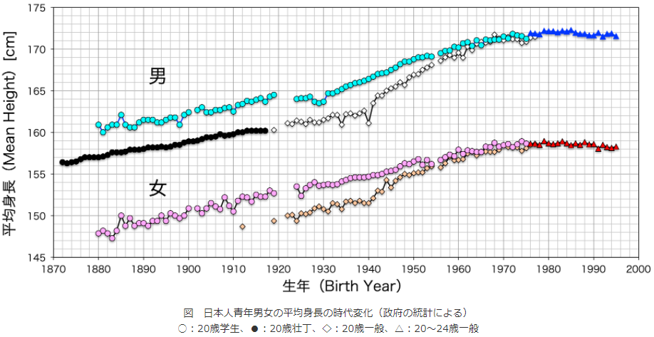

# 狭ピッチキーボードの世界にようこそ

2019/12/20

この記事は[キーボード #2 Advent Calendar 2020](https://adventar.org/calendars/5307)の19日目の記事です。

昨日の記事はt2kobさんの「[FLINT キーボード作ろうぜ！キットでつくる 物理 Raise 機構つき自作キーボード](https://zenn.dev/t2kob/articles/4115f37c41f10d)」でした。次の記事はYoshifumi YAMAGUCHIさんの「キーボードのお店を始めるに至った話」です。

<!-- TOC -->

- [狭ピッチキーボードの世界にようこそ](#狭ピッチキーボードの世界にようこそ)
    - [キーピッチについて](#キーピッチについて)
    - [キーピッチの規格](#キーピッチの規格)
    - [標準キーピッチが19mmである理由](#標準キーピッチが19mmである理由)
    - [標準キーピッチへの問題提起](#標準キーピッチへの問題提起)
    - [狭ピッチのメリットは何か](#狭ピッチのメリットは何か)
    - [そうは言っても狭ピッチは打ちやすいのか](#そうは言っても狭ピッチは打ちやすいのか)
    - [そうは言っても狭ピッチが打ちやすいのは個人の感想ですよね](#そうは言っても狭ピッチが打ちやすいのは個人の感想ですよね)
    - [手のサイズのデータから考える](#手のサイズのデータから考える)
    - [キーピッチに関する論文から考える](#キーピッチに関する論文から考える)
        - [日本の論文](#日本の論文)
        - [海外の論文](#海外の論文)
        - [論文を読んでみて](#論文を読んでみて)
    - [自分の手にあったキーピッチのキーボードを作るヒント](#自分の手にあったキーピッチのキーボードを作るヒント)
        - [使用するキースイッチによる制約](#使用するキースイッチによる制約)
        - [縦方向のキーピッチ](#縦方向のキーピッチ)
        - [横方向のキーピッチ](#横方向のキーピッチ)
    - [そのほかに狭ピッチキーボードに対して言われそうなこと](#そのほかに狭ピッチキーボードに対して言われそうなこと)
        - [狭ピッチに合うキーキャップがないよね](#狭ピッチに合うキーキャップがないよね)
        - [狭ピッチに慣れたら普通のキーピッチに戻れないのでは？](#狭ピッチに慣れたら普通のキーピッチに戻れないのでは)
        - [どんなキーピッチが自分に合うかしばらく試してみないとわからないしそのためにゼロから設計するのは大変](#どんなキーピッチが自分に合うかしばらく試してみないとわからないしそのためにゼロから設計するのは大変)
    - [おわりに](#おわりに)
- [資料編](#資料編)
    - [各種規格におけるキーピッチ](#各種規格におけるキーピッチ)
        - [DIN 66234 (1980-1984)](#din-66234-1980-1984)
        - [ANSI/HFS100-1988 American national standard for human factors engineering of visual display terminal workstations](#ansihfs100-1988-american-national-standard-for-human-factors-engineering-of-visual-display-terminal-workstations)
        - [ISO 9241-4:1998 Ergonomic requirements for office work with visual display terminals (VDTs) -Part 4 : Keyboard requirements](#iso-9241-41998-ergonomic-requirements-for-office-work-with-visual-display-terminals-vdts--part-4--keyboard-requirements)
        - [JIS Z 8514:2000 人間工学－視覚表示装置を用いるオフィス作業－キーボードの要求事項](#jis-z-85142000-人間工学視覚表示装置を用いるオフィス作業キーボードの要求事項)
        - [ANSI/HFES 100-2007 Human Factors Engineering of Computer Workstations](#ansihfes-100-2007-human-factors-engineering-of-computer-workstations)
        - [ISO 9241-400:2007 Ergonomics of human-system interaction - Part 400: Principles and requirements for physical input devices](#iso-9241-4002007-ergonomics-of-human-system-interaction---part-400-principles-and-requirements-for-physical-input-devices)
        - [ISO/TS 9241-411:2012 Ergonomics of human-system interaction - Part 411: Evaluation methods for the design of physical input devices](#isots-9241-4112012-ergonomics-of-human-system-interaction---part-411-evaluation-methods-for-the-design-of-physical-input-devices)
    - [手のサイズに関する資料](#手のサイズに関する資料)
        - [坂村 健 (1987). TRONを創る, 共立出版, 177](#坂村-健-1987-tronを創る-共立出版-177)
        - [1988 Anthropometric Survey of US Army Personnel (ANSUR)](#1988-anthropometric-survey-of-us-army-personnel-ansur)
        - [AIST人体寸法データベース 1991-92](#aist人体寸法データベース-1991-92)
            - [身長と手の各部位の比率](#身長と手の各部位の比率)
            - [性別・身長と手のサイズとの関係](#性別・身長と手のサイズとの関係)
        - [AIST人体寸法データベース 1997-98](#aist人体寸法データベース-1997-98)
        - [NASA-STD-3000, the Man-System Integration Standards (1995)](#nasa-std-3000-the-man-system-integration-standards-1995)
        - [NASA Constellation Program Human-System Integration Requirements (2010)](#nasa-constellation-program-human-system-integration-requirements-2010)
        - [一般社団法人 人間生活工学研究センター 在日外国人の身体特性計測 結果概要報告 (2011)](#一般社団法人-人間生活工学研究センター-在日外国人の身体特性計測-結果概要報告-2011)
        - [AIST手の寸法データ(2012)](#aist手の寸法データ2012)
        - [2012 Anthropometric Survey of US Army Personnel (ANSUR2)](#2012-anthropometric-survey-of-us-army-personnel-ansur2)
    - [キーピッチに関連する論文](#キーピッチに関連する論文)
        - [坂村 健 (1986). BTRONにおける入力方式　－TRONキーボードの設計－, 情報処理学会研究報告 日本語文書処理 2 (7), 1-8](#坂村-健-1986-btronにおける入力方式　tronキーボードの設計-情報処理学会研究報告-日本語文書処理-2-7-1-8)
        - [岩崎 昭浩, 上田 義弘, 津田 光弘 (1991). 小型キーボードの研究 : 縮小ピッチキーボードの操作性検討とデザイン提案(口頭による研究発表,第38回研究発表大会), 人間工学, 1991 巻 87 号, 26](#岩崎-昭浩-上田-義弘-津田-光弘-1991-小型キーボードの研究--縮小ピッチキーボードの操作性検討とデザイン提案口頭による研究発表第38回研究発表大会-人間工学-1991-巻-87-号-26)
        - [小林 雅幸 (1992). キーボードのキーピッチが操作性に及ぼす影響, 人間工学, 28 巻 Supplement 号, 448-449](#小林-雅幸-1992-キーボードのキーピッチが操作性に及ぼす影響-人間工学-28-巻-supplement-号-448-449)
        - [Ryohji Yoshitake (1995). Relationship between Key Space and User Performance on Reduced Keyboards, Applied Human Science, Vol.14 No.6, 287-292.](#ryohji-yoshitake-1995-relationship-between-key-space-and-user-performance-on-reduced-keyboards-applied-human-science-vol14-no6-287-292)
        - [Goro Watanabe, Tamotsu Koike, Hideyuki Motoyama (1998). Small, Low-profile Keyboard That Does NotImpair Operability, Fujitsu scientific and technical journal, 34 (1), 112-118.](#goro-watanabe-tamotsu-koike-hideyuki-motoyama-1998-small-low-profile-keyboard-that-does-notimpair-operability-fujitsu-scientific-and-technical-journal-34-1-112-118)
        - [Anna Pereira, David L. Lee, Harini Sadeeshkumar, Charles Laroche, Dan Odell, David Rempel (2012). The Effect of Keyboard Key Spacing on Productivity, Usability, and Biomechanics in Touch Typists with Large Hands, Proceedings of the Human Factors and Ergonomics Society Annual Meeting, 56 (1), 1872-1876.](#anna-pereira-david-l-lee-harini-sadeeshkumar-charles-laroche-dan-odell-david-rempel-2012-the-effect-of-keyboard-key-spacing-on-productivity-usability-and-biomechanics-in-touch-typists-with-large-hands-proceedings-of-the-human-factors-and-ergonomics-society-annual-meeting-56-1-1872-1876)
        - [Anna Pereira, David L. Lee, Harini Sadeeshkumar, Charles Laroche, Dan Odell, David Rempel (2013). The Effect of Keyboard Key Spacing on Typing Speed, Error, Usability, and Biomechanics: Part 1, Human Factors: The Journal of the Human Factors and Ergonomics Society, 55 (3), 557-566.](#anna-pereira-david-l-lee-harini-sadeeshkumar-charles-laroche-dan-odell-david-rempel-2013-the-effect-of-keyboard-key-spacing-on-typing-speed-error-usability-and-biomechanics-part-1-human-factors-the-journal-of-the-human-factors-and-ergonomics-society-55-3-557-566)
        - [Anna Pereira, Chih-Ming Hsieh, Charles Laroche, David Rempel (2014). The Effect of Keyboard Key Spacing on Typing Speed, Error, Usability, and Biomechanics, Part 2: Vertical Spacing, Human Factors: The Journal of the Human Factors and Ergonomics Society, 56 (4), 752-759.](#anna-pereira-chih-ming-hsieh-charles-laroche-david-rempel-2014-the-effect-of-keyboard-key-spacing-on-typing-speed-error-usability-and-biomechanics-part-2-vertical-spacing-human-factors-the-journal-of-the-human-factors-and-ergonomics-society-56-4-752-759)
        - [Heather Madison, Anna Pereira, Mette Korshoj, Laura Taylor, Alan Barr, David Rempel (2015). Mind the Gap: The Effect of Keyboard Key Gap and Pitch on Typing Speed, Accuracy, and Usability, Part 3, Human Factors: The Journal of the Human Factors and Ergonomics Society, 57 (7), 1188-1194.](#heather-madison-anna-pereira-mette-korshoj-laura-taylor-alan-barr-david-rempel-2015-mind-the-gap-the-effect-of-keyboard-key-gap-and-pitch-on-typing-speed-accuracy-and-usability-part-3-human-factors-the-journal-of-the-human-factors-and-ergonomics-society-57-7-1188-1194)
        - [その他の論文](#その他の論文)
            - [Alden, D. G., Daniels, R. W., & Kanarick, A. F. (1972). Keyboard design and operation: a review of the major issues. Human Factors, 14(4), 275-293.](#alden-d-g-daniels-r-w--kanarick-a-f-1972-keyboard-design-and-operation-a-review-of-the-major-issues-human-factors-144-275-293)
            - [Clare, C. R. (1976). Human Factors: A most important ingredient in keyboard design. EDN, 21 (8), 99-102.](#clare-c-r-1976-human-factors-a-most-important-ingredient-in-keyboard-design-edn-21-8-99-102)
            - [Ilg, R. (1987). Ergonomic keyboard design. Behavior and Information Technology, 6, 303-309.](#ilg-r-1987-ergonomic-keyboard-design-behavior-and-information-technology-6-303-309)

<!-- /TOC -->

## キーピッチについて

キーピッチとは、キーボードのあるキーの中心から隣のキーの中心までの長さです。

[キーボードのキーピッチが操作性に及ぼす影響](#小林-雅幸-1992-キーボードのキーピッチが操作性に及ぼす影響-人間工学-28-巻-supplement-号-448-449)より引用

現在市販されているキーボードでは特に小型を謳った製品でない限り、このキーピッチは19.05mmまたは19mmとなっています。

国内の自作キーボードも19.05mmや19mmのキーピッチで作られているものが大多数です。

ちなみに、なぜ中途半端な19.05mmという数字が存在するかというと、初期のキーボードはアメリカで開発、製造が進んでいて、そのときに3/4インチがデファクトスタンダードとなったことが原因です。3/4インチはメートル表記で19.05mmなので、メートル表記を普段使う側からすると、端数が付いているように見えるというわけです。

19mmキーピッチの製品があるのは、メートル表記に寄せて、19.05mm→19mmキーピッチにしたのではないかと推測しています。

## キーピッチの規格

様々なものに規格が定められているように、もちろんキーボードについても規格があります。ではこの19.05mmピッチという業界標準に対し、規格ではどう定められているのでしょう？

国際規格（ISO）、米国規格（ANSI/HFES）、日本産業規格（JIS）において、キーボードについての要求事項、推奨事項が定められています<a href="#foot1">[1]</a>。規格では、キーボードの高さ、傾斜角、形状などのほかに、キーピッチについても書かれています。

キーボードの日本産業規格（JIS Z 8514:2000）はその時点の国際規格（ISO 9241-4:1998）を翻訳したものなので内容的には同一です。

いずれの規格でもキーピッチに関しては大意は同じで、

- 英数字と数字のキーのキーピッチは、19mm±1mmを推奨
- その他のキーは小さくしてもよい（ただしISO規格では15mm以下は推奨せず）

ということが書かれています。

## 標準キーピッチが19mmである理由

[Alden (1972)](#alden-d-g-daniels-r-w--kanarick-a-f-1972-keyboard-design-and-operation-a-review-of-the-major-issues-human-factors-144-275-293)には、キーピッチを含む基本的なキー特性について、業界や軍の基準がない、一般的に基準として使用されている19mmサイズには科学的根拠がないといったことが書かれているようです。 「経験的なデータよりも設計上の慣習によるものである。（中略）これらのキーボードの典型的なキーセンター間の間隔は18.1mmである」<a href="#foot2">[2]</a>。

[Pereira (2012)](#anna-pereira-david-l-lee-harini-sadeeshkumar-charles-laroche-dan-odell-david-rempel-2012-the-effect-of-keyboard-key-spacing-on-productivity-usability-and-biomechanics-in-touch-typists-with-large-hands-proceedings-of-the-human-factors-and-ergonomics-society-annual-meeting-56-1-1872-1876)には、業界慣行と[Clare (1976)](#clare-c-r-1976-human-factors-a-most-important-ingredient-in-keyboard-design-edn-21-8-99-102)に基づき19mm±1mmピッチが標準となったと書かれています<a href="#foot3">[3]</a>。

## 標準キーピッチへの問題提起

TRONプロジェクトリーダーとして高名な坂村健東京大学名誉教授が1980年代にTRONキーボードの論文・書籍で、服を例に挙げて、手の大きい人、小さい人がいるにもかかわらずキーボードのサイズが1種類だけなのは不足だと書かれています<a href="#foot4">[4]</a>。

キーボードは工業製品であるのでひとつの規格で存在したほうがいろいろ便利な点があったのでしょうが、基板から設計する自作キーボードではキーピッチを19mmのみとする必要性はあまりないと言えます。

## 狭ピッチのメリットは何か

自作キーボードにはいろいろなキーレイアウトがありますが、その中のひとつの方向性として、打ちやすさを求める考え方があります。

そして、キーレイアウト上の打ちやすさとは、具体的には指の移動距離がより短いこと、と私は理解しています。

例えばファンクションキーと数字行を無くしたキーボードでは、指の上下方向の移動が1キーに収まりますし

Google検索結果より引用

カラムスタッガードとオーソリニアのキーボードは、ロウスタッガードのキーボードと比較して縦方向の指の移動距離が3～10%減ります。

Google検索結果より引用

3D形状のキーボードではキーの傾斜に合わせてお椀型に凹ませることにより、キートップ同士の間隔が近くなり、平面のキーボードに比べて指の移動距離が短くなります。

Google検索結果より引用

これらと同様に、狭ピッチキーボードも指の移動距離が短くなります。

16mmキーピッチの場合、19mmキーピッチと比較して16%移動距離が減ります。16%はそんなものと言えばそんなものですが、意外にばかにできない数字です。

しかも、普段使っているキーレイアウトをそのままにして適用できるので、移行コストが少ないというのもメリットです。

指の移動距離が減ることで、タイピング速度も上がることが期待できます。

あと、これは見た目だけの話ですが、小さくてかわいいんですよね。

16%小さいってだけでこんなに変わるのかってぐらいコンパクトに感じます。

最後に、設計者目線になりますが、昨今の自作キーボードは結構いろいろなキーレイアウトが既に存在しますし、MCU直付けやアルミ削り出しといった高級な路線も開拓されつつあります。もうやれることはだいたい先人がやってしまっている……と思ってしまっていませんか？

大丈夫です。通常キーピッチから離れれば、まだまだフロンティアが広がっています。狭ピッチ自作キーボードはいくつか存在するのですが、コンセプトとキーピッチの組み合わせの数を考えるとほんのちょっと手が付けられたぐらいで、全然開拓されていません。

キーレイアウトだけではなくキーピッチも最適化を目指せると考えると、わくわくしてきませんか。

## そうは言っても狭ピッチは打ちやすいのか

わかります。この疑念は持ちますよね。私も以前に小型端末の小さいキーボードを触ったことがありますか、結構打ちにくかった覚えがあります。

狭ピッチは移動距離が短いとは言っても、本当に打ちやすいのか。とりあえず自分の体で実証しないとなあ、と思って作ったのが16mmキーピッチオーソリニアキーボードの「浮葉」です。

[GitHub - e3w2q/ukiha-keyboard: small key pitch 5x12 ortholinear keyboard](https://github.com/e3w2q/ukiha-keyboard)

私はかな入力派なので、常用できるように4×12キーにかな文字を収めました。長音キーのみ「ろ」の横に移したほかは、JISキーボードレイアウトの英数字キー部分と同じです。

狭ピッチキーボード練習初日。

e-Typingで試打を始めてすぐ、「打ちにくい」と思いました。指が窮屈な感じがします。指がここだと感じた場所にキーがありません。正直、「これはダメかも」と思いました。

タイプミスも多かったです。英字キー部分もミスが頻発しましたが、特に離れたキーでは移動距離のズレが大きく思うように打てませんでした。

初日はe-Typingで2回練習して終了。

練習2日目。

ちょっと本腰を入れて練習しなきゃと思ってe-Typingで淡々と練習しました。1日経っただけで違和感は減っていたのでちょっとほっとしました。

練習3日目。

まだミスは多いですが、指を1キー分ずつ上下させるだけで済む英字キーの範囲での打鍵は明らかに指の動かし方が小さくで済むので、その範囲で収まる入力はちょっと楽しくなりました。

練習を始めて確か5日目ぐらいでe-Typingから文章入力に切り替えましたが、e-Typingの場合は間違えてもBackSpaceキーを打たなくていいですが、文章入力の場合は間違えるとBackSpaceキーを打たないといけないので入力速度は相当遅いです。

ちょっと失敗したなあと思ったのは、通常のかな入力レイアウトのまま狭ピッチに移行したのではなく、5×12キーの範囲に収めるために長音キーを移動させたりShift、Space、Enter、BackSpaceあたりの配置変更も一緒にやってしまったため、新しいキー配置に慣れることも並行して行う必要がありました。

移行しやすさを第一に考えるのであれば、馴染みのキーレイアウトのまま狭ピッチとしたほうがいいと思います。

しかし練習開始から3週間経った今では普通のキーボードでの入力速度並になり、特にホームポジションから近いキーの連続打鍵は気持ちいい感じに早くなったので、キー配置の変更も一緒にしてやれないことはないです。

狭ピッチを使い始めてからしばらくの感覚は、自分がマウスから親指トラックボールに移行したときと似ているなと思いました。トラックボールを使い始めたときも「そんなに器用でもない親指で玉を触るだけで今までやっていたような細かいマウス移動は絶対無理」と思いましたが、1週間ぐらい使うと慣れてきて、今では1pxだけドラッグするような操作もトラックボールでできています。

これから狭ピッチを使う方にアドバイスするとすれば、狭ピッチはちょっと触ってみて合う合わないを判断するのではなく、「狭ピッチにすると移動距離が減る、ということは打鍵が楽になる」と信じて数日単位で使ってみて判断してほしいということです。

なお、私の経験上は無理に長時間練習する必要はないと思います。数分程度の試し打ちやタイピング練習を何日かやっていると、日を追うごとに慣れていくのが感覚でわかるはず。

## そうは言っても狭ピッチが打ちやすいのは個人の感想ですよね

わかる。わかりますその気持ち。

普通のキーピッチのキーボードで十分エンドゲームに近づいているのに、こんなN=1の主観だけで狭ピッチキーボードを使ってみようという気にはなれませんよね。

狭ピッチキーボードに興味を持ってもらうには、もっと客観的なデータが必要っ！

## 手のサイズのデータから考える

体格，体形，プロポーションに，明瞭な人種差（民族差）があることはよく知られていることだそうです<a href="#foot5">[5]</a>。

日本人とアメリカ人の男女の平均データをまとめました。

| 出典                                                         | 対象者   | 手長 男性 | 手長 女性 | 手幅 男性 | 手幅 女性 |
| ------------------------------------------------------------ | -------- | --------- | --------- | --------- | --------- |
| [AIST人体寸法データベース 1991-92](#aist人体寸法データベース-1991-92)より青年層データ | 日本人   | 190.8     | 173.8     | 82.1      | 73.0      |
| [AIST人体寸法データベース 1997-98](#aist人体寸法データベース-1997-98)より青年層データ | 日本人   | 180.6     | 167.8     | 81.8      | 73.6      |
| [AIST手の寸法データ (2012)](#aist手の寸法データ2012)         | 日本人   | 183.4     | 169.3     | 83.3      | 74.0      |
| [ANSUR (1988)](#1988-anthropometric-survey-of-us-army-personnel-ansur) | 米国陸軍 | 193.8     | 180.5     | 90.4      | 79.4      |
| [ANSUR2 (2012)](#2012-anthropometric-survey-of-us-army-personnel-ansur2) | 米国陸軍 | 193.3     | 181.1     | 88.3      | 78.2      |

AIST人体寸法データベース 1991-92の青年男性手長と米国陸軍データの手長はかなり近いですが、そのほかは男性と女性、日本人とアメリカ人で平均値に違いがあります<a href="#foot6">[6]</a>。

19mmという標準キーピッチはアメリカの業界慣行により決まったものですので、アメリカ人よりも手のサイズが5%前後小さい日本人には、より小さいキーピッチが適当と言えるかもしれません。

また、これはあくまで平均値ですので、平均値より手が小さい人にとっては、より小さいキーピッチが適当かもしれません。

## キーピッチに関する論文から考える

手のサイズの比較だけではぼやっとした話しかできないので、キーボードのキーピッチとパフォーマンスの関係を実験した論文を以下にまとめました<a href="#foot7">[7]</a>。

[J-STAGE](https://www.jstage.jst.go.jp/browse/-char/ja)と[Google Scholar](https://scholar.google.com/)で該当しそうなキーワードで検索し、関連論文を辿って見つけて読めた全ての論文を挙げています。取捨選択はしていません。

| 出典                                                         | 対象者             | パフォーマンス等が比較的よいキーピッチ(縦×横)              | パフォーマンス等が比較的わるいキーピッチ(縦×横) |
| ------------------------------------------------------------ | ------------------ | ---------------------------------------------------------- | ----------------------------------------------- |
| [岩崎 (1991)](#岩崎-昭浩-上田-義弘-津田-光弘-1991-小型キーボードの研究--縮小ピッチキーボードの操作性検討とデザイン提案口頭による研究発表第38回研究発表大会-人間工学-1991-巻-87-号-26) | 12名               | 19×19mm 17×17mmは慣れによりかなりの改善が期待できる     | 15×15mm                                         |
| [小林 (1992)](#小林-雅幸-1992-キーボードのキーピッチが操作性に及ぼす影響-人間工学-28-巻-supplement-号-448-449) | 12名               | 18×18mm、19×19mm                                           | なし                                            |
| [Yoshitake (1995)](#ryohji-yoshitake-1995-relationship-between-key-space-and-user-performance-on-reduced-keyboards-applied-human-science-vol14-no6-287-292) | 指が大きい4名      | 15.6×15.6mm、16×16mm、16.7×16.7mm、19.05×mm                | 15×15mm                                         |
| 同上                                                         | 指が小さい4名      | 15×15mm、15.6×15.6mm、16×16mm、16.7×16.7mm、19.05×mm       | なし                                            |
| [Watanabe (1998)](#goro-watanabe-tamotsu-koike-hideyuki-motoyama-1998-small-low-profile-keyboard-that-does-notimpair-operability-fujitsu-scientific-and-technical-journal-34-1-112-118) | 記載なし           | 13.05×19.05mm、15.05×19.05mm、17.05×19.05mm、19.05×19.05mm | なし                                            |
| [Pereira (2012)](#anna-pereira-david-l-lee-harini-sadeeshkumar-charles-laroche-dan-odell-david-rempel-2012-the-effect-of-keyboard-key-spacing-on-productivity-usability-and-biomechanics-in-touch-typists-with-large-hands-proceedings-of-the-human-factors-and-ergonomics-society-annual-meeting-56-1-1872-1876) | 指が大きい37名     | 17×17mm、17×19mm、18×19mm、19×19mm                         | 16×19mm                                         |
| [Pereira (2014)](#anna-pereira-chih-ming-hsieh-charles-laroche-david-rempel-2014-the-effect-of-keyboard-key-spacing-on-typing-speed-error-usability-and-biomechanics-part-2-vertical-spacing-human-factors-the-journal-of-the-human-factors-and-ergonomics-society-56-4-752-759) | 指が大きい男性26名 | 16×17mm、17×17mm、18×17mm、16×18mm                         | 15.5×17mm                                       |
| 同上                                                         | 指が小さい女性26名 | 16×17mm、17×17mm、18×17mm、16×18mm                         | 15.5×17mm                                       |
| [Madison (2015)](#heather-madison-anna-pereira-mette-korshoj-laura-taylor-alan-barr-david-rempel-2015-mind-the-gap-the-effect-of-keyboard-key-gap-and-pitch-on-typing-speed-accuracy-and-usability-part-3-human-factors-the-journal-of-the-human-factors-and-ergonomics-society-57-7-1188-1194) | 25名               | 17×17mm                                                    | 16×16mm                                         |

それぞれ対象者や実験条件が異なりますが、19mmキーピッチより小さいキーピッチでもある程度まではパフォーマンスが落ちない（有意差がない）という結果となっています。

これは狭ピッチ始まったのでは！？

細かく見ていきましょう。

### 日本の論文

[岩崎 (1991)](#岩崎-昭浩-上田-義弘-津田-光弘-1991-小型キーボードの研究--縮小ピッチキーボードの操作性検討とデザイン提案口頭による研究発表第38回研究発表大会-人間工学-1991-巻-87-号-26)、[小林 (1992)](#小林-雅幸-1992-キーボードのキーピッチが操作性に及ぼす影響-人間工学-28-巻-supplement-号-448-449)、[Yoshitake (1995)](#ryohji-yoshitake-1995-relationship-between-key-space-and-user-performance-on-reduced-keyboards-applied-human-science-vol14-no6-287-292)、[Watanabe (1998)](#goro-watanabe-tamotsu-koike-hideyuki-motoyama-1998-small-low-profile-keyboard-that-does-notimpair-operability-fujitsu-scientific-and-technical-journal-34-1-112-118)はいずれも国内の研究者による論文です。

岩崎氏らとWatanabe氏らは富士通所属、小林氏は日本電気所属、Yoshitake氏は日本IBM所属であり、小型キーボードの商品化の検討の一環としてキーピッチによる影響を研究していた可能性があります。論文中に研究の背景としてそのようなことを書いているものもありました。

テスト内容や条件が異なるので乱暴なまとめ方しかできませんが、総括すると

- 15mmキーピッチになるとパフォーマンスが落ちるという研究もある
- 15.6mmキーピッチまでは通常の19mmキーピッチと有意差はない

という結果です。

これらの中でも[Yoshitake (1995)](#ryohji-yoshitake-1995-relationship-between-key-space-and-user-performance-on-reduced-keyboards-applied-human-science-vol14-no6-287-292)は指の大きさに着目して結果を分析しており、高速タイピスト（wpm40程度以上）のうち指が大きい（中指の長さ平均8.48cm、中指第二関節の幅平均2.24cm）4名は15mmピッチで有意な速度低下が見られた、と書かれています。

[Yoshitake (1995)](#ryohji-yoshitake-1995-relationship-between-key-space-and-user-performance-on-reduced-keyboards-applied-human-science-vol14-no6-287-292)より引用

ただし、論文中の図を見ると指が大きいグループでは16mmキーピッチ以下になると速度が低下しはじめています。一方で指が小さいグループは19mmキーピッチから15mmキーピッチまでパフォーマンスにほとんど差がありません。

この実験の被験者はアメリカ在住者と日本在住者ですので、この実験での指が大きいグループは日本人のどれくらいの人に当てはまるか、気になります。

そこで、AIST人体寸法データベース 1991-92の青年層データで、この研究で指が大きい・小さいというグループの境目となる中指の長さ81.65mm以下の人がどれくらいいるか調べると、男性は216人中150人（69.4%）、女性は204人中198人（97.1%）でした<a href="#foot8">[8]</a>。

つまり、日本人の場合、男性の2/3とほとんどの女性は15mmキーピッチでもパフォーマンスに影響が出ず、残りの指が大きい人であっても16.7mmキーピッチまではパフォーマンスに影響が出ない、と言えるかもしれません。

注意点は、この実験の被験者はwpm40程度以上の高速打鍵が可能な人ということと、N=8という少人数のデータであるということです。

### 海外の論文

残りの[Pereira (2012)](#anna-pereira-david-l-lee-harini-sadeeshkumar-charles-laroche-dan-odell-david-rempel-2012-the-effect-of-keyboard-key-spacing-on-productivity-usability-and-biomechanics-in-touch-typists-with-large-hands-proceedings-of-the-human-factors-and-ergonomics-society-annual-meeting-56-1-1872-1876)、[Pereira (2014)](#anna-pereira-chih-ming-hsieh-charles-laroche-david-rempel-2014-the-effect-of-keyboard-key-spacing-on-typing-speed-error-usability-and-biomechanics-part-2-vertical-spacing-human-factors-the-journal-of-the-human-factors-and-ergonomics-society-56-4-752-759)、[Madison (2015)](#heather-madison-anna-pereira-mette-korshoj-laura-taylor-alan-barr-david-rempel-2015-mind-the-gap-the-effect-of-keyboard-key-gap-and-pitch-on-typing-speed-accuracy-and-usability-part-3-human-factors-the-journal-of-the-human-factors-and-ergonomics-society-57-7-1188-1194)は研究グループの主要メンバーが同じであり、一連の研究となっています。

[Pereira (2012)](#anna-pereira-david-l-lee-harini-sadeeshkumar-charles-laroche-dan-odell-david-rempel-2012-the-effect-of-keyboard-key-spacing-on-productivity-usability-and-biomechanics-in-touch-typists-with-large-hands-proceedings-of-the-human-factors-and-ergonomics-society-annual-meeting-56-1-1872-1876)では特に指が大きい人（中指の長さ8.7cm以上または中指第二関節の幅2.3cm以上）を集めて実験が行われました。

結果は、縦16×横19mmキーピッチで有意なパフォーマンス低下が見られたものの、残りのキーピッチ（17mmキーピッチ含む）では有意な差は見られませんでした。

[Pereira (2012)](#anna-pereira-david-l-lee-harini-sadeeshkumar-charles-laroche-dan-odell-david-rempel-2012-the-effect-of-keyboard-key-spacing-on-productivity-usability-and-biomechanics-in-touch-typists-with-large-hands-proceedings-of-the-human-factors-and-ergonomics-society-annual-meeting-56-1-1872-1876)より引用

この実験の対象者である中指の長さ8.7cm以上というのは、AIST人体寸法データベース 1991-92の青年層データでは男性216人中9人、女性は204人中該当者0なので、日本人においては相当指が大きい人と言えます。そして、そういった人でさえ17mmキーピッチで速度が明らかに落ちないというのはかなり興味深い結果です。

[Madison (2015)](#heather-madison-anna-pereira-mette-korshoj-laura-taylor-alan-barr-david-rempel-2015-mind-the-gap-the-effect-of-keyboard-key-gap-and-pitch-on-typing-speed-accuracy-and-usability-part-3-human-factors-the-journal-of-the-human-factors-and-ergonomics-society-57-7-1188-1194)では手の大きさに関わらず16mmキーピッチが17mmキーピッチと比較して有意なパフォーマンス低下が見られましたが、この実験では対象者がそれぞれのキーボードで2分間ずつ3回の試行を行った結果によるものであり、長期の試行ではないことに注意が必要です。

### 論文を読んでみて

これらの研究を踏まえると、ある程度まで狭ピッチにしても問題はなさそうです。

狭ピッチにすることで手の移動距離が減るため、単純に考えると入力速度が上がりそうですが、残念ながらそのような研究結果は見つかりませんでした。入力速度の向上が不慣れさを上回るまでの期間までは実験が行われなかったのか、あるいは指の移動距離が減っても個々人の打鍵速度はそんなに向上しないものなのか、新たな研究に期待したいところです。

余談ですが、[J-STAGE](https://www.jstage.jst.go.jp/browse/-char/ja)でキーボード関係の論文を探すと結構楽しいです。ここではキーピッチに関するものだけを取り上げましたが、キーボードは身近な入力デバイスなだけあって、いろいろな論文が見つかります。

## 自分の手にあったキーピッチのキーボードを作るヒント

### 使用するキースイッチによる制約

MX互換スイッチでは16mm、Kailhロープロファイルスイッチでは15mm、Kailh Mid-Heightスイッチでは13mmが限界です。

### 縦方向のキーピッチ

縦方向は指の幅の制約を受けないので、指先が触れるキートップの大きさを確保できる範囲でキーピッチを詰めることができます。

15mmでパフォーマンスが落ちるとする論文もある一方で、[Watanabe (1998)](#goro-watanabe-tamotsu-koike-hideyuki-motoyama-1998-small-low-profile-keyboard-that-does-notimpair-operability-fujitsu-scientific-and-technical-journal-34-1-112-118)では13.05mmでも問題がなかったとされています。

梨さんの[tsubuteをつくった話 - 自作キーボード作業机](https://nashi-kbd.hatenablog.com/entry/2020/05/12/203906)には、

- 縦のピッチは狭ければ狭いほど楽
  - ただし、 13 mm と 14 mm ではあまり差がない

と書かれています。

### 横方向のキーピッチ

横方向は指の幅の制約を受けます。

15mmでパフォーマンスが落ちたとする国内論文、手の小さい人は15mmでもパフォーマンスが落ちなかったとする国内論文、17mmまでは大丈夫だったが16mmはパフォーマンスが落ちたとする海外論文があります。

自分の指にとって自然なキーピッチ（かもしれない）を確認する方法があります。

1. 普段使っているキーボードのホームポジションに各指を置きます。
2. その指の丸め方を覚えておきます。
3. 机の上に同じ指の丸め方で手を置きます。このときの各指の頂点間の距離を記録します。

自分の場合は人差し指と中指の間隔が15mmでした。こうやってみると、19mmという標準キーピッチに合わせるために、ほんのちょっと指に力入れてるんだなあということがよくわかります。

## そのほかに狭ピッチキーボードに対して言われそうなこと

### 狭ピッチに合うキーキャップがないよね

それな。

いや、ちゃんとあるんですよ。狭ピッチやるにあたって調べてまとめました。

- [挟ピッチ対応キーキャップを求めて | e3w2q.github.io](https://e3w2q.github.io/10/)

ちゃんとした製品がよければ入手しやすいのは[TEX ADA ABS 0.8Uブランクキーキャップ](https://e3w2q.github.io/10/#tex-ada-abs-08u%E3%83%96%E3%83%A9%E3%83%B3%E3%82%AF%E3%82%AD%E3%83%BC%E3%82%AD%E3%83%A3%E3%83%83%E3%83%97)だけですね。高くてもよければ[Datamancer Typewriter Keycaps](https://e3w2q.github.io/10/#datamancer-typewriter-keycaps)もあります。

種類が少なすぎる？

それなら3Dプリントタイプのキーキャップで発注時に好きな色を選んで

[薙刀式3Dキーキャップ【MX】【狭ピッチ16mm用】【バラ】平10個 - DMM.make クリエイターズマーケット](https://make.dmm.com/item/1108070/)より引用

そこにビット・トレード・ワンの[強！ キートップシール](https://yushakobo.jp/shop/a0400ks/)（白・黒・赤・青）を貼ってお好みのキーキャップを作るしかないですね。

### 狭ピッチに慣れたら普通のキーピッチに戻れないのでは？

私が狭ピッチキーボードを使っているのは今文章を書いているPCのみで、日中は普通のキーピッチのキーボードを使っています。そして、キーピッチが違うキーボードを日常的に触っても普通に切り替えできています。人間ってすごい。

### どんなキーピッチが自分に合うかしばらく試してみないとわからないしそのためにゼロから設計するのは大変

確かに狭ピッチはレイアウトのほかにキーピッチという要素が加わるので、いろいろ試してみたいですよね。

そのためにte96という自作キーボード試作基板を作りました。基板設計せずに16～18mmキーピッチの自作キーボードを作成できます。

- [GitHub - e3w2q/te96-keyboard: Expandable keyboard PCB with a smaller pitch.](https://github.com/e3w2q/te96-keyboard)
- [挟ピッチ自作キーボード基板te96を公開しました | e3w2q.github.io](https://e3w2q.github.io/11/)

## おわりに

この記事により狭ピッチキーボードに興味を持ってもらえたら幸いです。

この記事は16mmキーピッチキーボード「[浮葉](https://github.com/e3w2q/ukiha-keyboard)」で書きました。

それではよい自作キーボードライフを！

[一覧へ](../)

[1]

[各種規格におけるキーピッチ](#各種規格におけるキーピッチ)

[2]

Ryohji Yoshitake (1995). Relationship between Key Space and User Performance on Reduced Keyboards, Applied Human Science, Vol.14 No.6, 287

Anna Pereira, David L. Lee, Harini Sadeeshkumar, Charles Laroche, Dan Odell, David Rempel (2012). The Effect of Keyboard Key Spacing on Productivity, Usability, and Biomechanics in Touch Typists with Large Hands, Proceedings of the Human Factors and Ergonomics Society Annual Meeting, 56 (1), 1872

[3]

Anna Pereira, David L. Lee, Harini Sadeeshkumar, Charles Laroche, Dan Odell, David Rempel (2012). The Effect of Keyboard Key Spacing on Productivity, Usability, and Biomechanics in Touch Typists with Large Hands, Proceedings of the Human Factors and Ergonomics Society Annual Meeting, 56 (1), 1872

[4]

坂村 健 (1986). BTRONにおける入力方式　－TRONキーボードの設計－, 情報処理学会研究報告 日本語文書処理 2 (7), 5

坂村 健 (1987). TRONを創る, 共立出版, 168

[5]

河内まき子 (2005). [AIST人体寸法データベース1991-92 解説書](https://www.airc.aist.go.jp/dhrt/91-92/fig/91-92_anthrop_manual.pdf), 31

[6]

手長、手幅ともに測定器具や基準点により測定値が変わるので厳密なことは言えません。

特に手長については、手首のしわを起点にする測り方と、撓骨茎突点を起点にする測り方があります。ここでは似たような測定をしているデータを採用しました。

[7]

このほかにキーピッチに関連する論文としては坂村健氏のTRONキーボードの設計に関する論文がありますが、キーピッチを変えたキーボードでの比較実験ではないため、ここには載せていません。

[8]

Pereira (2012)には、日本人男性の89%が指が小さいグループに該当すると書かれています。

# 資料編

## 各種規格におけるキーピッチ

規格は本文が基本的に有償なのできちんと内容を確認できていないものも多いのですが、参考情報として私が調べたことをまとめておきます。

### DIN 66234 (1980-1984)

ドイツ規格協会（Deutsches Institut fur Normung）の規格です。モニタやキーボードのことが書かれているようです。キーボードに関係する規格では一番古そうですが、何が書いてあるかは確認できていません。ドイツではこの規格に適合しているか試験に合格しないと市場に受け入れられないのでドイツを含むヨーロッパ市場に製品を出荷する企業にとっては適合する必要があったとのことです。

参考：

- [The great size change – Telcontar.net](https://telcontar.net/KBK/tech/DIN_ergonomics)
- [PC (ハードウェア) の開発現場における人間工学ガイドラインの利用](https://www.jstage.jst.go.jp/article/jje1965/30/Supplement/30_Supplement_74/_article/-char/ja/)

### ANSI/HFS100-1988 American national standard for human factors engineering of visual display terminal workstations
米国国家規格協会(American National Standards Institute )とHFES(Human Factors and Ergonomics Society)が共同で開発した規格です。モニタやキーボードやオフィス環境などについて定められています。

Horizontal spaceing should be between 18 and 19 mm.

縦キーピッチは18～19mmとすることが望ましい

Vertical spacing should be between 18mm and 21 mm.

横キーピッチは18～21mmとすることが望ましい

と書かれているようです。

この規格は後にANSI/HFES 100-2007に改定されました。

参考：

- [Handbook of Human-Computer Interaction - Google ブックス](https://books.google.co.jp/books?id=WuQbERgXR10C&pg=PA1297&lpg=PA1297&dq=ANSI+HFS+100+1988#v=onepage&q=ANSI%20HFS%20100%201988&f=false)

### ISO 9241-4:1998 Ergonomic requirements for office work with visual display terminals (VDTs) -Part 4 : Keyboard requirements

いわゆるISO規格です。

> 6.2.1 Key layout and centre-line spacing
> The layout of the keys shall conform to ISO/IEC 9995. The horizontal and vertical distances between two adjacent keys in the alphanumeric and the numeric zones measured centre to centre shall be 19 mm± 1 mm. Outside the alphanumeric and numeric zones, other centre-line spacings are permitted, but should not be smaller than 15 mm.
> NOTE Certain keys can occupy more than one position in the grid and therefore the 19 mm centre to centre restriction may not be applicable either vertically or horizontally or both (see ISO/IEC 9995-1).

英数字キー、数字キーの縦横キーピッチは19mm±1mmとすることが望ましいと書かれています。

この規格は後に [ISO 9241-400:2007](https://www.iso.org/standard/38896.html) と [ISO/TS 9241-411:2012](https://www.iso.org/standard/54106.html) に置き換えられました。

参考

- [EN ISO 9241-4:1998 - Ergonomic requirements for office work with visual display terminals (VDTs) - Part 4: Keyboard requirements (ISO 9241-4:1998)](https://standards.iteh.ai/catalog/standards/cen/3aeaa734-a1e2-412d-99a2-0ad4bb99bbd7/en-iso-9241-4-1998)

### JIS Z 8514:2000 人間工学－視覚表示装置を用いるオフィス作業－キーボードの要求事項 

日本産業規格です。ISO 9241-4:1998を内容を変えずに翻訳したものです。

購入は有償ですが、閲覧であれば、[日本産業標準調査会：データベース検索-JIS検索](https://www.jisc.go.jp/app/jis/general/GnrJISSearch.html)から可能です。とてもありがたいですね。

キーピッチに関しては以下のように書かれています。引用します。

> 6.2.1 キー配列及びキーの中心間距離　キーの配列は，ISO/IEC 9995に適合しなければならない。中心間を測定した英数字領域と数字領域における隣接する二つのキーの中心間距離は，左右方向と上下方向とも，19mm±1mmでなければならない。英数字領域，又は数字領域以外のキーの中心間距離は適用外であるが，15mmより小さくないことが望ましい。 
>
> 備考　ある種のキーは，キー1個分を超える位置を占めることは許容され，中心間の距離は左右方向，上下方向，又は両方向で19mmを適用しなくてもよい（ISO/IEC 9995-1参照）。 

ISOを翻訳してJIS化する場合は語義を変えてはいけないルールなので、「19mm±1mmでなければならない」は「19mm±1mmであることが望ましい」と翻訳すべきところです。翻訳された時期が古いので、このあたりの取り扱いが今ほど統一されてなかったのかもしれません。JIS規格は直訳調すぎて文意が掴みにくいことがあったり、このようにまれにおかしいところがあったりするので、疑問に思ったところは元のISOを当たって語義を確認したほうがよいです。

参考

- [ISO規格要求事項って何？（その１）](https://www.technofer.co.jp/iso/whatis-iso-25/)
- [JISにおける規定を表す言葉の表現形式 - 水底の血](https://momdo.hatenablog.jp/entry/20160619/1466314471)

### ANSI/HFES 100-2007 Human Factors Engineering of Computer Workstations

ANSI/HFES 100-1988の2007年改定版です。

> The centerline-to-centerline horizontal and vertical spacing between adjacent keys within the
> alphanumeric and numeric zones shall
>
> Be 19 mm ± 1 mm (0.74 in. ± 0.039 in.)
>
> Function keys and infrequently used keys may be smaller. The specification for horizontal and vertical key spacing is supported by conventional practice. The key-spacing specifications apply to keys within a functional group but not to the separation between functional groups of keys, such as noncontiguous keys in a conventional or alternative keyboard design.

ISO 9241-4:1998と同様に英数字キー、数字キーの縦横キーピッチは19mm±1mmとすることが望ましいと書かれています。

### ISO 9241-400:2007 Ergonomics of human-system interaction - Part 400: Principles and requirements for physical input devices

ISO 9241-4:1998の改定版です。

> This part of ISO 9241 specifies generic ergonomic principles valid for the design and use of input devices.

入力装置の設計及び使用に有効な一般的な人間工学的原則を規定しているとのことです。内容は未確認ですが、ANSI/HFES 100-2007と整合性が取れているならキーピッチは19 mm±1mmから変更されていないと思います。

### ISO/TS 9241-411:2012 Ergonomics of human-system interaction - Part 411: Evaluation methods for the design of physical input devices

ISO 9241-4:1998の改定版です。

> This part of ISO 9241 presents methods for the laboratory analysis and comparison of input devices for interactive systems.

対話型システムのための入力デバイスの実験室での分析及び比較のための方法を示しているとのことです。内容は未確認です。

## 手のサイズに関する資料

### 坂村 健 (1987). TRONを創る, 共立出版, 177

手長の測定データが載っています。

| 手長     | 男    | 女    | 全体  |
| -------- | ----- | ----- | ----- |
| 平均     | 194.5 | 178.9 | 189.5 |
| 標準偏差 | 10.6  | 8.2   | 12.2  |

この本の中には測定対象者について書かれていませんが、[BTRONにおける入力方式　－TRONキーボードの設計－](https://ipsj.ixsq.nii.ac.jp/ej/?action=repository_uri&item_id=37816&file_id=1&file_no=1)には20才～60才の男女約150名に対して手の寸法、機能の測定を行ったと書かれています。

手長の測定は、手首の撓骨茎突点から測る場合と手首のしわから測る場合がありますが、測定の仕方は触れられていません。

### 1988 Anthropometric Survey of US Army Personnel (ANSUR)

URL：[https://www.researchgate.net/publication/277984979_Anthropometric_Survey_of_US_Army_Personnel_Summary_Statistics_Interim_Report_for_1988](https://www.researchgate.net/publication/277984979_Anthropometric_Survey_of_US_Army_Personnel_Summary_Statistics_Interim_Report_for_1988)

陸軍要員の1987年から1988年にかけてアメリカ軍の人体測定調査の結果の統計データが掲載されています。データは、1988年6月の現役軍人の年齢と人種の比率に一致するようにサンプリングされた要員のサブセット（男性1774人と女性2208人）について示されています。

個々人のデータが[Matthew P. Reed, PhD](http://mreed.umtri.umich.edu/mreed/)氏の[Downloads](http://mreed.umtri.umich.edu/mreed/downloads.html#ansur)やペンシルベニア州立大学の[ANSUR I | The OPEN Design Lab](https://www.openlab.psu.edu/ansur/)から入手できます。

手に関しても基本的なデータが掲載されてます。

[Anthropometric Survey of U.S. Army Personnel: Summary Statistics, Interim Report for 1988](https://www.researchgate.net/publication/277984979_Anthropometric_Survey_of_US_Army_Personnel_Summary_Statistics_Interim_Report_for_1988)より引用

| 手長     | 男      | 女      |
| -------- | ------- | ------- |
| 平均     | 19.38cm | 18.05cm |
| 標準偏差 | 0.98cm  | 0.97cm  |

### AIST人体寸法データベース 1991-92

産業技術総合研究所の指定する引用表記：河内まき子・持丸正明、2005 AIST人体寸法データベース、産業技術総合研究所H16PRO 287。

URL：[https://www.airc.aist.go.jp/dhrt/91-92/](https://www.airc.aist.go.jp/dhrt/91-92/)

メールで申請し使用同意書に同意すると、1991年と1992年の7月から8月にかけて、青年男子217名、女子204名、高齢者男女各50名について計測された被験者ひとりひとりの全寸法項目の生データが提供されます。

手に関しても多くの項目で測定されています。

[人体寸法データベース 1991-92-寸法項目検索-L. 手の寸法 | 研究チーム | 人工知能研究センター](https://www.airc.aist.go.jp/dhrt/91-92/data/search12.html)より引用

測定時期が古く、現在と合わないのではという疑問に対しては、[デジタルヒューマン研究チーム　公開データ　よくあるご質問 | 研究チーム | 人工知能研究センター](https://www.airc.aist.go.jp/dhrt/dhdb-faq.html)に、平均身長の伸びは1960年代生まれ以降鈍化し、1980年生まれ以降では止まっていることから、青年男女の寸法データについては、現在も有効な青年層のデータである考えられる、と書かれています。

[日本人の身長の時代変化 | 研究チーム | 人工知能研究センター](https://www.airc.aist.go.jp/dhrt/archives/centered/secularchange/index.html)より引用

以下に、AIST人体寸法データベース 1991-92 の青年層データ（手の主な測定項目に関して測定値の欠落があるデータを除く）を使って調べたことを書きます。ただ統計のことがちゃんとわかっていないので、まずい点などあればご指摘ください。

#### 身長と手の各部位の比率

身長と、人体寸法データベースの測定項目である手の主要な各部位のサイズの相関を相関行列で表したのが以下の表です。

相関係数が0.5以上で相関があると言えるらしいので、身長、手の各部位それぞれに概ね相関があると言えそうです。

ただ項目間で相関係数にばらつきがあるのは興味深いところで、たとえば第二指長（人差し指の長さ）と第三指長（中指の長さ）は強い相関がありますし、第一指長（親指の長さ）と第二指遠位関節幅（人差し指の第一関節の幅）は弱い相関だったりしています。

|                        |     身長 |   手掌長 | 第一指長 | 第二指長 | 第三指長 | 手幅（手軸直交） | 第二指遠位関節幅 | 手厚（第三中手骨頭位） |
| ---------------------: | -------: | -------: | -------: | -------: | -------: | ---------------: | ---------------: | ---------------------- |
|                   身長 | 1.000000 | 0.826610 | 0.651695 | 0.766680 | 0.802021 |         0.788103 |         0.681916 | 0.625697               |
|                 手掌長 | 0.826610 | 1.000000 | 0.611049 | 0.727977 | 0.764864 |         0.808032 |         0.661068 | 0.607099               |
|               第一指長 | 0.651695 | 0.611049 | 1.000000 | 0.735810 | 0.679757 |         0.568737 |         0.392587 | 0.531509               |
|               第二指長 | 0.766680 | 0.727977 | 0.735810 | 1.000000 | 0.922990 |         0.700904 |         0.523206 | 0.528360               |
|               第三指長 | 0.802021 | 0.764864 | 0.679757 | 0.922990 | 1.000000 |         0.767256 |         0.612749 | 0.542650               |
|       手幅（手軸直交） | 0.788103 | 0.808032 | 0.568737 | 0.700904 | 0.767256 |         1.000000 |         0.738172 | 0.681005               |
|       第二指遠位関節幅 | 0.681916 | 0.661068 | 0.392587 | 0.523206 | 0.612749 |         0.738172 |         1.000000 | 0.481693               |
| 手厚（第三中手骨頭位） | 0.625697 | 0.607099 | 0.531509 | 0.528360 | 0.542650 |         0.681005 |         0.481693 | 1.000000               |

#### 性別・身長と手のサイズとの関係

性別・身長と第一指（親指）の長さとの関係

|       | coef    | std err | t      | P>\|t\| | [0.025 | 0.975] |
| ----- | ------- | ------- | ------ | ------- | ------ | ------ |
| const | 3.3419  | 4.286   | 0.780  | 0.436   | -5.084 | 11.768 |
| 性別  | -0.5903 | 0.450   | -1.310 | 0.191   | -1.476 | 0.295  |
| 身長  | 0.0347  | 0.003   | 12.890 | 0.000   | 0.029  | 0.040  |

|       | coef   | std err | t      | P>\|t\| | [0.025 | 0.975] |
| ----- | ------ | ------- | ------ | ------- | ------ | ------ |
| const | 7.2791 | 3.060   | 2.379  | 0.018   | 1.265  | 13.294 |
| 身長  | 0.0321 | 0.002   | 17.376 | 0.000   | 0.028  | 0.036  |

性別・身長と第二指（人差し指）の長さとの関係

|       | coef    | std err | t      | P>\|t\| | [0.025  | 0.975] |
| ----- | ------- | ------- | ------ | ------- | ------- | ------ |
| const | -2.6677 | 4.013   | -0.665 | 0.507   | -10.556 | 5.220  |
| 性別  | -0.3456 | 0.422   | -0.819 | 0.413   | -1.175  | 0.483  |
| 身長  | 0.0432  | 0.003   | 17.166 | 0.000   | 0.038   | 0.048  |

|       | coef    | std err | t      | P>\|t\| | [0.025 | 0.975] |
| ----- | ------- | ------- | ------ | ------- | ------ | ------ |
| const | -0.3627 | 2.861   | -0.127 | 0.899   | -5.986 | 5.261  |
| 身長  | 0.0417  | 0.002   | 24.150 | 0.000   | 0.038  | 0.045  |

性別・身長と第三指（中指）の長さとの関係

|       | coef   | std err | t      | P>\|t\| | [0.025 | 0.975] |
| ----- | ------ | ------- | ------ | ------- | ------ | ------ |
| const | 1.4949 | 4.243   | 0.352  | 0.725   | -6.845 | 9.835  |
| 性別  | 1.1917 | 0.446   | 2.673  | 0.008   | 0.315  | 2.068  |
| 身長  | 0.0448 | 0.003   | 16.835 | 0.000   | 0.040  | 0.050  |

性別・身長と第二指遠位関節（人差し指の第一関節）の幅との関係

|       | coef   | std err | t      | P>\|t\| | [0.025 | 0.975] |
| ----- | ------ | ------- | ------ | ------- | ------ | ------ |
| const | 5.7521 | 1.800   | 3.195  | 0.002   | 2.213  | 9.291  |
| 性別  | 3.4397 | 0.189   | 18.182 | 0.000   | 3.068  | 3.812  |
| 身長  | 0.0047 | 0.001   | 4.169  | 0.000   | 0.002  | 0.007  |

わかったことは以下のとおりです。

- 身長と、指の長さ（親指・人差し指・中指）、人差し指の第一関節幅は、相関関係にある。
- 性別は手の部位によって影響に差がある。親指と人差し指の長さは性別による影響が少なく、中指の長さと人差し指の第一関節幅は性別による影響がある。

性別・身長から指の長さ、指関節の幅を算出する回帰モデルは以下のとおりです。

- 親指の長さ=7.2791+0.0347×身長　※性別の影響は少ない
- 人差し指の長さ=-0.3627+0.0417×身長　※性別の影響は少ない
- 中指の長さ=1.4949+0.0448×身長+1.1917×性別（女性:0、男性:1）
- 人差し指の第一関節の幅=5.7521+0.0047×身長+3.4397×性別（女性:0、男性:1）

なお、中指の長さは性別による影響を受けるとはいっても、この回帰モデルによると男性のほうが1.2mmほど長いだけなので、指の長さは性別による影響をほぼ受けないと言っていいかもしれません。

女性のほうが手が小さいというのは、女性のほうが男性に比べて身長が低いためで、身長が同じなら男性も女性も同じくらいの手の大きさと言えそうです（ただし平均的には、というだけで、もちろん個人差はある）。

指関節の幅だけは、男性のほうが3.4mmほど大きく、これは性別による違いがあると言えそうです。

### AIST人体寸法データベース 1997-98

産業技術総合研究所の指定する引用表記：河内まき子，持丸正明，岩澤洋，三谷誠二（2000）：日本人人体寸法データベース1997-98，通商産業省工業技術院くらしとJISセンター

URL：[https://www.airc.aist.go.jp/dhrt/97-98/index.html](https://www.airc.aist.go.jp/dhrt/97-98/index.html)

メールで申請し使用同意書に同意すると、1997年5月から1998年4月にかけて、青年男子110名、女子107名、高齢者男子51名、高齢者女子50名について計測された被験者ひとりひとりの全寸法項目の生データが提供されます。

ただし、手に関する測定箇所が4箇所と少ないため、手に関するより詳しいデータが欲しい場合はAIST人体寸法データベース 1991-92を参照したほうがよさそうです。

[AIST人体寸法データベース1997-98　項目リスト](https://www.airc.aist.go.jp/dhrt/97-98_ListOfMeasurement.pdf)より引用

### NASA-STD-3000, the Man-System Integration Standards (1995)

URL：[https://msis.jsc.nasa.gov/sections/section03.htm](https://msis.jsc.nasa.gov/sections/section03.htm)

Volume I, Section 3 ANTHROPOMETRY AND BIOMECHANICS に、人体データが掲載されています。

当時の宇宙モジュールの乗組員と訪問者である可能性が高いと考えられる人員のサイズの範囲に関する情報を提供することを目的として、日本人女性と、白人または黒人のアメリカ人男性のサイズが掲載されています。

データは2000年時点の40歳の予測値です。

また掲載されている値は平均値ではなくパーセンタイル値となっているので注意が必要です。

手に関するデータは以下のとおりです。

[ANTHROPOMETRY AND BIOMECHANICS](https://msis.jsc.nasa.gov/sections/section03.htm)より引用

|      | アメリカ人男性中央値 | 日本人女性中央値 |
| ---- | -------------------- | ---------------- |
| 手長 | 19.3cm               | 17.2cm           |
| 手幅 | 8.9cm                | 7.8cm            |
| 手周 | 21.8cm               | 17.9cm           |

### NASA Constellation Program Human-System Integration Requirements (2010)

URL：[https://ntrs.nasa.gov/citations/20120014522](https://ntrs.nasa.gov/citations/20120014522)

APPENDIX B  ANTHROPOMETRY, BIOMECHANICS, AND STRENGTH に、アメリカ人女性および男性の一般的な体格寸法のデータの範囲が記載されています。

|      | 最小   | 最大   |
| ---- | ------ | ------ |
| 手長 | 15.8cm | 22.1cm |
| 手幅 | 7.1cm  | 10.2cm |
| 手周 | 16.8cm | 24.1cm |

### 一般社団法人 人間生活工学研究センター 在日外国人の身体特性計測 結果概要報告 (2011)

PDF：[https://www.hql.jp/hql/wp/wp-content/uploads/2017/08/non_japanese2011.pdf](https://www.hql.jp/hql/wp/wp-content/uploads/2017/08/non_japanese2011.pdf)

報告書は有償ですが、概要であればWebで閲覧できます。

概要のグラフから日本人とアメリカ・カナダ系外国人の手長を読み取ると以下のとおりでした。正確な数字は報告書を確認すべきなので、あくまで目安です。

| 手長（撓骨茎突点から第三指の先まで） | 男    | 女    |
| ------------------------------------ | ----- | ----- |
| 日本人平均                           | 192mm | 177mm |
| アメリカ・カナダ系平均               | 200mm | 188mm |

### AIST手の寸法データ(2012)

産業技術総合研究所の指定する引用表記：河内まき子、2012：AIST日本人の手の寸法データ。

URL：[https://www.airc.aist.go.jp/dhrt/hand/index.html](https://www.airc.aist.go.jp/dhrt/hand/index.html)

2004年～2011年に日本人男女530名について計測された、72項目の手の寸法の男女別統計量が公開されています。AIST人体寸法データベース 1991-92よりも多くの部分が測定されています。なお、個別データは提供されていません。

| 手長（撓骨茎突点から第3指の先まで） | 男   | 女   |
| ------------------------------------ | ---- | ---- |
| 平均                           | 189.6  | 175.4  |
| 標準偏差               | 8.1  | 7.3  |

| 第3指長 | 男   | 女   |
| ------------------------------------ | ---- | ---- |
| 平均                           | 105.6  | 96.5  |
| 標準偏差               | 4.7  | 4.1  |

### 2012 Anthropometric Survey of US Army Personnel (ANSUR2)

URL：[https://www.hsdl.org/?abstract&did=762624](https://www.hsdl.org/?abstract&did=762624)

2012年に測定されたアメリカ陸軍兵士の人体測定調査の結果の統計データが掲載されています。対象は男性7435人、女性3922人で、現役軍人、州兵、予備役が含まれています。

個々人のデータが[Matthew P. Reed, PhD](http://mreed.umtri.umich.edu/mreed/)氏の[Downloads](http://mreed.umtri.umich.edu/mreed/downloads.html#ansur2)やペンシルベニア州立大学の[ANSUR II | The OPEN Design Lab](https://www.openlab.psu.edu/ansur2/)からから入手できます。

手に関する測定項目は1988年より減って手幅、手周、手長のみの測定値が掲載されています。

(42) HAND BREADTH

(43) HAND CIRCUMFERENCE

(44) HAND LENGTH

[2012 Anthropometric Survey of U.S. Army Personnel: Methods and Summary Statistics](https://www.hsdl.org/?view&did=762624)より引用

| 手長     | 男      | 女      |
| -------- | ------- | ------- |
| 平均     | 19.33cm | 18.11cm |
| 標準偏差 | 0.99cm  | 1.01cm  |

## キーピッチに関連する論文

### 坂村 健 (1986). BTRONにおける入力方式　－TRONキーボードの設計－, 情報処理学会研究報告 日本語文書処理 2 (7), 1-8

リンク：[http://id.nii.ac.jp/1001/00037816/](http://id.nii.ac.jp/1001/00037816/)

PDF：[https://ipsj.ixsq.nii.ac.jp/ej/?action=repository_uri&item_id=37816&file_id=1&file_no=1](https://ipsj.ixsq.nii.ac.jp/ej/?action=repository_uri&item_id=37816&file_id=1&file_no=1)

日本人の手の大きさに合ったキーボードを求めるために20才～60才の男女約150名に対して手の寸法、機能の測定を行い、親指と手首を固定した状態での指の動く範囲に収まるようにキーを配置したと書かれています。

[BTRONにおける入力方式　－TRONキーボードの設計－](https://ipsj.ixsq.nii.ac.jp/ej/?action=repository_uri&item_id=37816&file_id=1&file_no=1)より引用

また、衣類や靴のように小さな手、大きな手用の複数のサイズのキーボードが実際に提供されることを期待している、と書かれています。

この論文にはTRONキーボードのキーのサイズは具体的に書かれていませんが、satromiさんの[TRONキーボード製作のあれこれ ? 埋立地の記憶](https://landfilljp.wordpress.com/2020/12/10/advent2020/)によると、TRONキーボードはS（14mm)・M（16mm）・L（18mm）と3サイズ規定され、このうち市販はMサイズのみだったとのことです。

### 岩崎 昭浩, 上田 義弘, 津田 光弘 (1991). 小型キーボードの研究 : 縮小ピッチキーボードの操作性検討とデザイン提案(口頭による研究発表,第38回研究発表大会), 人間工学, 1991 巻 87 号, 26

リンク：[https://www.jstage.jst.go.jp/article/jssdj/1991/87/1991_KJ00007025854/_article/-char/ja](https://www.jstage.jst.go.jp/article/jssdj/1991/87/1991_KJ00007025854/_article/-char/ja)

PDF：[https://www.jstage.jst.go.jp/article/jssdj/1991/87/1991_KJ00007025854/_pdf/-char/ja](https://www.jstage.jst.go.jp/article/jssdj/1991/87/1991_KJ00007025854/_pdf/-char/ja)

被験者：第一次実験では健康な9名（男性8名、女性1名）、第二次実験ではブラインドタッチが可能で各実験機器に慣れた男性3名

比較キーピッチ：15mm、17mm、19mm

概要：

15mmピッチは、パフォーマンス、疲労感、操作感共に評価が低い。

17mmピッチは疲労感、操作感が19mmピッチに対して若干劣るが、慣れによりかなりの改善が期待できる。

### 小林 雅幸 (1992). キーボードのキーピッチが操作性に及ぼす影響, 人間工学, 28 巻 Supplement 号, 448-449

リンク：[https://www.jstage.jst.go.jp/article/jje1965/28/Supplement/28_Supplement_448/_article/-char/ja](https://www.jstage.jst.go.jp/article/jje1965/28/Supplement/28_Supplement_448/_article/-char/ja)

PDF：[https://www.jstage.jst.go.jp/article/jje1965/28/Supplement/28_Supplement_448/_pdf/-char/ja](https://www.jstage.jst.go.jp/article/jje1965/28/Supplement/28_Supplement_448/_pdf/-char/ja)

被験者：初級者～上級者、20～40代男女　合計12名

比較キーピッチ：18mm、19mm

概要：

キーピッチ18mmと19mmのキーボードは作業効率においてはほとんど差がない。

[キーボードのキーピッチが操作性に及ぼす影響](https://www.jstage.jst.go.jp/article/jje1965/28/Supplement/28_Supplement_448/_pdf/-char/ja)より引用

主観評価では、18mmピッチを好む被験者が多かった。
入力速度が早い被験者の中には19mmピッチを好む被験者がいた。
手長の長い被験者の中には19mmピッチを好んだり、どちらともいえないという被験者がいた。

### Ryohji Yoshitake (1995). Relationship between Key Space and User Performance on Reduced Keyboards, Applied Human Science, Vol.14 No.6, 287-292.

リンク：[https://www.jstage.jst.go.jp/article/ahs1995/14/6/14_6_287/_article/-char/ja](https://www.jstage.jst.go.jp/article/ahs1995/14/6/14_6_287/_article/-char/ja)

PDF：[https://www.jstage.jst.go.jp/article/ahs1995/14/6/14_6_287/_pdf/-char/ja](https://www.jstage.jst.go.jp/article/ahs1995/14/6/14_6_287/_pdf/-char/ja)

被験者：アメリカ在住男性5名・女性5名　日本在住男性5名・女性3名　合計18名

比較キーピッチ：15mm、15.6mm、16mm、16.7mm、19.05mm

概要：

被験者全体では、指の大きさ、キーピッチによる入力時間への影響は認められなかった。

高速タイピスト（wpm40程度以上）の8名では、指の大きさ、キーピッチが入力時間に影響した。

高速タイピストのうち指が大きい（中指の長さ平均8.48cm、中指第二関節の幅平均2.24cm）4名は15mmピッチのみ速度低下が見られた。

高速タイピストのうち指が小さい（中指の長さ平均7.85cm、中指第二関節の幅平均1.90cm）4名はいずれのキーピッチにおいても速度低下は見られなかった。

### Goro Watanabe, Tamotsu Koike, Hideyuki Motoyama (1998). Small, Low-profile Keyboard That Does NotImpair Operability, Fujitsu scientific and technical journal, 34 (1), 112-118.

リンク：[https://www.fujitsu.com/global/about/resources/publications/fstj/archives/vol34-1.html](https://www.fujitsu.com/global/about/resources/publications/fstj/archives/vol34-1.html)

PDF：[https://www.fujitsu.com/global/documents/about/resources/publications/fstj/archives/vol34-1/paper14.pdf](https://www.fujitsu.com/global/documents/about/resources/publications/fstj/archives/vol34-1/paper14.pdf)

被験者：日常的にタイピングを行う人と行わない人　人数の記載なし

比較キーピッチ：横19.05mmピッチ固定で縦13.05mm、15.05mm、17.05mm、19.05mmの4種

概要

13.05mm間隔は他の間隔に比べて劣る結果となったが、他の間隔との間に有意な差は見られなかった。

熟練者グループでは、テスト前の印象段階では13.05mmと15.05mmの評価が低かった。最初のテストの後は、13.05mmのみ評価が低かった。 2回目のテストの後は、13.05mmと15.05mmの評価が低かった。

非熟練者グループでは、テスト前の印象段階では13.05mmの評価が低かった。最初のテストの後は、どのキーピッチも評価に差は出なかった。 2回目のテストの後は、13.05mmと19.05mmの評価が低く、17.05の評価が高かった。

熟練者グループは標準的な間隔に慣れているため、キーボードが標準的なキーピッチを持っているかどうかで評価し、一方非熟練者グループは、標準的なキーピッチを基準にせず操作性のみで評価し、その結果、標準的なキーボードよりも狭いキーボードの方が好まれていたと考えられる。

### Anna Pereira, David L. Lee, Harini Sadeeshkumar, Charles Laroche, Dan Odell, David Rempel (2012). The Effect of Keyboard Key Spacing on Productivity, Usability, and Biomechanics in Touch Typists with Large Hands, Proceedings of the Human Factors and Ergonomics Society Annual Meeting, 56 (1), 1872-1876.

リンク：[https://journals.sagepub.com/doi/10.1177/1071181312561271?icid=int.sj-related-articles.similar-articles.3](https://journals.sagepub.com/doi/10.1177/1071181312561271?icid=int.sj-related-articles.similar-articles.3)

PDF：[http://citeseerx.ist.psu.edu/viewdoc/download?doi=10.1.1.857.7120&rep=rep1&type=pdf](http://citeseerx.ist.psu.edu/viewdoc/download?doi=10.1.1.857.7120&rep=rep1&type=pdf)

被験者：30wpm以上、中指の長さ8.7cm以上または中指第二関節の幅2.3cm以上（アメリカ人男性の75%が該当）　37名

比較キーピッチ：横19mmピッチ固定で縦16mm、17mm、18mm、19mmの4種、縦横17mm

概要

縦16mm横19mmピッチのキーボードでタイピング速度、エラー率、ユーザビリティ評価が他のキーボードと比較して有意に悪かった。

その他のキーボードについては、これらの指標に有意な差はなかった。

### Anna Pereira, David L. Lee, Harini Sadeeshkumar, Charles Laroche, Dan Odell, David Rempel (2013). The Effect of Keyboard Key Spacing on Typing Speed, Error, Usability, and Biomechanics: Part 1, Human Factors: The Journal of the Human Factors and Ergonomics Society, 55 (3), 557-566.

リンク：[https://journals.sagepub.com/doi/abs/10.1177/0018720812465005](https://journals.sagepub.com/doi/abs/10.1177/0018720812465005)

PDF：[https://www.researchgate.net/profile/David_Rempel/publication/247154064_The_Effect_of_Keyboard_Key_Spacing_on_Typing_Speed_Error_Usability_and_Biomechanics_Part_1/links/0f31752ffa69e36178000000/The-Effect-of-Keyboard-Key-Spacing-on-Typing-Speed-Error-Usability-and-Biomechanics-Part-1.pdf](https://www.researchgate.net/profile/David_Rempel/publication/247154064_The_Effect_of_Keyboard_Key_Spacing_on_Typing_Speed_Error_Usability_and_Biomechanics_Part_1/links/0f31752ffa69e36178000000/The-Effect-of-Keyboard-Key-Spacing-on-Typing-Speed-Error-Usability-and-Biomechanics-Part-1.pdf)

上の論文のタイトルを変更して掲載誌を変えたもののようで、内容は同一でした。

### Anna Pereira, Chih-Ming Hsieh, Charles Laroche, David Rempel (2014). The Effect of Keyboard Key Spacing on Typing Speed, Error, Usability, and Biomechanics, Part 2: Vertical Spacing, Human Factors: The Journal of the Human Factors and Ergonomics Society, 56 (4), 752-759.

リンク：[https://journals.sagepub.com/doi/abs/10.1177/0018720813502524](https://journals.sagepub.com/doi/abs/10.1177/0018720813502524)

PDF：[https://www.researchgate.net/profile/David_Rempel/publication/262558889_The_Effect_of_Keyboard_Key_Spacing_on_Typing_Speed_Error_Usability_and_Biomechanics_Part_2_Vertical_Spacing/links/0deec537f69167e938000000.pdf](https://www.researchgate.net/profile/David_Rempel/publication/262558889_The_Effect_of_Keyboard_Key_Spacing_on_Typing_Speed_Error_Usability_and_Biomechanics_Part_2_Vertical_Spacing/links/0deec537f69167e938000000.pdf)

被験者：中指の長さ7.71cm以下または中指第二関節の幅1.93cm以下の女性26名　中指の長さ8.37cm以上または中指第二関節の幅2.24cm以上の男性26名　合計52名

比較キーピッチ：横17mmピッチ固定で縦15.5mm、16mm、17mm、18mmの4種、横18mm×縦16mm

概要

指の小さい女性のグループ、指の大きい男性のグループともに、縦15.5mm横17mmピッチのキーボードでタイピング速度、エラー率、ユーザビリティ評価が他のキーボードと比較して有意に悪かった。

その他のキーボードについては、これらの指標に有意な差はなかった。

この研究の限界としては、試験条件間でキー間の垂直方向の間隔が変化したにもかかわらず、キーキャップの大きさが一定であったことが挙げられる。Yoshitake研究のようにキーキャップのサイズをキー間隔に比例して小さくしていれば、縦15.5mm横17mmピッチでエラー率と生産性は低下しなかった可能性がある。

### Heather Madison, Anna Pereira, Mette Korshoj, Laura Taylor, Alan Barr, David Rempel (2015). Mind the Gap: The Effect of Keyboard Key Gap and Pitch on Typing Speed, Accuracy, and Usability, Part 3, Human Factors: The Journal of the Human Factors and Ergonomics Society, 57 (7), 1188-1194.

リンク：[https://journals.sagepub.com/doi/abs/10.1177/0018720815587423](https://journals.sagepub.com/doi/abs/10.1177/0018720815587423)

PDF：[https://www.researchgate.net/profile/David_Rempel/publication/277078471_Mind_the_Gap_The_Effect_of_Keyboard_Key_Gap_and_Pitch_on_Typing_Speed_Accuracy_and_Usability_Part_3/links/5658adee08ae4988a7b783d0.pdf](https://www.researchgate.net/profile/David_Rempel/publication/277078471_Mind_the_Gap_The_Effect_of_Keyboard_Key_Gap_and_Pitch_on_Typing_Speed_Accuracy_and_Usability_Part_3/links/5658adee08ae4988a7b783d0.pdf)

被験者：女性14名　男性11名　合計25名

比較キーピッチ：縦横17mmピッチのキーボード3種（キートップサイズ縦横12mm、14mm、16mm）、16mmピッチのキーボード3種（キートップサイズ縦横11mm、13mm、15mm）

概要

キートップの隙間が1mmよりも5mmの方がタイピング精度が高かった。

 タイピング速度、使い勝手、好みはキートップの隙間（1mm、3mm、5mm）によって差はなかった。

17.0mmピッチは16.0mmピッチと比較して、タイピング速度、精度、およびほとんどのユーザビリティの指標が優れていた。

手の小さいほうの被験者グループ13名では、16mmピッチのキーボードと比較して、17mmピッチのキーボードでタイピングの速度と精度が良好であった。手の大きいほうの被験者グループ12名では、16mmピッチと比較して17mmピッチのキーボードで精度のみが良好であった。

この研究の限界としては、参加者がそれぞれのキーボードで2分間ずつ3回の試行を行ったという点が挙げられる。キーボードの使用時間が長ければ、参加者はキーボード間の使いやすさや好みの違いをより強く指摘していた可能性がある。

### その他の論文

他にも以下の論文がキーピッチについて触れられているようですが、内容は確認できていません。論文に自由にアクセスできる環境にある方は是非見てみてください。

#### Alden, D. G., Daniels, R. W., & Kanarick, A. F. (1972). Keyboard design and operation: a review of the major issues. Human Factors, 14(4), 275-293. 

#### Clare, C. R. (1976). Human Factors: A most important ingredient in keyboard design. EDN, 21 (8), 99-102. 

#### Ilg, R. (1987). Ergonomic keyboard design. Behavior and Information Technology, 6, 303-309. 

