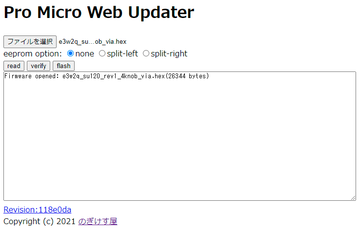
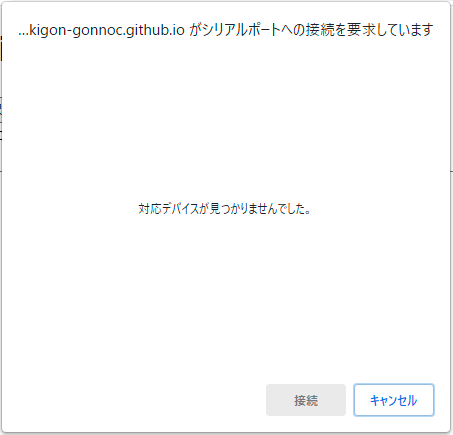
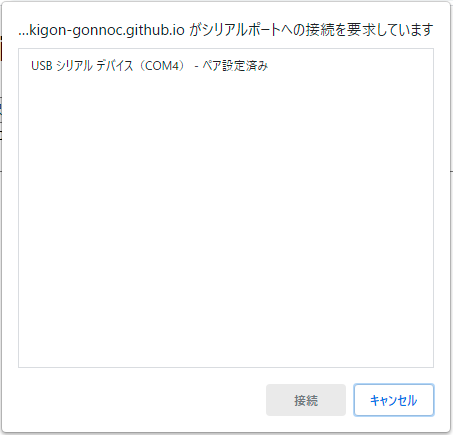
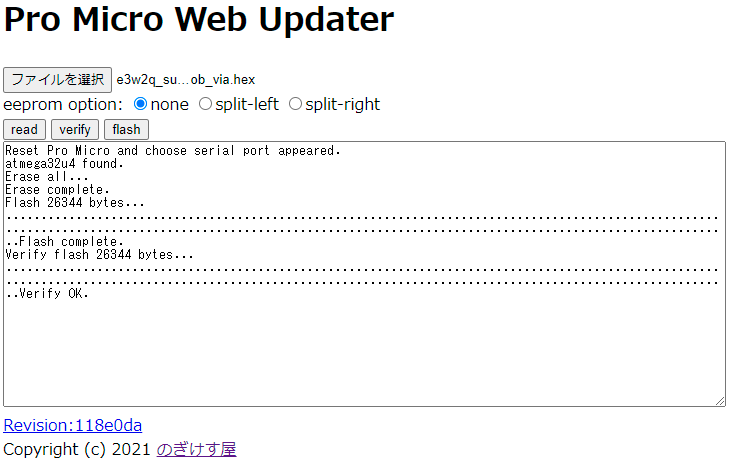
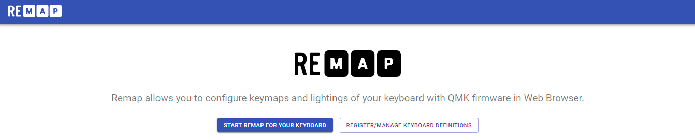
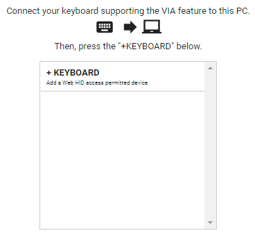
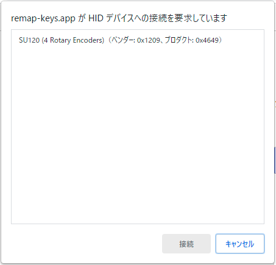
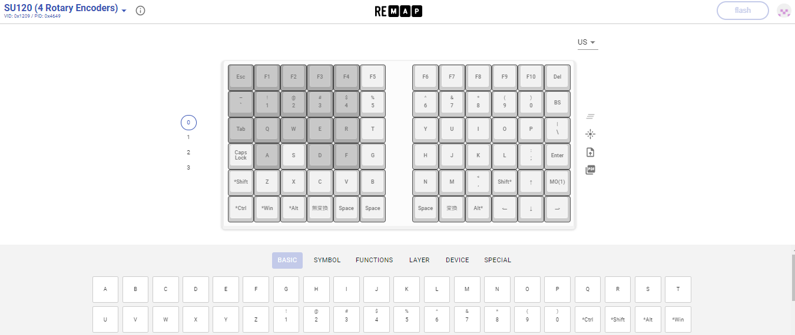

# SU120のキー割り当てをRemapで書き換える

2021/03/13

<!-- TOC -->

- [SU120のキー割り当てをRemapで書き換える](#su120のキー割り当てをremapで書き換える)
    - [概要](#概要)
    - [SU120でRemapを使うには](#su120でremapを使うには)
        - [ファームウェアのダウンロード](#ファームウェアのダウンロード)
        - [ファームウェアの書き込み](#ファームウェアの書き込み)
        - [Remapでの書き換え](#remapでの書き換え)
        - [書き換え後の確認](#書き換え後の確認)
    - [Remapに関する各種情報](#remapに関する各種情報)
    - [所感](#所感)

<!-- /TOC -->

## 概要

Remapはブラウザから対応ファームウェアの載った自作キーボードのキー割り当てを変更できるツールです。

設定してみてとても便利だったので手順を紹介します。

## SU120でRemapを使うには

### ファームウェアのダウンロード

最初にRemap対応のファームウェアをPro Microに書き込む必要があります。

ファームウェアは、ロータリーエンコーダーの数によって3種類あります。以下から該当するもののリンクを右クリックして保存してください。

- [su120-keyboard/e3w2q_su120_rev1_via.hex at master · e3w2q/su120-keyboard](https://github.com/e3w2q/su120-keyboard/blob/master/firmware/e3w2q_su120_rev1_via.hex?raw=true)
  - ロータリーエンコーダー無し、最大120キー用ファームウェア
- [su120-keyboard/e3w2q_su120_rev1_2knob_via.hex at master · e3w2q/su120-keyboard](https://github.com/e3w2q/su120-keyboard/blob/master/firmware/e3w2q_su120_rev1_2knob_via.hex?raw=true)
  - ロータリーエンコーダー片手側1個、両手で2個、最大96キー用ファームウェア
- [su120-keyboard/e3w2q_su120_rev1_4knob_via.hex at master · e3w2q/su120-keyboard](https://github.com/e3w2q/su120-keyboard/blob/master/firmware/e3w2q_su120_rev1_4knob_via.hex?raw=true)
  - ロータリーエンコーダー片手側2個、両手で4個、最大72キー用ファームウェア

### ファームウェアの書き込み

ダウンロードしたファームウェアをせきごんさんのPro Micro Web UpdaterでPro Microに書き込みます。

- [Pro Micro Web Updater](https://sekigon-gonnoc.github.io/promicro-web-updater/index.html)

SU120をPCに接続した状態で、Pro Micro Web Updaterにアクセスし、ダウンロードしたhexファイルを選択し、「flash」をクリックします。

シリアルポートへの接続要求の画面が出ます。

SU120のリセットスイッチを押し、出てきたUSBシリアルデバイスを選択して「接続」をクリックします。

するとファームウェアが書き込まれます。

以下のサリチル酸さんの解説記事も参考になります。

- [（初心者編）自作キーボードにファームウェアを書き込む - 自作キーボード温泉街の歩き方](https://salicylic-acid3.hatenablog.com/entry/qmk-toolbox#%E3%83%80%E3%82%A6%E3%83%B3%E3%83%AD%E3%83%BC%E3%83%89%E3%81%97%E3%81%9F%E3%83%95%E3%82%A1%E3%83%BC%E3%83%A0%E3%82%A6%E3%82%A7%E3%82%A2%E3%82%92%E3%82%A2%E3%83%83%E3%83%97%E3%83%AD%E3%83%BC%E3%83%89%E3%81%99%E3%82%8B)

### Remapでの書き換え

- [Remap](https://remap-keys.app/)

SU120をPCに接続した状態で、RemapのWebサイトにアクセスし、「START REMAP FOR YOUR KEYBOARD」をクリックします。

「+KEYBOARD」をクリックします。

HIDデバイスへの接続要求の画面が出ます。
書き込んだファームウェアによって、

- SU120
- SU120 (2 Rotary Encoders)
- SU120 (4 Rotary Encoders)

のいずれかが表示されますので、選択して「接続」をクリックします。

キー割り当てを変更できる画面が表示されます。

画面上のキーボードのちょっと色の濃い部分は、基板1枚をそのまま使った際のキー範囲です。

使わない部分のキー割り当てはそのままでも構いません。

キー割り当てを変更して右上の「flash」をクリックすると、変更されます。

以下のサリチル酸さんの解説記事がとても詳しいです。

- [（初心者編）Remapを使ってキーマップを書き換えよう - 自作キーボード温泉街の歩き方](https://salicylic-acid3.hatenablog.com/entry/remap-manual#Remap%E3%81%A7%E3%81%A7%E3%81%8D%E3%82%8B%E3%81%93%E3%81%A8)

なお、ロータリーエンコーダーのキー割り当てを変更したい場合は、今までどおりQMK Firmwareの該当部分を修正して使ってください。

### 書き換え後の確認

QMK Configuratorのテストモードが便利です。

- [QMK Configurator](https://config.qmk.fm/#/test)

手順は以上です。

## Remapに関する各種情報

- [Remap](https://remap-keys.app/)
  - RemapのWebサイトです。
- [（初心者編）Remapを使ってキーマップを書き換えよう - 自作キーボード温泉街の歩き方](https://salicylic-acid3.hatenablog.com/entry/remap-manual)
  - 自作キーボード界の進捗がすごい人、サリチル酸さんのRemap紹介ページです。Remapの概要からRemapを使ってキー割り当てを変更する手順までスクリーンショット入りで詳しく書かれています。RemapのWebサイト自体わかりやすくてある程度直感的に触れますが、概観したい際やちょっと詰まった際に見ると知りたいことがだいたい載っています。
- [（設計者向け）VIA対応のファームウェアを作ろう - 自作キーボード温泉街の歩き方](https://salicylic-acid3.hatenablog.com/entry/via-support)
  - 同じくサリチル酸さんのページ。VIA対応ファームウェアとVIA対応のJSONを作るとRemap対応できますので、ここを見ながら必要なものを作るとRemap対応できます。
- [RemapにキーマップJSONの登録する方法について - 自作キーボード温泉街の歩き方](https://salicylic-acid3.hatenablog.com/entry/remap-manual#Remap%E3%81%AB%E3%82%AD%E3%83%BC%E3%83%9E%E3%83%83%E3%83%97JSON%E3%81%AE%E7%99%BB%E9%8C%B2%E3%81%99%E3%82%8B%E6%96%B9%E6%B3%95%E3%81%AB%E3%81%A4%E3%81%84%E3%81%A6)
  - サリチル酸さんのRemap紹介ページの最後のほうに作ったファームウェアとJSONをRemapに登録する方法がスクリーンショット入りで解説されています。
- [remap-keys](https://discord.com/invite/uf7v5DruMB)
  - RemapのDiscordコミュニティです。RemapのWebサイトの一番下にリンクがあります。
- [remap-keys/remap: Keymap Customization Web app for your keyboard.](https://github.com/remap-keys/remap)
  - Remapはオープンソースで開発されています。GitHubのプロジェクトページがこちらです。2021年3月2日にClosed Beta制限が解除されたのですが、[クローズされたIssue](https://github.com/remap-keys/remap/issues?q=is%3Aissue+is%3Aclosed)を見てみてください。今も怒涛の勢いで開発が進んでいます。
- [ウェブブラウザからキーマップを書き換える「WebVIA」を開発中です](https://www.eisbahn.jp/yoichiro/2020/12/webvia.html)
  - Remap開発者のおひとり、洋一郎さんの、Remapを開発している途中の記事です。このときはWebVIAというコードネームでした。開発のきっかけなどが書かれています。
- [Remap Open Betaを公開しました](https://www.eisbahn.jp/yoichiro/2021/02/remap_open_beta.html)
  - Remap Open Beta公開時の機能説明の記事です。今はOpen Beta制限が解除されて、キーボード作者であれば自分のキーボードを登録できるようになっています。

## 所感

[Pro Micro Web Updater](https://sekigon-gonnoc.github.io/promicro-web-updater/index.html)、[Remap](https://remap-keys.app/)、[QMK Configurator](https://config.qmk.fm/#/test)と、ブラウザだけであらかた設定でき、とても便利になりました。

このようなツールを公開いただき、とてもありがたいです。

[一覧へ](../)