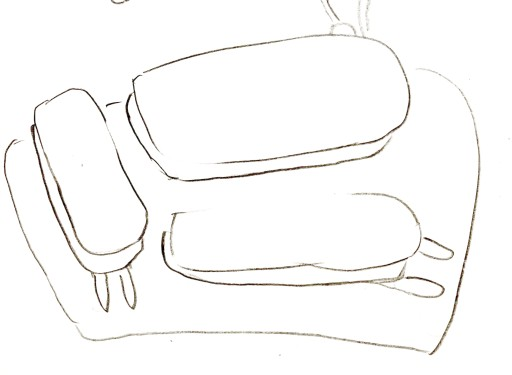

# 調整可能なキーボード、Pangaeaを作っています

2021/08/02

## 概要

Pangaeaという物理キー配置の調整が可能な自作キーボードのプロジェクトを進めています。

<small>Photo by @otahinosame</small>

## きっかけ

6月5日にオタヒーのサメさん（[@otahinosame](https://twitter.com/otahinosame)）がTwitterでつぶやきました。

<blockquote class="twitter-tweet">
SU120とBS Flexの中間みたいな、既に部分的な配列ができてる基板同士をつなげ合わせて好きなサイズのキーボードを組み立てるキットがあったらよさそう。 カラムスタッガードの親指だけ好きな角度にするとか、小指の長さに合わせて端の2列のずれ量だけ変えるとか
&mdash; オタヒーのサメ (@otahinosame) <a href="https://twitter.com/otahinosame/status/1400957887719960577?ref_src=twsrc%5Etfw">June 4, 2021</a></blockquote> 
SU120は、私が設計した自作キーボードの試行ができる基板です。

[自作キーボード基板SU120の紹介 - e3w2q.github.io](https://e3w2q.github.io/9/)

BS Flexは、正式名はBrownSugar Flexと言い、アーサー㌠さん（[@KokToH_kuro](https://twitter.com/KokToH_kuro)）の複数のモジュールを接続することでキーレイアウトを変えられるキーボードです。

[BrownSugar Flex - BrownSugarキーボードショップ - BOOTH](https://brownsugar.booth.pm/items/2774693)

[初めて設計したキーボードが変態になったので紹介する - Qiita](https://qiita.com/koktoh/items/33bc10043a4e49e84ed8)

このオタヒーのサメさんのつぶやきにk2さん（[@k2\_\_\_\_\_\_\_\_\_\_\_](https://twitter.com/k2___________)）と私（[@e3w2q](https://twitter.com/e3w2q)）が反応し、この3人でプロジェクトを進めています。

3人の自作キーボードとのかかわり方は以下のとおりです（私の印象です）。

オタヒーのサメさん： Twitterで自作キーボードの写真を投稿しあう[#KEEB_PD](https://twitter.com/hashtag/KEEB_PD)の1周年記念大会で優勝した以下の写真を見てもらえたら一発で「ああ……」とわかるとおり、自作キーボード沼の底を泳ぐ……サメ？イカ？

<blockquote class="twitter-tweet">
1年間 Keyboards: <a href="https://twitter.com/hashtag/DZ60?src=hash&amp;ref_src=twsrc%5Etfw">#DZ60</a> <a href="https://twitter.com/hashtag/AJisai74?src=hash&amp;ref_src=twsrc%5Etfw">#AJisai74</a> <a href="https://twitter.com/hashtag/KaWaii?src=hash&amp;ref_src=twsrc%5Etfw">#KaWaii</a> kusamakura <a href="https://twitter.com/hashtag/sphh_jp?src=hash&amp;ref_src=twsrc%5Etfw">#sphh_jp</a> <a href="https://twitter.com/hashtag/JP60SS?src=hash&amp;ref_src=twsrc%5Etfw">#JP60SS</a> <a href="https://twitter.com/hashtag/CorneChocolate?src=hash&amp;ref_src=twsrc%5Etfw">#CorneChocolate</a> <a href="https://twitter.com/hashtag/Jones?src=hash&amp;ref_src=twsrc%5Etfw">#Jones</a> <a href="https://twitter.com/hashtag/GPK60_46A?src=hash&amp;ref_src=twsrc%5Etfw">#GPK60_46A</a> <a href="https://twitter.com/hashtag/UT47_2?src=hash&amp;ref_src=twsrc%5Etfw">#UT47_2</a> <a href="https://twitter.com/hashtag/Ergotonic49?src=hash&amp;ref_src=twsrc%5Etfw">#Ergotonic49</a> <a href="https://twitter.com/hashtag/cool844?src=hash&amp;ref_src=twsrc%5Etfw">#cool844</a> <a href="https://twitter.com/hashtag/ALETH42?src=hash&amp;ref_src=twsrc%5Etfw">#ALETH42</a> <a href="https://twitter.com/hashtag/Sesame?src=hash&amp;ref_src=twsrc%5Etfw">#Sesame</a> <a href="https://twitter.com/hashtag/Acperience12?src=hash&amp;ref_src=twsrc%5Etfw">#Acperience12</a> <a href="https://twitter.com/hashtag/ATTACK25?src=hash&amp;ref_src=twsrc%5Etfw">#ATTACK25</a>/ <a href="https://twitter.com/hashtag/NumATTACK16?src=hash&amp;ref_src=twsrc%5Etfw">#NumATTACK16</a> <a href="https://twitter.com/hashtag/Soyuz?src=hash&amp;ref_src=twsrc%5Etfw">#Soyuz</a><a href="https://twitter.com/hashtag/KEEB_PD?src=hash&amp;ref_src=twsrc%5Etfw">#KEEB_PD</a> <a href="https://twitter.com/hashtag/KEEB_PD_R53?src=hash&amp;ref_src=twsrc%5Etfw">#KEEB_PD_R53</a> <a href="https://twitter.com/hashtag/%E8%87%AA%E4%BD%9C%E3%82%AD%E3%83%BC%E3%83%9C%E3%83%BC%E3%83%89?src=hash&amp;ref_src=twsrc%5Etfw">#自作キーボード</a> <a href="https://t.co/c5tILEiW7Q">pic.twitter.com/c5tILEiW7Q</a>
&mdash; オタヒーのサメ (@otahinosame) <a href="https://twitter.com/otahinosame/status/1416699268572729348?ref_src=twsrc%5Etfw">July 18, 2021</a></blockquote> 
k2さん：割と早い時期にSU120で普段遣いキーボードを作り、しかもそれを自分に合うように日々カスタマイズして使っておられる。ひとつのものを自分の手に合うように調整して使い続けているところがすごい。またSU120を使い倒してもらっていて、ありがたすぎて足を向けて寝られない。

<blockquote class="twitter-tweet">
本日のセットアップ<a href="https://twitter.com/hashtag/SU120?src=hash&amp;ref_src=twsrc%5Etfw">#SU120</a><a href="https://twitter.com/hashtag/%E3%82%B9%E3%83%A9%E3%82%A4%E3%83%89%E6%A3%9A?src=hash&amp;ref_src=twsrc%5Etfw">#スライド棚</a> <a href="https://t.co/20iByNNt4b">pic.twitter.com/20iByNNt4b</a>
&mdash; k2 (@k2___________) <a href="https://twitter.com/k2___________/status/1414841361325445120?ref_src=twsrc%5Etfw">July 13, 2021</a></blockquote> 
e3w2q：自作キーボードのカスタマイズ性が好きでSU120やte96といった試行用基板を作ったりしている人。カスタマイズの自由度と組みやすさはトレードオフな関係にありますが、サメさんのアイデイアは自由度を残しつつも組みやすくもある、面白いアイディアだなと思って参加しました。

## キーボード名

可動式の各パーツを大陸に見立て、大陸移動説のPangaeaから名前を取りました。

オタヒーのサメさんの発案で、残り2人とも諸手を挙げて賛成しました。仕組みを表したとてもいいネーミングだと思います。

## アイディア出しから試作まで

アイディア出し

<small>Sketch by @otahinosame</small>

可動方式の検討

<small>Sketch by @otahinosame</small>

<small>Sketch by @otahinosame</small>

物理キー配列の検討

ロゴ案

<small>Sketch by @otahinosame</small>

基板設計

紙での確認

<small>Photo by @k2\_\_\_\_\_\_\_\_\_\_\_</small>

<small>Photo by @k2\_\_\_\_\_\_\_\_\_\_\_</small>

## 試作機

キー動作確認、ファームウェア作成

<small>Photo by @otahinosame</small>

組み立て

<small>Photo by @otahinosame</small>

SU120パーツで1キー、ロータリーエンコーダを追加した場合

<small>Photo by @k2\_\_\_\_\_\_\_\_\_\_\_</small>

## 今後の予定

試作機で出た修正点を踏まえた2号機を設計中です。

☑小指パーツのネジ穴位置変更
☑ピンソケットを変更
☑小指パーツのピン位置変更
☐スリットに目盛りを入れる
☐親指パーツの可動方式を変更
☐ボトムプレート見直し
☐マイコン部とメインパーツを分離可能に

意見を出し合って作っていくのはとても楽しいです。いいものができそうな気がしています！

[一覧へ](../)