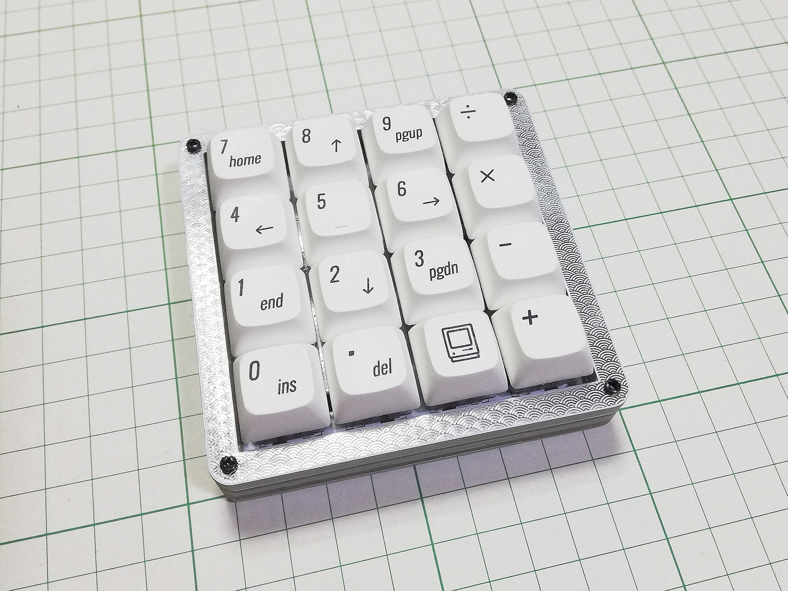
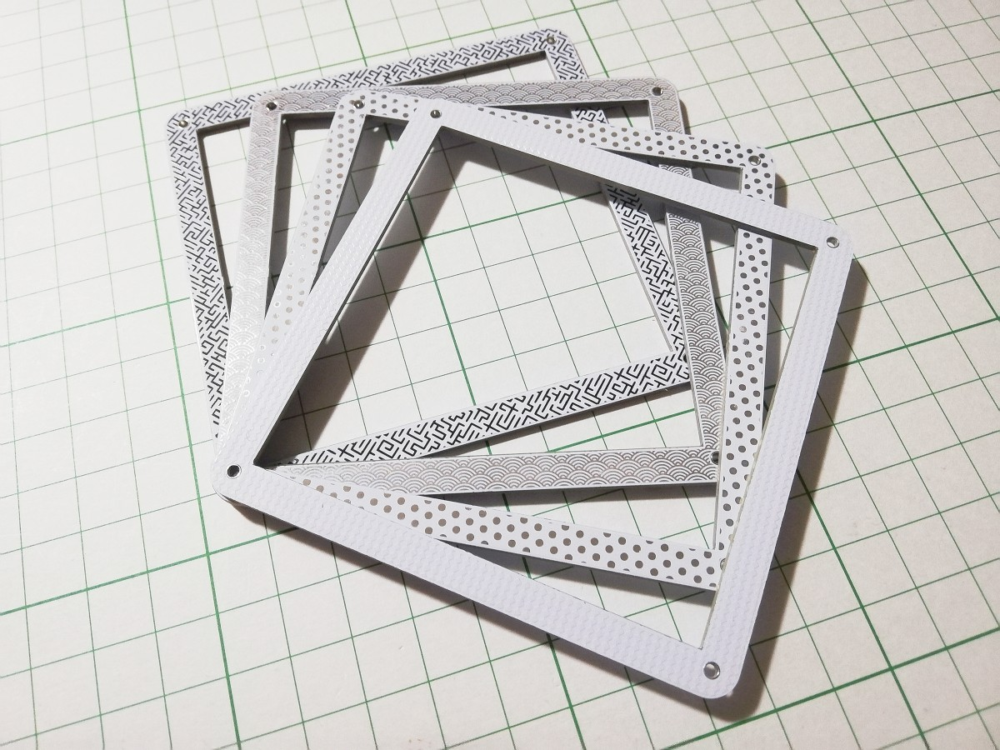
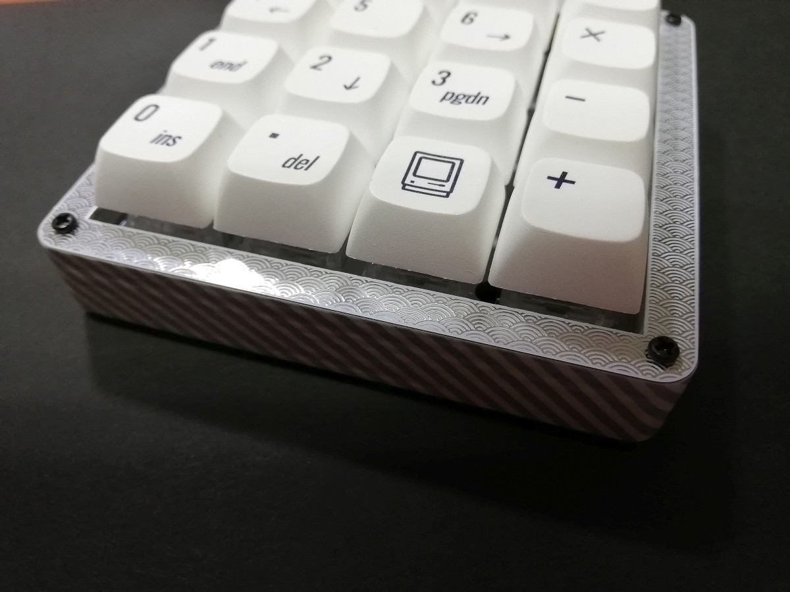
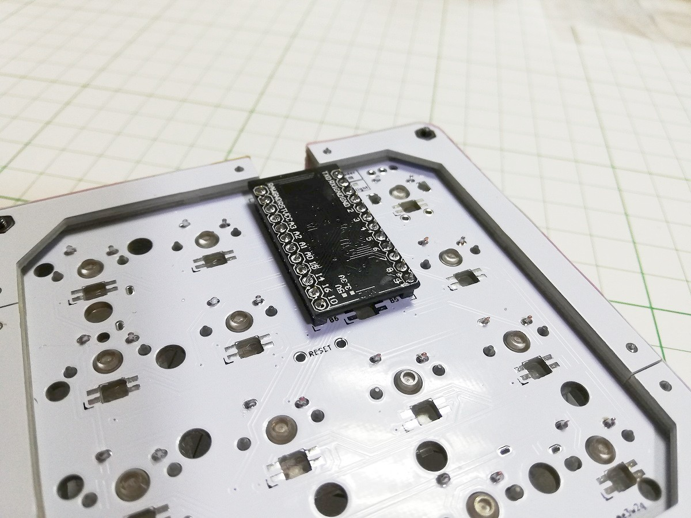
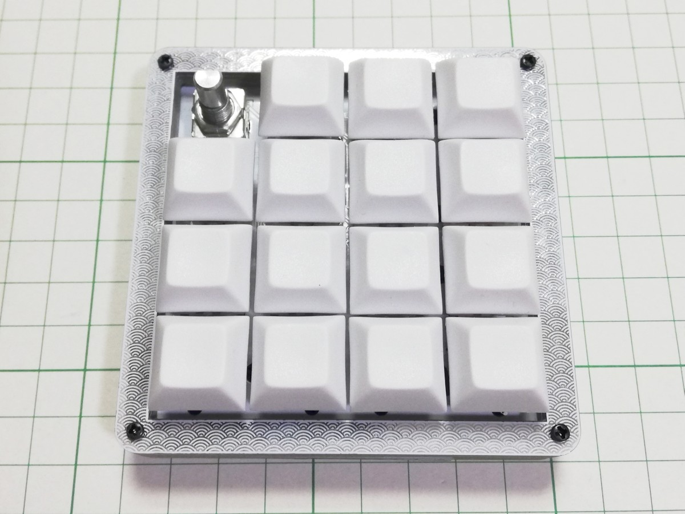
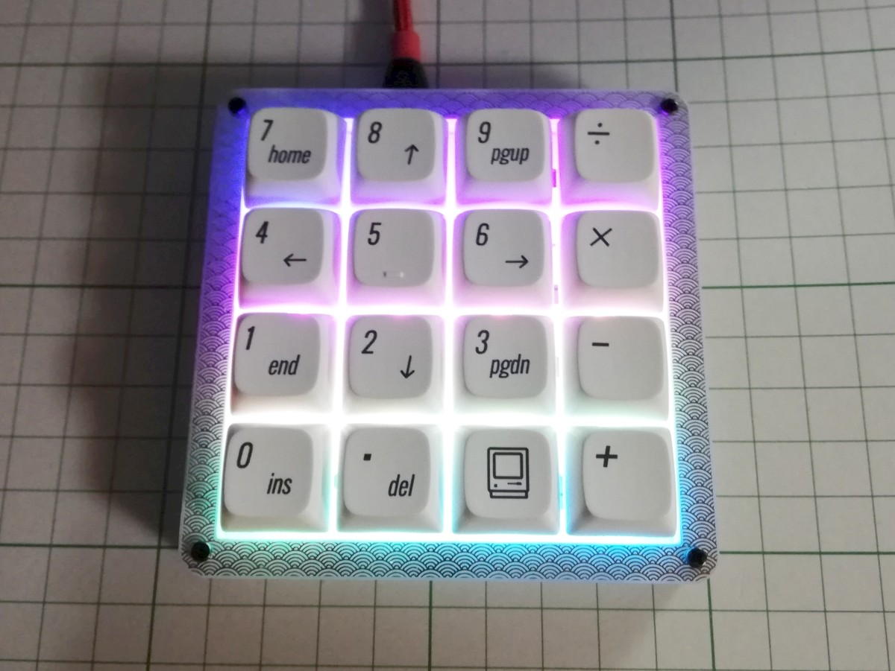
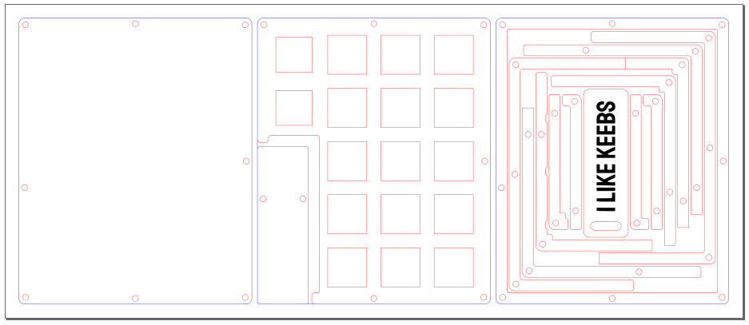
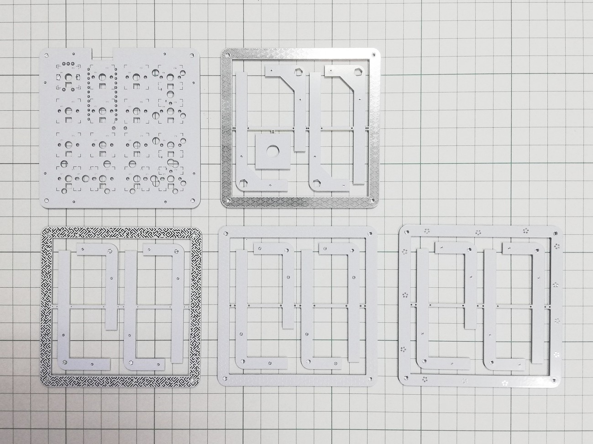

# 着せ替えできるキーパッド、霞襲を作りました

2021/09/06

## 概要

霞襲（かすみがさね）は16キーのキーバッドです。

フレーム用のプレートが4つ付いているので、両面で8種類の柄から、気分に合わせてお好みの模様を選べます。

好きな柄の15mm幅マスキングテープで外周をぐるっと覆うことができます。

ダイオードのはんだ付けが不要です。

プロジェクトページ: [https://github.com/e3w2q/Kasumigasane-keypad](https://github.com/e3w2q/Kasumigasane-keypad)

## オプション

ロータリーエンコーダを1つ装着できます。

バックライトで光らせられます。

仕様するピン数の関係で、ロータリーエンコーダとバックライトは排他です。

## きっかけなど

かわいいキーバッドがほしいと前々から思っていて、折角ならダイオードレスにするとシンプルかつ組み立てが簡単でいいなと思っていました。年明けから設計を開始し、途中いろいろ忙しくて進まなかったりPangaeaに着手してしまったりしましたが、ようやく完成したものです。

SU120用に以前アクリル積層ケースを作った経験を活かして、今回は基板（FR-4）を積み重ねてケースになるようにしました。

ガラスエキポシから連想して霞、それを重ねるので襲（かさね）、合わせて霞襲（かすみがさね）という名前にしました。ただ重ねるだけではなく、柄を着せ替え可能なことから、重ねて着た着物を指す「襲（かさね）」の字を使っています。

枠の柄、外周のマスキングテープの柄、そしてキーキャップと、組み合わせを楽しめるキーパッドになりました。

夏の衣替えには間に合いませんでしたが、冬の衣替えに間に合ってよかったです。

[一覧へ](../)