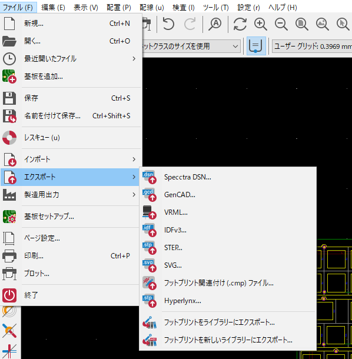
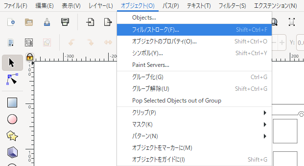
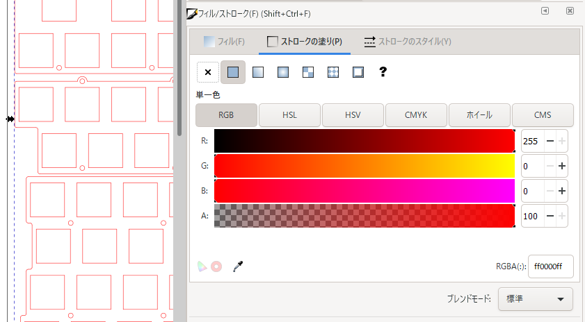
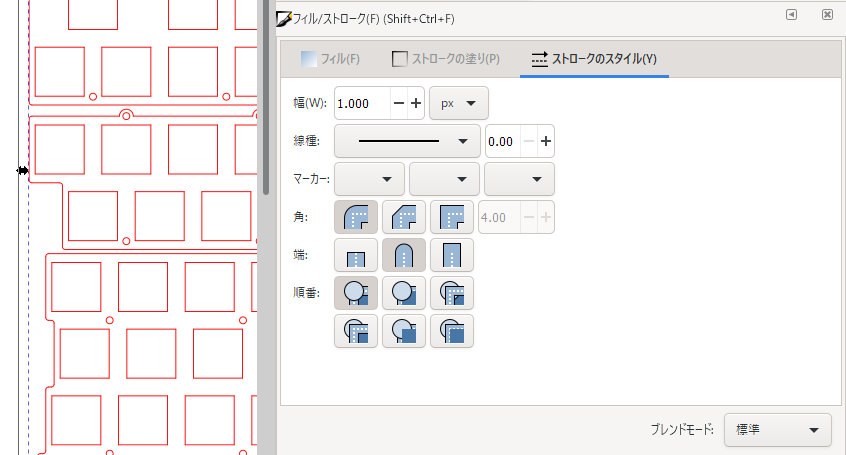

# 自作キーボードのトッププレートをレーザーカットサービスで発注する方法のメモ

2021/11/16

## Webサービスを使ってデータを作る

[Keyboard Layout Editor](http://www.keyboard-layout-editor.com/)で作ったレイアウトでプレートを出力するサービスがあります。

- [Plate & Case Builder - swillkb](http://builder.swillkb.com/)
  - SVG, DXF, EPSでの出力が可能
  - たまにサービスが落ちていることがある
- [ai03 - Keyboard Plate Generator](https://kbplate.ai03.com/)
  - DXFでの出力が可能

## KiCadでデータを作る

ネジ穴も一緒に出力したいならKiCadを使う方法があります。

参考：魔王様の記事 [いろいろなトッププレートの作り方 - topplate_tips](https://swanmatch.github.io/topplate_tips/)

出力の際には、ファイル→エクスポート→SVGで、SVG形式で出力できます。

DXFやPDFで出力したい場合は、ファイル→プロットから出力できます。

## レーザーカットサービスのルールを確認する

レーザーカットサービスによってルールがあるのでそれを守ります。対応可能なファイル形式もそれぞれ異なります。

- [遊舎工房 – 自作キーボード＆レーザーカット](https://yushakobo.jp/)
  - [レーザーカットサービス – 遊舎工房](https://yushakobo.jp/lasercut/)
- [Anymany（エニメニ）](https://anymany.net/)
  - ページ中の「データ作成ガイド」を参照
- [切断堂 - 切断堂/レーザー加工によりあなた好みの金属板をどこよりも安く早くお届け](https://setsudando.jp/)
  - [自作キーボード用パーツの受注製作 - 切断堂](https://setsudando.jp/news/%E8%87%AA%E4%BD%9C%E3%82%AD%E3%83%BC%E3%83%9C%E3%83%BC%E3%83%89%E7%94%A8%E3%83%91%E3%83%BC%E3%83%84%E3%81%AE%E5%8F%97%E6%B3%A8%E8%A3%BD%E4%BD%9C/)
- [Hardware Manufacturing for PCB, CNC, 3D printing & Molding - Elecrow - Make Your Making Easier](https://www.elecrow.com/services.html)
  - [Acrylic Laser Cutting - Order Online](https://www.elecrow.com/acrylic-cutting.html)
  - [5pcs Wood Laser Cutting Service](https://www.elecrow.com/5pcs-wood-laser-cutting-service.html)
- [Online Laser Cutting Service - Laserboost](https://www.laserboost.com/)
  - [Design Guidelines - LaserBoost](https://www.laserboost.com/design-guidelines/)

## Inkscapeで線種や色を変更する

Inkscapeでファイルを開き、オブジェクト→フィル/ストロークを開く

変更したい線を選択する。全部選択したいならCtrl+A。

選択した状態で、「ストロークの塗り」タブで色を変更します。

Shiftキーを押しながら色をクリックでも変更できます。

選択した状態で、「ストロークの塗り」タブで線の幅と単位を変更できます。

[一覧へ](../)