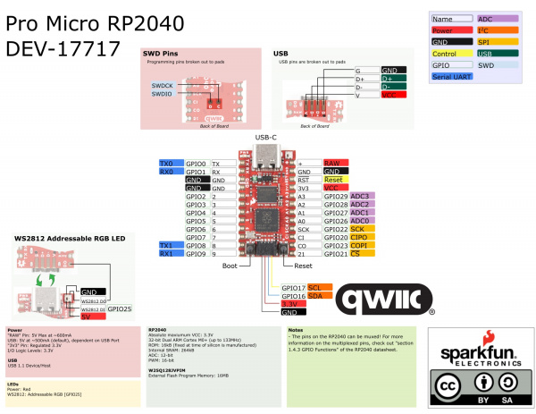

# PRK Firmwareに対応した自作キーボードを設計する際のメモ

2021/12/01

**この記事は書きかけです。未確認の事項を含みます。**

## キーマトリクスに使えるGPIOピン

PRK Firmwareでは以下のように指定します。

```ruby
# Initialize GPIO assign
kbd.init_pins(
  [ 4, 5, 6, 7 ],            # row0, row1,... respectively
  [ 29, 28, 27, 26, 22, 20 ] # col0, col1,... respectively
)
```

[prk_crkbd/keymap.rb at main · picoruby/prk_crkbd](https://github.com/picoruby/prk_crkbd/blob/main/keymap.rb#L18-L22)

数字は、GPIOに割り振られたピン番号です。GNDピンなども含めた総ピンの連番ではないことに注意してください。

Raspberry Pi Picoの場合、GP0～GP28なのでキーマトリクスに使えるのは0～28の最大29本です。


出典：[Raspberry Pi Documentation - Raspberry Pi Pico](https://www.raspberrypi.com/documentation/microcontrollers/raspberry-pi-pico.html)

Pro Micro RP2040の場合、GPIO0～9、GPIO20～23、GPIO26～29なので、キーマトリクスに使えるのは0～9、20～23、26～29の最大18本です。



出典：[Pro Micro RP2040 Hookup Guide - learn.sparkfun.com](https://learn.sparkfun.com/tutorials/pro-micro-rp2040-hookup-guide/all)

## LED用のGPIOピン

PRK Firmwareでは以下のように指定します。

```ruby
# Initialize RGBLED with pin, underglow_size, backlight_size and is_rgbw.
rgb = RGB.new(
  0,    # pin number
  6,    # size of underglow pixel
  21,   # size of backlight pixel
  false # 32bit data will be sent to a pixel if true while 24bit if false
)
```

[prk_crkbd/keymap.rb at main · picoruby/prk_crkbd](https://github.com/picoruby/prk_crkbd/blob/main/keymap.rb#L69-L75)

ここで指定する数字も、GPIOに割り振られたピン番号です。

## 分割キーボードの左右間シリアル通信用のGPIOピン

PRK Firmwareでは以下のようにGPIOに割り振られたピン番号を指定します。

```ruby
# `split=` should happen before `init_pins`
kbd.split = true
kbd.uart_pin = 1
```

デフォルトは1なので、GPIO1を左右間シリアル通信に使用する場合は、

```ruby
kbd.uart_pin = 1
```

と明示的に書かなくても構いません。

左右でLEDの同期を取りたい場合は

```ruby
kbd.mutual_uart_at_my_own_risk = true
```

と書き足します。ただし記事執筆時点では実験的な機能として提供されているので、以下も確認ください。

参考：[Mutual UART communication · picoruby/prk_firmware Wiki](https://github.com/picoruby/prk_firmware/wiki/Mutual-UART-communication)

なお、KMK Firmwareを使った分割キーボードの場合は、右手側と左手側で左右間シリアル通信に使うピンを変えないと動かないようです（マスター側はGPIO1、スレーブ側はGPIO0のようにする）。

<blockquote class="twitter-tweet" data-conversation="none"><p lang="ja" dir="ltr">そのようですね。ピンの役割（TX/RX）は固定のようでして、KMKはなぜかわざわざ逆を指定しようとしているので、余計なことすんな、って感じで逆に指定してあげてピンの役割どおりにしてあげないと行けないっぽいですね。</p>&mdash; Yoichiro Revision 2.5 (@yoichiro) <a href="https://twitter.com/yoichiro/status/1439059178568359937?ref_src=twsrc%5Etfw">September 18, 2021</a></blockquote> <script async src="https://platform.twitter.com/widgets.js" charset="utf-8"></script>
PRK Firmwareはそのようなことは気にせず、どちらも同じGPIO番号でよいとのことです。

<blockquote class="twitter-tweet" data-conversation="none"><p lang="ja" dir="ltr">&gt; 左右間シリアル通信のピンを左右で1-&gt;0のように変える必要はありますか？<br>その必要はありません。<br>左右のマイコンは同じピンを送信あるいは受信に使用します。<br>ファームの起動時、自分にUSBが接続されているかを判断して、適切な役割を自ら初期化するようになっています<br><br>追加質問なんでもどうぞ！</p>&mdash; hasumikin (@hasumikin) <a href="https://twitter.com/hasumikin/status/1465910373375111168?ref_src=twsrc%5Etfw">December 1, 2021</a></blockquote> <script async src="https://platform.twitter.com/widgets.js" charset="utf-8"></script>
## 分割キーボードで左右間通信のためにTRRSコネクタに接続するピン

以下の3つのピンです。3つなので、TRRSケーブルのほかにTRSケーブルも使えます。

- 電源（Raspberry Pi PicoならVBUS、Pro Micro RP2040ならVCC）
- GND
- 信号線として指定したGPIOピン（kbd.uart_pin）

なお、Raspberry Pi Pico を使った分割キーボードで、38ピン目のGNDを左右間通信に使うと動作が不安定になった、という事例を拝見しました。

<blockquote class="twitter-tweet" data-conversation="none"><p lang="ja" dir="ltr">VBUS-&gt;VSYS と GND（38ピン同士）を配線していて、近すぎたせいかノイズ発生してて、めっちゃ動作が不安定でした。GNDを33ピン同士にして VBUS-&gt;VSYS から離したことで、ノイズの影響を受けずに、ちゃんと動作するようになりました。 <a href="https://twitter.com/hashtag/%E8%87%AA%E4%BD%9C%E3%82%AD%E3%83%BC%E3%83%9C%E3%83%BC%E3%83%89?src=hash&amp;ref_src=twsrc%5Etfw">#自作キーボード</a></p>&mdash; Yoichiro Revision 2.5 (@yoichiro) <a href="https://twitter.com/yoichiro/status/1439357283675242501?ref_src=twsrc%5Etfw">September 18, 2021</a></blockquote> <script async src="https://platform.twitter.com/widgets.js" charset="utf-8"></script>
## その他の注意点

VCCとRAWが接続した基板だとPro Micro RP2040はクラッシュするとのことです。

出典：[PRK Firmware: Keyboard is Essentially Ruby - HASUMI Hitoshi - Rabbit Slide Show](https://slide.rabbit-shocker.org/authors/hasumikin/RubyKaigiTakeout2021/)の[14枚目のスライド](https://slide.rabbit-shocker.org/authors/hasumikin/RubyKaigiTakeout2021/13)

## リンク集

- [picoruby/prk_firmware: A keyboard firmware platform in PicoRuby](https://github.com/picoruby/prk_firmware)
  - 公式サイト
- [PRK Firmware: Keyboard is Essentially Ruby - HASUMI Hitoshi - Rabbit Slide Show](https://slide.rabbit-shocker.org/authors/hasumikin/RubyKaigiTakeout2021/)
  - RubyKaigi Takeout 2021のスライド
- [Home · picoruby/prk_firmware Wiki](https://github.com/picoruby/prk_firmware/wiki)
  - 公式Wiki
  - まだ内容は少ないですが、ポイントとなる機能が載っています
- [picoruby/prk_pipigherkin: A keymap for PiPi Gherkin (Gherkin for Raspberry Pi Pico) on PRK Firmware](https://github.com/picoruby/prk_pipigherkin)
  - Raspberry Pi Picoを使ったPiPi Gherkinの作例
  - keymap.rbが一体型キーボードの場合のファームウェアの書き方例として参考になります
- [picoruby/prk_meishi2: Keymap for meishi2 with PRK firmware](https://github.com/picoruby/prk_meishi2)
  - MeishiキーボードにPro Micro RP2040を載せた作例
  - keymap.rbに、キーを押すとフィボナッチ数列を出力したりランダムな英字記号列を出力する書き方が載っています
- [picoruby/prk_claw44: A keymap for Claw44 on PRK Firmware](https://github.com/picoruby/prk_claw44)
  - Crow44ににPro Micro RP2040を載せた作例
  - keymap.rbが分割型キーボードの場合のファームウェアの書き方例として参考になります
- [picoruby/prk_crkbd: A keymap for Crkbd (Corne) on PRK Firmware](https://github.com/picoruby/prk_crkbd)
  - Corne KeyboardにPro Micro RP2040を載せた作例
  - keymap.rbが分割型キーボードの場合のファームウェアの書き方例として参考になります
- [picoruby/prk_helix_rev3: A keymap for Helix rev3 on PRK Firmware](https://github.com/picoruby/prk_helix_rev3)
  - Herix rev3にPro Micro RP2040を載せた作例
  - keymap.rbが分割型キーボード+左右に1個ずつのロータリーエンコーダを置く場合のファームウェアの書き方例として参考になります

[一覧へ](../)

