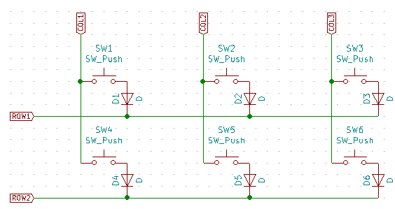
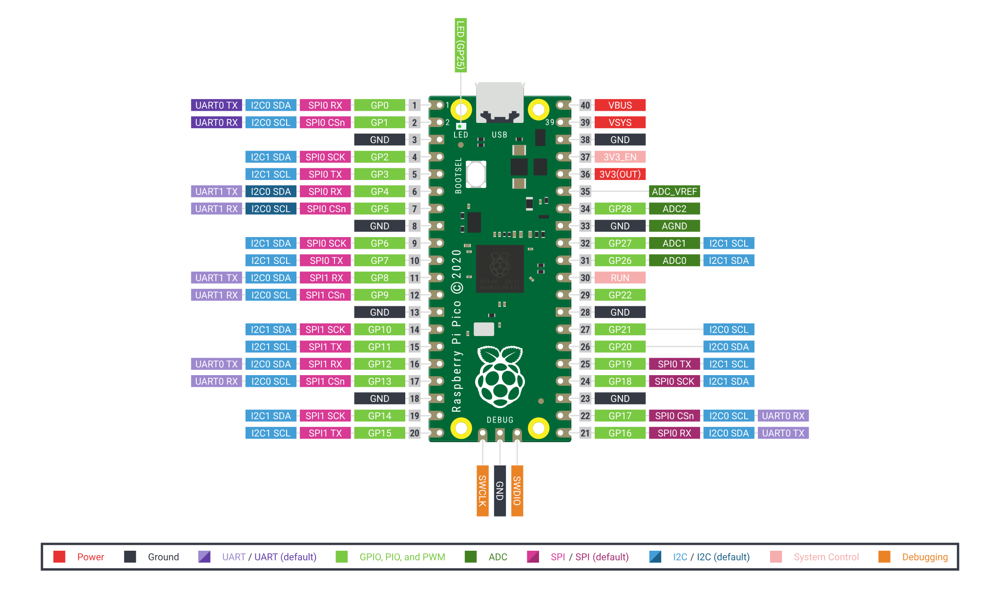

# Raspberry Pi Pico、Pro Micro RP2040を使ってPRK Firmwareに対応した自作キーボードを設計する際のポイント

2021/12/03

これは、[PRK Firmware Advent Calendar 2021](https://adventar.org/calendars/7086)の3日目の記事です。ライセンスはMIT Licenseです。

## キーマトリクスの配線

COL2ROWとなるようにダイオードを配線します。



キーマトリクスに使えるGPIO番号に特に制限はありません。

PRK Firmwareでは以下のように書きます。

```ruby
# Initialize GPIO assign
kbd.init_pins(
  [ 4, 5, 6, 7 ],            # row0, row1,... respectively
  [ 29, 28, 27, 26, 22, 20 ] # col0, col1,... respectively
)
```

[prk_crkbd/keymap.rb at main · picoruby/prk_crkbd](https://github.com/picoruby/prk_crkbd/blob/main/keymap.rb#L18-L22)

数字は、GPIOに割り振られたピン番号です。GNDピンなども含めた総ピンの連番ではないことに注意してください（以下同じ）。

Raspberry Pi Picoの場合、GP0～GP28なのでキーマトリクスに使えるのは0～28の最大29本です。



出典：[Raspberry Pi Documentation - Raspberry Pi Pico](https://www.raspberrypi.com/documentation/microcontrollers/raspberry-pi-pico.html)

Pro Micro RP2040の場合、GPIO0～9、GPIO20～23、GPIO26～29なので、キーマトリクスに使えるのは0～9、20～23、26～29の最大18本です。


出典：[Pro Micro RP2040 Hookup Guide - learn.sparkfun.com](https://learn.sparkfun.com/tutorials/pro-micro-rp2040-hookup-guide/all)

## シリアルLEDの配線

シリアルLEDに、電源、GND、1つのGPIOピンを配線します。

PRK FirmwareではGPIOピンを以下のように指定します。

```ruby
# Initialize RGBLED with pin, underglow_size, backlight_size and is_rgbw.
rgb = RGB.new(
  0,    # pin number
  6,    # size of underglow pixel
  21,   # size of backlight pixel
  false # 32bit data will be sent to a pixel if true while 24bit if false
)
```

[prk_crkbd/keymap.rb at main · picoruby/prk_crkbd](https://github.com/picoruby/prk_crkbd/blob/main/keymap.rb#L69-L75)

使えるGPIO番号に制限はありません。

## 分割キーボードの左右間シリアル通信に使えるGPIOピン

### 基本

PRK Firmwareでは以下のようにGPIO番号を指定します。

```ruby
# `split=` should happen before `init_pins`
kbd.split = true
kbd.uart_pin = 1
```

kbd.uart_pinは、デフォルトで1なので、GPIO1を左右間シリアル通信に使用する場合は、

```ruby
kbd.split = true
```

と書くだけでよいです。

kbd.uart_pinに設定できるのは、RP2040の「UART0 RX」の機能を持つピンです。

- Raspberry Pi Picoなら1,13,17
- Pro Micro RP2040なら1,29
- その他のRP2040を使ったマイコンなら1,13,17,29の全てか一部

Pro Micro RP2040は公式のピンアウト図には29に「UART0 RX」が使えるとは書いてありませんが、RP2040データシート上は使えるはずです。

現在は対応していない、UART1のRXやUART0/1のTXを使えるようにPRKを改修することは、強い要望があれば可能とのことです。

### バージョン0.9.6以降

```ruby
kbd.mutual_uart_at_my_own_risk = true
```

と書き足すことにより、ハードウェアUARTの機能を使わず、ソフトウェア的に実装されたUARTを使うことができます。

これにより、kbd.uart_pinに任意のGPIO番号が利用可能となります。

また、左右のLEDの同期が可能となります。

参考：[Mutual UART communication · picoruby/prk_firmware Wiki](https://github.com/picoruby/prk_firmware/wiki/Mutual-UART-communication)

現在は実験的な機能ですが、問題がなければ正式機能に格上げする予定とのことです。

<blockquote class="twitter-tweet" data-conversation="none"><p lang="ja" dir="ltr">キーボードの個体差などを心配しておりまして、e<br>xperimentalです。<br>現行リリースからしばらく様子を見ます。<br>実用にならないくらい遅いなどの報告がなく、報告があってもその問題に対処できたら、<br>`<a href="https://t.co/5qxYQRofl2">https://t.co/5qxYQRofl2</a>_uart=true` というエイリアスをつくり、正式機能に格上げします。</p>&mdash; hasumikin (@hasumikin) <a href="https://twitter.com/hasumikin/status/1466204446388473859?ref_src=twsrc%5Etfw">December 2, 2021</a></blockquote> <script async src="https://platform.twitter.com/widgets.js" charset="utf-8"></script>
ちなみに、KMK Firmwareを使った分割キーボードの場合は、右手側と左手側で左右間シリアル通信に使うピンを変えないと動かないようです（マスター側はGPIO1、スレーブ側はGPIO0のようにする）。

<blockquote class="twitter-tweet" data-conversation="none"><p lang="ja" dir="ltr">そのようですね。ピンの役割（TX/RX）は固定のようでして、KMKはなぜかわざわざ逆を指定しようとしているので、余計なことすんな、って感じで逆に指定してあげてピンの役割どおりにしてあげないと行けないっぽいですね。</p>&mdash; Yoichiro Revision 2.5 (@yoichiro) <a href="https://twitter.com/yoichiro/status/1439059178568359937?ref_src=twsrc%5Etfw">September 18, 2021</a></blockquote> <script async src="https://platform.twitter.com/widgets.js" charset="utf-8"></script>
この点、PRK Firmwareは実験的な機能をオンにしてもしなくても同じGPIO番号が使えるのはいいところですね（リバーシブル基板が作りやすい、ファームウェアにおいて左右で設定を変えるようなコードを書かなくてよい）。

<blockquote class="twitter-tweet" data-conversation="none"><p lang="ja" dir="ltr">&gt; 左右間シリアル通信のピンを左右で1-&gt;0のように変える必要はありますか？<br>その必要はありません。<br>左右のマイコンは同じピンを送信あるいは受信に使用します。<br>ファームの起動時、自分にUSBが接続されているかを判断して、適切な役割を自ら初期化するようになっています<br><br>追加質問なんでもどうぞ！</p>&mdash; hasumikin (@hasumikin) <a href="https://twitter.com/hasumikin/status/1465910373375111168?ref_src=twsrc%5Etfw">December 1, 2021</a></blockquote> <script async src="https://platform.twitter.com/widgets.js" charset="utf-8"></script>
## 分割キーボードのTRRSコネクタの配線

以下の3つのピンを配線します。3つなので、TRRSケーブルのほかにTRSケーブルも使えます。

- 電源（Raspberry Pi PicoならVBUS、Pro Micro RP2040ならVCC）
- GND
- 信号線として指定したGPIOピン（kbd.uart_pin）

Raspberry Pi Picoの電源ピンとして3V3(OUT)も使えると考えられるとのことです。試した方は結果をPRK作者の[hasumikinさん (@hasumikin)](https://twitter.com/hasumikin)に連絡すると喜ばれると思います。

なお、Raspberry Pi Pico を使った分割キーボードで、38ピン目のGNDを左右間通信に使うと動作が不安定になった、という事例を拝見しました。設計の際には注意するとよいかもしれません。

<blockquote class="twitter-tweet" data-conversation="none"><p lang="ja" dir="ltr">VBUS-&gt;VSYS と GND（38ピン同士）を配線していて、近すぎたせいかノイズ発生してて、めっちゃ動作が不安定でした。GNDを33ピン同士にして VBUS-&gt;VSYS から離したことで、ノイズの影響を受けずに、ちゃんと動作するようになりました。 <a href="https://twitter.com/hashtag/%E8%87%AA%E4%BD%9C%E3%82%AD%E3%83%BC%E3%83%9C%E3%83%BC%E3%83%89?src=hash&amp;ref_src=twsrc%5Etfw">#自作キーボード</a></p>&mdash; Yoichiro Revision 2.5 (@yoichiro) <a href="https://twitter.com/yoichiro/status/1439357283675242501?ref_src=twsrc%5Etfw">September 18, 2021</a></blockquote> <script async src="https://platform.twitter.com/widgets.js" charset="utf-8"></script>
## ロータリーエンコーダ用の配線

ロータリーエンコーダに2つのGPIOピンとGNDを配線します。

キーマトリクスやシリアルLEDに使えるGPIOピンと同様に、使えるGPIO番号に制限はありません。

PRK Firmware側では以下のように指定します。

```ruby
encoder = RotaryEncoder.new(21, 9)
```

ロータリーエンコーダは一体型キーボードなら最大4個まで、分割キーボードならそれぞれの側に2個ずつまで配置できます。この数は要望があれば増やすことは可能とのことです。

<blockquote class="twitter-tweet"><p lang="ja" dir="ltr">ソース上では左右分割型なら各2個まで、一体型なら4個までです。要望があれば上限を増やすことも検討します<br>ただし私自身が複数エンコーダをまだ試せていないのでバグがあるかもしれません。<br>そもそもの回転の検出が甘いかもしれない気がしており、その辺のフィードバックもお聞かせいただきたいです</p>&mdash; hasumikin (@hasumikin) <a href="https://twitter.com/hasumikin/status/1466272813619154947?ref_src=twsrc%5Etfw">December 2, 2021</a></blockquote> <script async src="https://platform.twitter.com/widgets.js" charset="utf-8"></script>
分割キーボードで、左右それぞれにロータリーエンコーダがある場合、以下のように書きます。

```ruby
encoder_left = RotaryEncoder.new(21, 9)
encoder_left.configure :left
encoder_right = RotaryEncoder.new(21, 9)
encoder_right.configure :right
```

Herix rev3基板にPro Micro RP2040を載せた場合のファームウェアが参考になります。

- [prk_helix_rev3/keymap.rb at master · picoruby/prk_helix_rev3](https://github.com/picoruby/prk_helix_rev3/blob/master/keymap.rb)

## その他の注意点

VCCとRAWが接続した基板だとPro Micro RP2040はクラッシュするとのことです。

出典：[PRK Firmware: Keyboard is Essentially Ruby - HASUMI Hitoshi - Rabbit Slide Show](https://slide.rabbit-shocker.org/authors/hasumikin/RubyKaigiTakeout2021/)の[14枚目のスライド](https://slide.rabbit-shocker.org/authors/hasumikin/RubyKaigiTakeout2021/13)

## リンク集

- [picoruby/prk_firmware: A keyboard firmware platform in PicoRuby](https://github.com/picoruby/prk_firmware)
  - 公式サイト
- [PRK Firmware: Keyboard is Essentially Ruby - HASUMI Hitoshi - Rabbit Slide Show](https://slide.rabbit-shocker.org/authors/hasumikin/RubyKaigiTakeout2021/)
  - RubyKaigi Takeout 2021のスライド
- [Home · picoruby/prk_firmware Wiki](https://github.com/picoruby/prk_firmware/wiki)
  - 公式Wiki
  - まだ内容は少ないですが、ポイントとなる機能が載っています
- [picoruby/prk_pipigherkin: A keymap for PiPi Gherkin (Gherkin for Raspberry Pi Pico) on PRK Firmware](https://github.com/picoruby/prk_pipigherkin)
  - Raspberry Pi Picoを使ったPiPi Gherkinの作例
  - keymap.rbが一体型キーボードの場合のファームウェアの書き方例として参考になります
- [picoruby/prk_meishi2: Keymap for meishi2 with PRK firmware](https://github.com/picoruby/prk_meishi2)
  - MeishiキーボードにPro Micro RP2040を載せた作例
  - keymap.rbに、キーを押すとフィボナッチ数列を出力したりランダムな英字記号列を出力する書き方が載っています
- [picoruby/prk_claw44: A keymap for Claw44 on PRK Firmware](https://github.com/picoruby/prk_claw44)
  - Crow44ににPro Micro RP2040を載せた作例
  - keymap.rbが分割型キーボードの場合のファームウェアの書き方例として参考になります
- [picoruby/prk_crkbd: A keymap for Crkbd (Corne) on PRK Firmware](https://github.com/picoruby/prk_crkbd)
  - Corne KeyboardにPro Micro RP2040を載せた作例
  - keymap.rbが分割型キーボードの場合のファームウェアの書き方例として参考になります
- [picoruby/prk_helix_rev3: A keymap for Helix rev3 on PRK Firmware](https://github.com/picoruby/prk_helix_rev3)
  - Herix rev3にPro Micro RP2040を載せた作例
  - keymap.rbが分割型キーボード+左右に1個ずつのロータリーエンコーダを置く場合のファームウェアの書き方例として参考になります

## 謝辞など

PRK作者の[hasumikinさん (@hasumikin)](https://twitter.com/hasumikin)に疑問点をいろいろお尋ねしたところ、丁寧なご説明をいただきました。ありがとうございました！これでRaspberry Pi Picoを使ったキーボードが設計できそうです。あとは厚かましいですがPRKでDuplex Matrixが使えるようになると嬉しいです。

[一覧へ](../)

