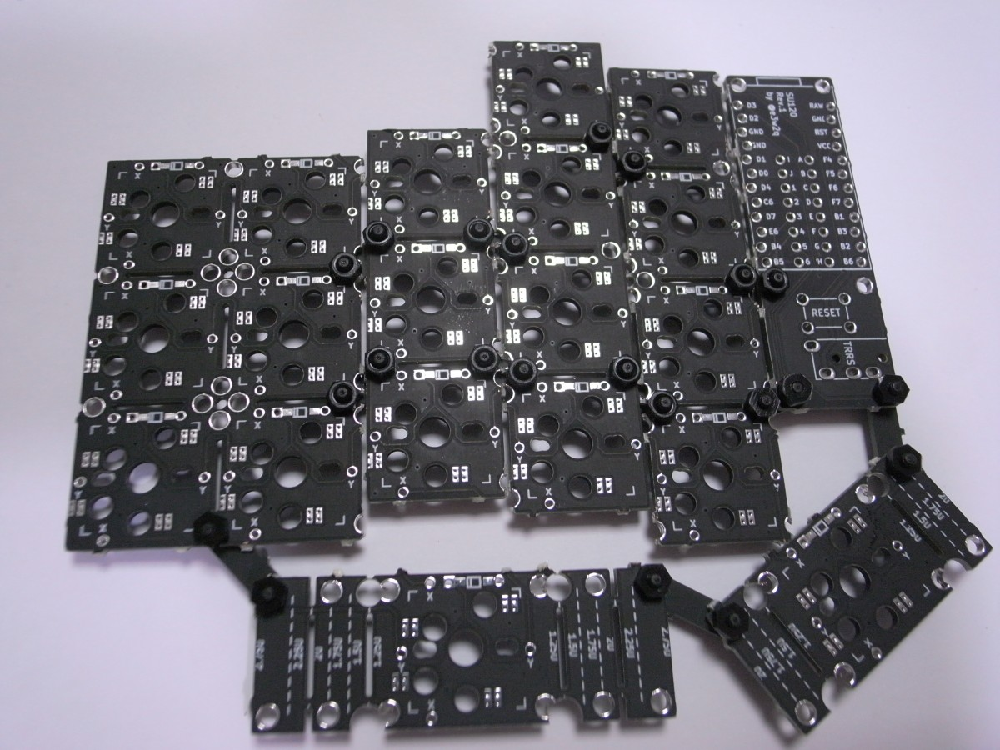

# 自作キーボード基板SU120を公開しました
2019/06/03

キーボードレイアウトを手軽に試行錯誤するための自作キーボード基板SU120を公開しました。

[https://github.com/e3w2q/su120-keyboard](https://github.com/e3w2q/su120-keyboard)

## 特徴
好きな大きさに割った基板と付属のビスケットをM2ネジとナットで固定し、基板間をエナメル線で繋げることにより、キーボードレイアウトを自由に試せます。

そのままでも19キーのキーパッドとして使えます。

## 注意点
現在公開しているのはRev.2です。Rev.1との違いは以下のとおりです。

- Pro Microを表向きに取り付けるようにしていましたが、裏向きに取り付けるように変更しました。
- キースイッチ部分の基板はリバーシブルではありませんが、Pro Micro部分はリバーシブルに使えるようにしました。表として使う面のジャンパーのハンダ付けが必要になります。
- 組んでみるとビスケットは短いものをより多く使うことに気がついたので、ビスケットの数量を変更しました。
- 単純なOrtholinearやRow Staggeredであれば支障なく組めますが、Aliceの折れ部分のようなレイアウトを組むのが困難だったため、試験的にM1.4mmタッピングネジ穴と対応するビスケットを追加しました。

## 今後の予定
当面はビルドガイドとファームウェアを整備していきます。

Rev.2基板が届いたら、検証してRev.3基板に活かします。

いろいろなレイアウトを試せる基板なので、作例も充実させていきたいと思っています。

しかしキーボード試作のための基板を何回も試作しているというのはどうなんだ……。

[一覧へ](../)
