# 調整可能なキーボード、Pangaeaの進捗とICのご案内

2021/12/05

## Pangaea（パンゲア）とは

2021年6月からオタヒーのサメさん、k2さん、私e3w2qの3人で進めている、物理キー配置の調整が可能な自作キーボードのプロジェクトです。

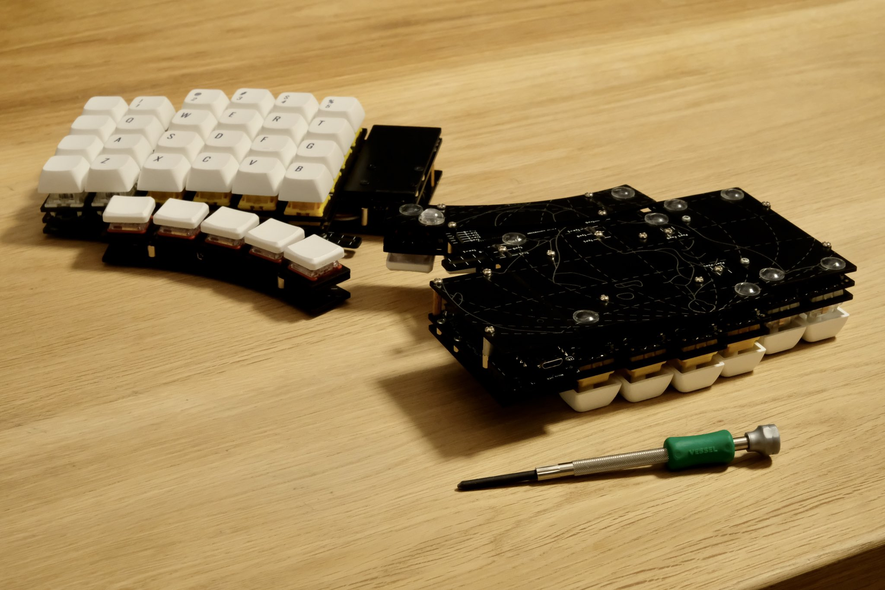

<small>Photo by @otahinosame</small>

特徴は以下のとおりです。

- 分割型のカラムスタッガードの自作キーボードです。
- 親指パーツ、小指パーツが独立しており、縦横方向、回転方向に調整することができます。
- 数字行が不要な場合、切り離して数字行なしで運用できます。
- 親指キーも切り離して4キーや3キーにして運用できます。
- SU120の基板を接続することにより、ファンクションキーやロータリーエンコーダを増設できます。

## これまでの進捗

6～8月の状況についてはこちらの記事をご覧ください。

- [調整可能なキーボード、Pangaeaを作っています - e3w2q.github.io](https://e3w2q.github.io/16/)

### v0.1

8月上旬に試作したv0.1の調整用のスリットは以下のようなものでした。

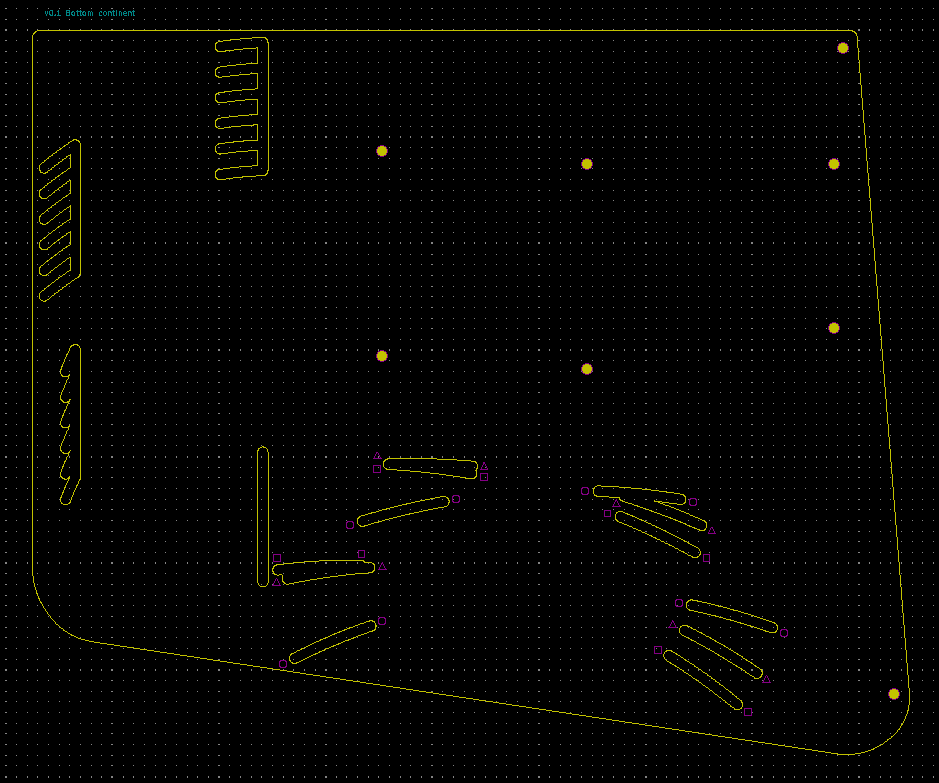

この方式では、親指パーツの左右方向の調整は無段階で行えますが、縦方向は特定の3パターンのみしか調整ができないという難点がありました。

### v0.1.6

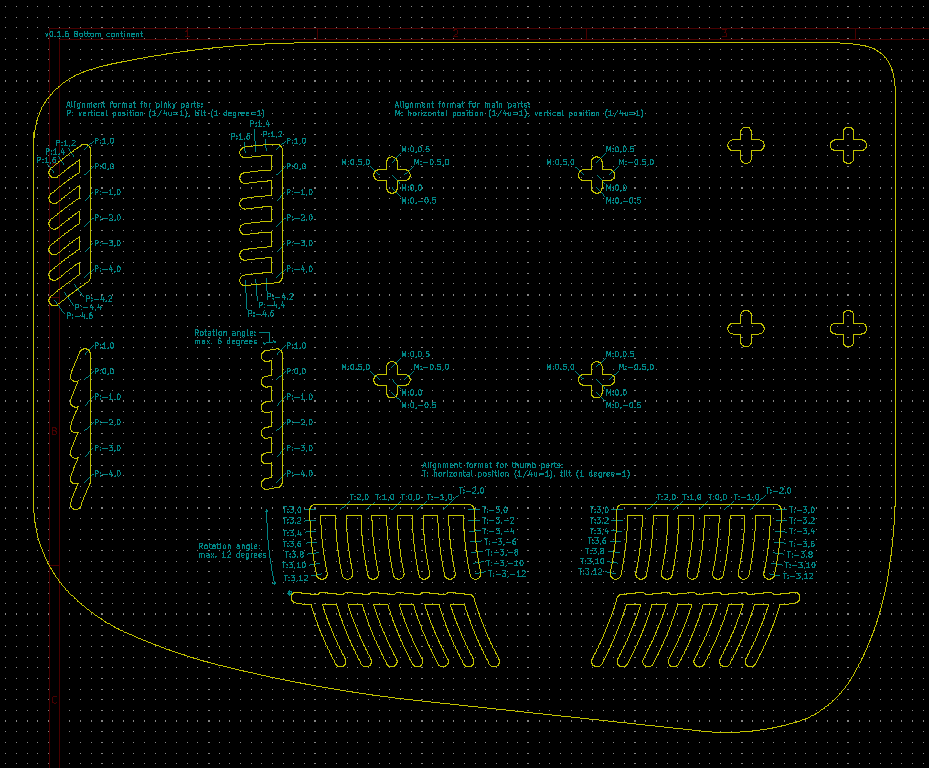

親指パーツの調整機構を小指の調整方式と合わせることにより、縦方向の自由度が増しました。横方向は0.25U刻みで調整できます。

### v0.2.0

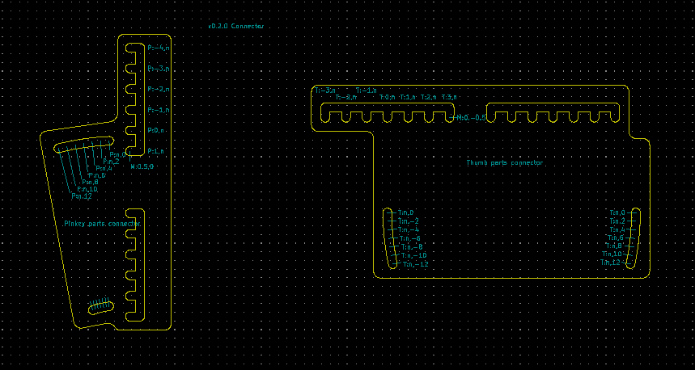

大きいボトムプレートにスリットを入れて調整する方式ではある程度大きな場所が必要になります。それを通常のカラムスタッガード程度の大きさまで小さくするため、接続パーツでメイン基板から親指パーツ、小指パーツへ接続する方式に変更しました。

上の図面のパーツにより、v1.0.6の大きいボトムプレートと同様の可動ができると考えたのですが、サメさんが3Dプリンタで印刷して実際に確認すると、接続パーツ同士が干渉して十分な可動範囲が取れないことがわかりました。スペーサーを噛ませて接続パーツ同士を同一平面上に置かないことにより干渉はしなくなりますが、代償として分厚くなってしまいます。

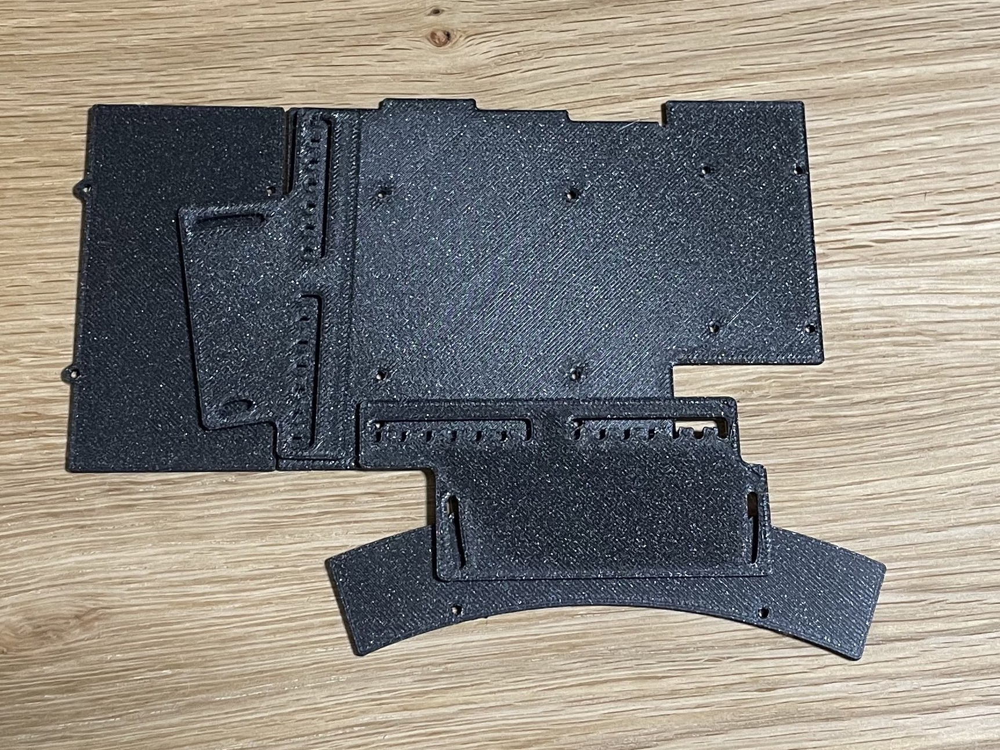

<small>Photo by @otahinosame</small>

### v0.2.6

それはよくないね、ということで接続パーツ同士の干渉を無くすために形状を何度も見直しました。

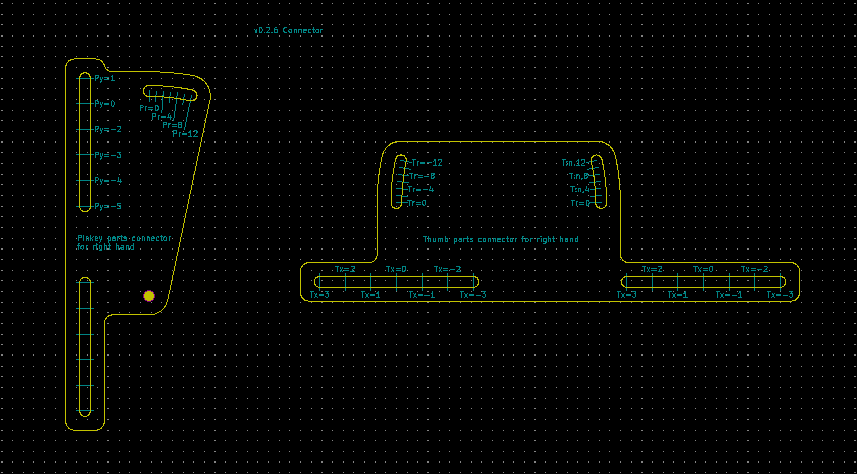

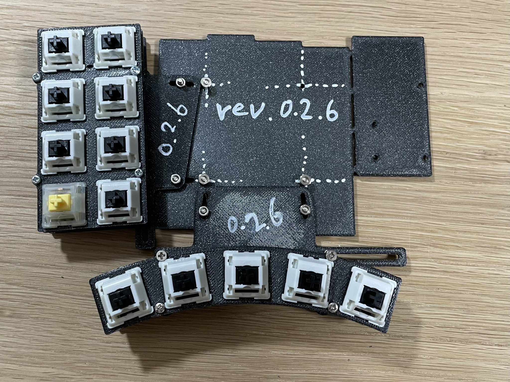

<small>Photo by @otahinosame</small>

v0.2.6の段階で、接続パーツ同士の干渉は完全に無くなりましたが、接続パーツが中央部分のスタンドオフにぶつかります。

### v0.2.7

スタンドオフに干渉しないように接続パーツをさらに調整しました。

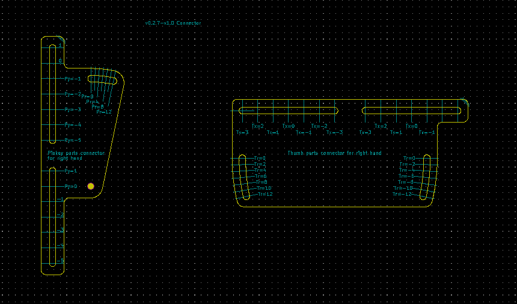

接続パーツ同士、接続パーツとスタンドオフが干渉しないことを念入りにチェック。 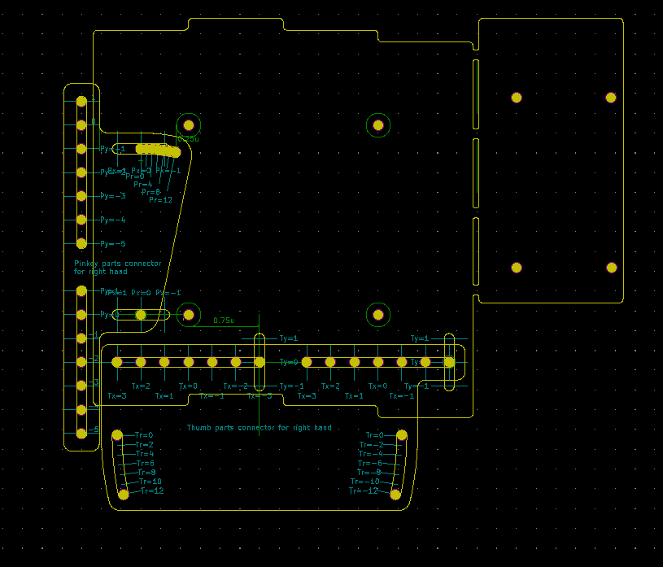 

サメさんが3Dプリントでも確認しました。

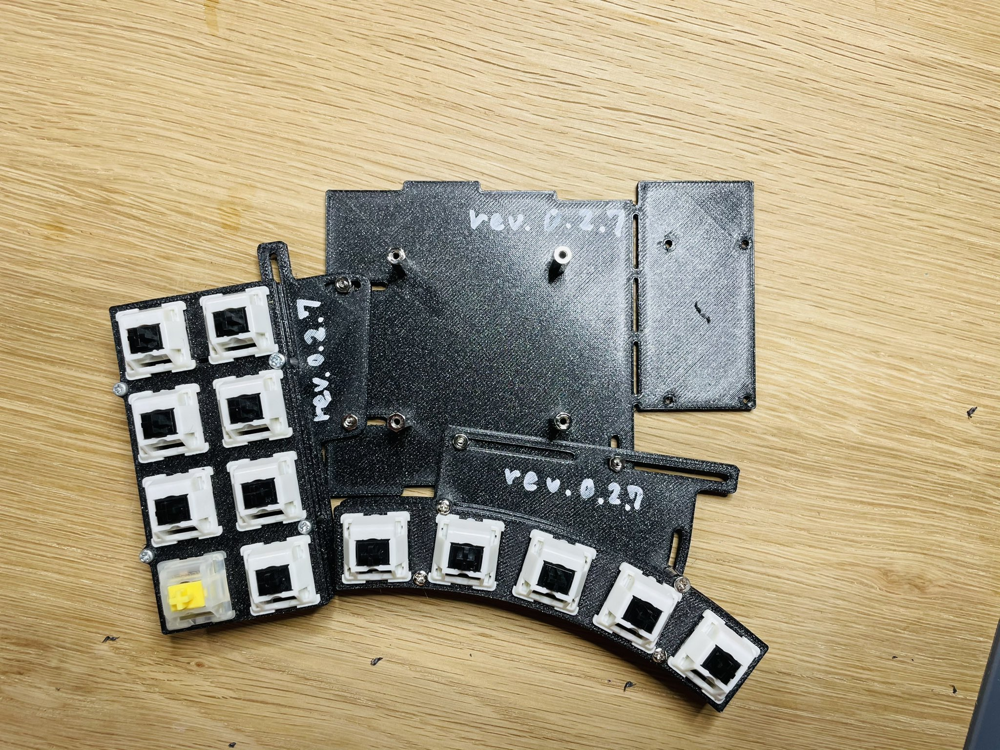

<small>Photo by @otahinosame</small>

大丈夫そうなので、基板を発注し、各自で組み立てました。

v0.2.7からSU120用のビスケットに対応したので、キーの増設が可能です。下のk2さんのメイン使用キーボードでは、ESCキーとロータリーエンコーダが増設されています。

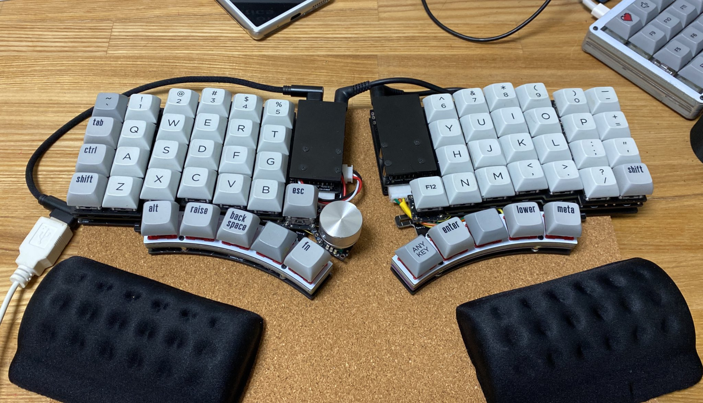

<small>Photo by @k2\_\_\_\_\_\_\_\_\_\_\_</small>

<small>Photo by @otahinosame</small>

### v1.0

調整機構やキーボードとしての使用に問題がないことをv0.2.7で確認できたので、v0.2.7の組み立て、使用の過程で見つかった点を改善し、リリース版としてv1.0としました。

右側がv0.2.7、左側がv1.0です。Pro Micro部分の形状と位置を見直したことにより、コンパクトにまとまりました。

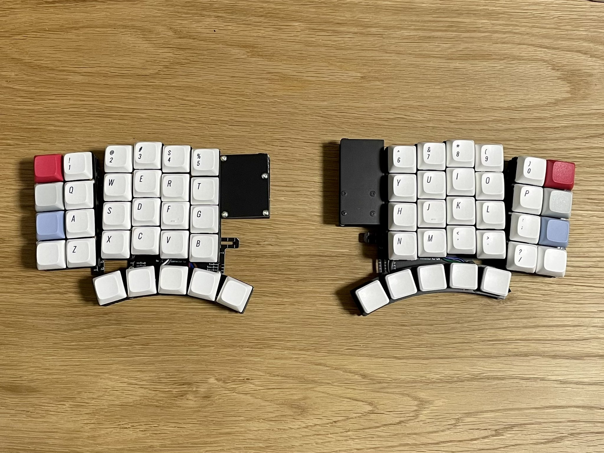

<small>Photo by @otahinosame</small>

MT3 WHITE-ON-BLACK KEYCAP SETを付けた例です。

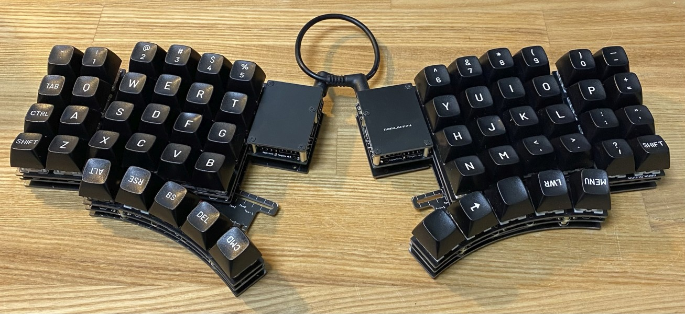

<small>Photo by @k2\_\_\_\_\_\_\_\_\_\_\_</small>

## Interest Checkを実施します

自作キーボードは自由度の高さがメリットの一つです。キーを入れ替えたり、いろいろな形状のキーボードを使ったり。ただ、こと物理キー配置のカスタマイズ性については、

1. 自分の手にあう物理キー配置のキーボードキットを探す
2. 自分でゼロから自作キーボードをつくる（基板設計からやるか、手配線するか）

の2択しかありません。

もちろん、これまでに世に出された自作キーボードキットはそれぞれがよく考えられた物理キー配置であることは間違いないのですが、私達は、1と2の間の新たな選択肢として、自分でゼロから自作キーボードをつくらなくても、一定程度自分の手に合わせた調整が可能なキーボードとして、Pangaeaを世に問いたいと考えています。

これまで大多数の人がロウスタッガードのキーボードを使い続けてきた歴史が示すように、人間側の「慣れ」の力は凄まじいものがあり、一定の物理キー配列に合わせて人が打鍵することは可能です。

しかし、その一方で、エルゴノミクス配列やいろいろなカラムスタッガードの自作キーボードが存在するように、より打ちやすい物理キー配列への欲求も、世の中には存在します。

Pangaeaはそれを一歩進めて、自分が打ちやすい物理キー配列にカスタマイズできる心地よさを、提供したい、

キーボードの贅沢さは高級感や打鍵感だけではなく、好きなタイミングで調整していけるという心地よさもあることを知ってほしい、

と思っています。

話が長くなりましたが、そういう考えで作っているこのPangaeaに、実際どれくらいのニーズがあるのかを把握するため、12/31までInterest Check（IC）を実施します。

ご協力いただける方は、以下のリンクからご意見をお聞かせください。

[[IC] Pangaea Keyboard](https://docs.google.com/forms/d/e/1FAIpQLSd-ynO4e0mi7V9eHIMYt2IivI6Gw1Ayzyii7_HXscVI4WSiJQ/viewform)

なお、Interest Checkの中で、テスターとしてご協力をいただける方も募っています。テスターの募集期間は12/12までですが、応募が多い場合は期限を待たずに募集を締め切ることがあります。もし興味のある方がいらっしゃいましたら、ぜひよろしくお願いします。

[一覧へ](../)