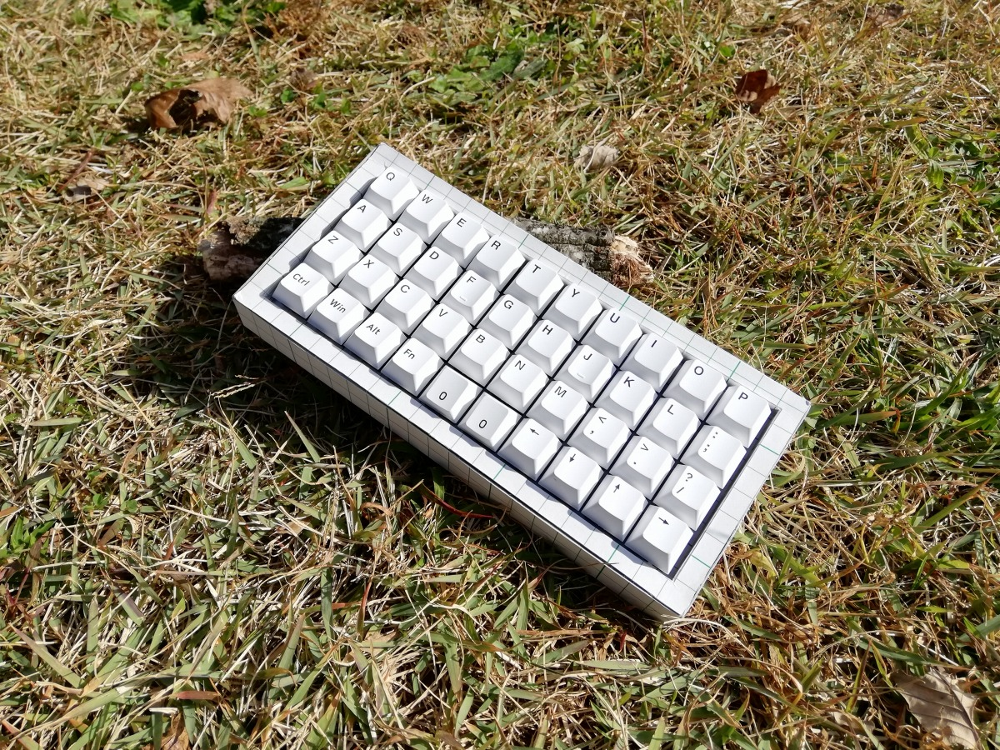

# 私のキーボード写真の撮り方

2021/12/21

これは、[KEEB_PD Advent Calendar 2021](https://adventar.org/calendars/6470)の21日目の記事です。

20日目の記事はMikoさんの[KEEB_PDのおかげで写真撮影する楽しさを思い出せた話](https://miko.info/keeb_pd_2021)でした。読んでいて楽しんでいる感じが伝わってきました。

## KEEB_PDとの関わり

[KEEB_PD](https://twitter.com/search?q=%23KEEB_PD)とは、毎週日曜日19時から21時まで開催されているキーボード写真のコンテストです。

これまで2回、一番多くのふぁぼをいただきました。

<blockquote class="twitter-tweet">
<a href="https://twitter.com/hashtag/KEEB_PD_R22?src=hash&amp;ref_src=twsrc%5Etfw">#KEEB_PD_R22</a> で1番ふぁぼが多かったのはe3w2pさんでした㊗️ おめでとうございます🎉🎉🎉 <a href="https://t.co/qg5SmdM9pd">https://t.co/qg5SmdM9pd</a>
&mdash; にるｺｯﾎﾟﾗ gangstre🐶 (@nillpo) <a href="https://twitter.com/nillpo/status/1338091417181175810?ref_src=twsrc%5Etfw">December 13, 2020</a></blockquote> 
<blockquote class="twitter-tweet">
<a href="https://twitter.com/hashtag/KEEB_PD_R39?src=hash&amp;ref_src=twsrc%5Etfw">#KEEB_PD_R39</a> で1番ふぁぼが多かったのは e3w2q さんでした！㊗️ おめでとうございます🍾🎉🎈🎊 <a href="https://t.co/9q3XHWaUhu">https://t.co/9q3XHWaUhu</a>
&mdash; にるｺｯﾎﾟﾗ gangstre🐶 (@nillpo) <a href="https://twitter.com/nillpo/status/1381215613641613320?ref_src=twsrc%5Etfw">April 11, 2021</a></blockquote> 
回を重ねるごとに参加者が増え、最多ふぁぼを狙うのは難しくなってきていると思いますが、この記事では私のKEEB_PD写真の撮り方を説明します。

つよつよなカメラを持っている人向けというよりは、いいカメラがないけどKEEB_PDに参加してみたい人向けの内容かなと思います。

## 撮影機材

Huawei P20 Liteという2018年発売のAndroidスマートフォンです。

iPhoneをお使いの方は、Sixeightさんの6日目の記事、[機材がなくてもなんとかなるキーボードの手抜き撮影](https://blog.nishimu.land/entry/2021/12/06/033242)も参考になります。

## 私の撮り方

室内だといい背景を用意したり光量を確保したりする必要があるので、KEEB_PD投稿用の写真はだいたい外で撮ります。

直射日光があればスマートフォンのカメラでもそれなりにそれなりの写真ぽくなる気がします。

室内でいい背景が用意できなかったりする場合にもおすすめです。

低い位置から撮って周りの景色を入れるといい感じになります。

その辺に落ちているものを小道具に使ったりすることもできます。例えばこの日は木の枝が落ちていました。

木の枝と枯れ葉を使ってこんな写真とか

こんな写真とか。

地面に直接置くことがはばかられる場合は、いい背景を探して

片手持ちして撮る方法があります。

いかがでしょうか。少しでも参考になれば幸いです。

[一覧へ](../)

