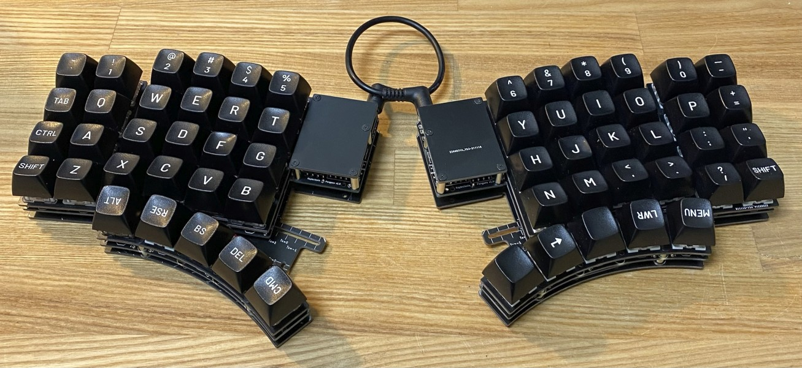

# 調整可能なキーボード、Pangaeaが完成しました

2022/12/24

この記事は[キーボード #2 Advent Calendar 2022](https://adventar.org/calendars/7646)の24日目の記事です。

昨日の記事はキムラシンショクバさんのアクリル積層キーキャップの話（仮）でした。明日の記事はサリチル酸さんの今年のまとめです。

## Pangaea（パンゲア）とは

2021年6月からオタヒーのサメさん、k2さん、私e3w2qの3人で進めている、物理キー配置の調整が可能な自作キーボードのプロジェクトです。

これまでのご報告:

- 2021/08/02 [調整可能なキーボード、Pangaeaを作っています](../16/)
- 2021/12/05 [調整可能なキーボード、Pangaeaの進捗とICのご案内](../20/) 

昨年の12月に進捗のお知らせをしてから長いお時間をいただきましたが、改良を重ねて、リリース版といえる完成度に達しましたので、ここにご報告します。

プロジェクトページ: [GitHub - e3w2q/Pangaea-keyboard: Parts adjustable keyboard.](https://github.com/e3w2q/Pangaea-keyboard)

<small>Photo by otahinosame</small>

特徴は以下のとおりです。

- 分割型のカラムスタッガードの自作キーボードです。
- 親指パーツ、小指パーツが独立しており、縦横方向、回転方向に調整することができます。
- さらにカスタマイズしたい場合、不要なキーを切り離したり、SU120の基板でキーを増設したり、設計したパーツを組み合わせたりできます。

Pangaeaという名称は、可動式の各パーツを大陸に見立て、アルフレッド・ウェゲナーが提唱した大陸移動説の中に出てきたパンゲアから名前を取りました（オタヒーのサメさん命名）。

実際に調整している様子は以下をご覧ください。これはひとつ前のバージョンですが、だいたいこんな感じに可動させられます。

<blockquote class="twitter-tweet">
オタヒーのサメさん <a href="https://twitter.com/otahinosame?ref_src=twsrc%5Etfw">@otahinosame</a> 、e3w2qさん <a href="https://twitter.com/e3w2q?ref_src=twsrc%5Etfw">@e3w2q</a> と進めている Pangaea は rev.3 まで進み可動部の変更で調整しやすく安定度も増しました。もうちょっとこのキーがこっちにずれてくれたらいいのに…などしっくりこない方にはよいかもしれません。拡張性もありますが、まずは調整範囲の動画です。 <a href="https://t.co/x6jwgsiEA3">pic.twitter.com/x6jwgsiEA3</a>
&mdash; k2 (@k2___________) <a href="https://twitter.com/k2___________/status/1467442697720188931?ref_src=twsrc%5Etfw">December 5, 2021</a></blockquote> 
とてもありがたいことにこの動画は今でもアクセスが増えており、2週間ほど前に1万アクセスを突破しました。大変お待たせして申し訳ないです！

## Interest Checkとテスターさんによる検証

昨年末にはInterest Check（IC）を実施しました。

Interest Checkには2つの目的がありました。

1つ目は、開発チームが熱量を持って開発しているこのキーボードは実際にニーズがどれだけあるのか確認したいということです。

[ほぼ週間キーボードニュース]([ほぼ週刊キーボードニュース 第135回 キー配置の調節が可能なキーボード「Pangaea」 ほか (12/05) - YouTube](https://www.youtube.com/watch?v=ErXLk3BW79g&t=355s))に取り上げていただいたこともあり、想定をはるかに超える多くの方から好意的なご意見をいただき、開発チームの励みになりました。ご意見いただいた皆様、本当にありがとうございました。

Interest Checkの目的の2つ目は、このキーボートが問題なく組み立ててもらえそうか確認するためにテスターさんを募集することでした。

ありがたいことに、ものすごく多くの方からテスターの応募をいただいて、選ぶに選べなかったのですが、最終的に5人の方にお願いして組んでいただきました。

テスターとして参加いただいた、algさん（[@alg0002](https://twitter.com/alg0002)）、LEN「A-7」さん（[@LENA_Anana](https://twitter.com/LENA_Anana)）、千葉千夏/あずさん（[@azulee](https://twitter.com/azulee)）、Hanachiさん（[@haswellep](https://twitter.com/haswellep)）、Ryoさん（[@Ryo46671803](https://twitter.com/Ryo46671803)）、この場をお借りしてお礼申し上げます。ありがとうございました！

テスターの方々に組み立てていただき、そこで見つかった課題を解消し、「自作キーボードキットの組み立てができる方が、それほどトラブルやストレスなく組み立てできる」と開発チームが判断したのが現バージョンです。

この記事の最後にこれまでの改良についてまとめましたので、そのあたりにもし興味を持っていただけましたらご覧ください。

## Pangeaの特徴

動画を見ていただくのが一番伝わると思いますので、こちらをご覧ください。

このように、親指パーツ、小指パーツを動かして、より自分の手に合った物理キー配置に調整することができます。

今はいろいろな自作キーボードキットがありますので、その中から自分に合ったキーボードを探すこともできます。さらに、より自分に合ったキーボードを求めて自分で設計される方もいらっしゃいます。

Pangaeaはちょうどその中間であり、好きなときに自分の手に合うキー配置に調整することができます。

椅子や靴など、日常において使用機会の多い道具には、固定式のもののほかに、個人で調整できたり、調整してくれるサービスがあったりします。

キーボードも現代人にとっては比較的使用機会の多い道具です。それなら、自分に合わせて調整できるタイプのものがあってもよいような気がしませんか？

椅子の座り心地を確かめながら座面の高さや背もたれの角度を調整するように、Pangaeaではキーボードを使いながら、心地よく使える形に調整していくことができます。

よかったらGitHubに掲載している[ホワイトペーパー](https://github.com/e3w2q/Pangaea-keyboard/blob/main/whitepaper_jp.md)もご覧ください。

### 拡張性

キー配置が調整できるとなると、他にもいろいろ変えたくなるかもしれません。

開発チームのk2さんから、ロータリーエンコーダやアプリ操作用の特殊キーを付けたいという要望があり、私もSU120というくっつけたりカットしたりできるキーボード基板を作っていたので、開発の初期段階から拡張性を意識して設計を行いました。

親指パーツと小指パーツはメインパーツから独立していますので、別パーツに組み替えることができます。例えば小指パーツはサメさんから要望があり、最も端の列を縦方向にずらしたバージョンがあります。

<small>Photo by otahinosame</small>

親指パーツと小指パーツの設計データは[GitHubのプロジェクトページ](https://github.com/e3w2q/Pangaea-keyboard/tree/main/design/pangaea_origin)にMITライセンスで掲載されていますので、それを参考に独自にパーツを設計することもできます。

Interest Checkでは、ファンクションキーがほしいというご要望もありました。これも後日設計データを公開する予定です。

設計まではちょっと……という方でも、SU120のビスケットが接続できるようになっていますので、ちょっとしたキーの追加であれば簡単に行なえます。

PCBにスリットを入れていますので、不要なキーを削ることができます（アクリルなどでボトムプレートを作る必要あり）。

SPIデバイス用のGPIOピンを確保してありますので、がんばったらトラックボールも使えるかもしれません（余力がなくて未検証です）。

## 開発チームの思い

TwitterやAdvent Calendarを見ていると、今年もいろいろなキーボードが自作され、自作キーボードキットが販売され、「自分の手に合うキーボードを自作する」というニーズはありつづけるように思います。

こうした中でPangaeaは、キーボードに自分の手を合わせるのではなく、キーボードを自分の手に合わせる、調整の楽しみを提供したいと思っています。

考え抜かれ、こだわりの詰まったキーボードを組んで使うのはそれ自体とても満足感があるものですが、もう一つの楽しみ方として、物理キー配列を（ある程度）自由に動かせるというのはとても贅沢なことだと思うのです。

この可動式のキーボードを仕上げて公開できたことは望外の喜びです。

開発チーム各人のコメントです。

- e3w2q

  - Pangaeaはパーツが「可動」するので、そのために解決すべきことが多く、「Pangaea以前に設計したキーボードは何て楽だったんだろう……」と何回も思いました。
    途中、くじけそうになったりなかなか時間を取れなかったりしましたが、k2さん、サメさんに支えていただき、完成まで持っていけたので、お二人には感謝しかありません。

- k2さん

  - PCB設計の魔術師e3w2qさんと、柔軟な発想のサメさんにより構造が進化し、組みやすく仕上がってきたと思います。
    Pangaeaはキーの位置を調整できるだけではなくて、部品を交換したり追加したりすることができる仕組みです。開発者向けには今後、拡張部品の作り方をご案内する予定です。 

- オタヒーのサメさん

  - 私ひとりでは想像するだけで終わっていたかもしれません、e3w2qさん、k2さんと良いチームを組めたおかげで、あったらいいなと夢に描いていた自由に調整できる可動式キーボードを実現することができました！
    Pangaeaに触れていろいろ遊ぶことが、新しいキーボードとの出会いを助けたり、独自レイアウト発見のきっかけになったりしたらいいなと思います。

## Pangaeaの入手方法と組み立て方

まず、基板の枚数、部品の個数は以下にまとまっています。

[Pangaea-keyboard/build_guide_jp.md at main · e3w2q/Pangaea-keyboard · GitHub](https://github.com/e3w2q/Pangaea-keyboard/blob/main/build_guide_jp.md#%E5%BF%85%E8%A6%81%E3%81%AA%E9%83%A8%E5%93%81%E3%81%AE%E7%A2%BA%E8%AA%8D)

基盤製造業者に発注するためのガーバーファイルは以下にあります。

[Pangaea-keyboard/products/pangaea_origin at main · e3w2q/Pangaea-keyboard · GitHub](https://github.com/e3w2q/Pangaea-keyboard/tree/main/products/pangaea_origin)

発注方法は、例えばJLCPCBの場合であればサリチル酸さんが詳しく記事にまとめていらっしゃいますので参考にしてください。

[JLCPCBの発注方法を解説するよ！ - 自作キーボード温泉街の歩き方](https://salicylic-acid3.hatenablog.com/entry/jlcpcb-order#%E3%82%AC%E3%83%BC%E3%83%90%E3%83%BC%E3%83%87%E3%83%BC%E3%82%BF%E3%82%92%E3%82%A2%E3%83%83%E3%83%97%E3%83%AD%E3%83%BC%E3%83%89%E3%81%99%E3%82%8B)

部品の入手先は以下に載せています。

[Pangaea-keyboard/bom_list_jp.md at main · e3w2q/Pangaea-keyboard · GitHub](https://github.com/e3w2q/Pangaea-keyboard/blob/main/bom_list_jp.md)

基板、部品ともに揃ったら、以下のビルドガイドを参照して組み立ててください。

[Pangaea-keyboard/build_guide_jp.md at main · e3w2q/Pangaea-keyboard · GitHub](https://github.com/e3w2q/Pangaea-keyboard/blob/main/build_guide_jp.md)

自作キーボードを組み慣れている方は、以下の資料もご覧ください。

[Pangaea-keyboard/quick_build_guide.md at main · e3w2q/Pangaea-keyboard · GitHub](https://github.com/e3w2q/Pangaea-keyboard/blob/main/quick_build_guide.md)

## 今後の展望

現バージョンのPangaeaでは、開発チームの3人がやりたいこと、ほしい機能を盛り込みましたが、開発チームのほかに使う人が出てくることで、開発チームが考えていなかった新しい使い方やパーツが生まれてくるといいなあと思っています。

もちろん開発チームも現バージョンで開発終了とせず、拡張パーツの開発など、改善を続ける予定です！

## おまけ:これまでのあゆみ

このキーボードのコンセプト「物理的に調整可能なキーボード」は非常に明快なのですが、公開できるまでの完成度に持っていくには、多くのチャレンジがありました。

興味を持った人がこの可動式キーボードを組んでもらえるようにするという目標に向けて、改良を重ねてきましたので、そのあたりについて触れておきます。

### v0.1

最初はこのサメさんのスケッチから設計を始めました。

<small>Sketch by otahinosame</small>

<small>Photo by k2</small>

最初のバージョンでは、ボトムプレートにスリットを入れ、各パーツをスライドさせる方式を採用しました。パーツを可動させるための一番素直な方式だと思います。

実際これで作ってみると、この方式ではスリットの入れ方に制約が多く、十分な可動域を確保しにくいという問題がありました。簡単にいうとパーツが決まった線路の上しか走れないので、ちょっと物足りない感じです。もっと自由にパーツを動かしたい！

また、ボトムプレートが大きいため、コンパクトな分割キーボードを見慣れていると、ちょっと圧迫感がありました。机が大きくてある程度大きなキーボードが置ける人しか興味を持ってもらえないのではないかとの懸念がありました。

### v0.2

<small>Photo by otahinosame</small>

v0.1の課題を解決するため、ボトムプレート上での調整機構ではなく、調整用の接続パーツを挟む方式に変更しました。

言葉で書くとこれだけなんですが、ストレスなく可動できる接続パーツの形状を決めるまでが長かった……。

必要条件は以下のとおりです。

- 接続パーツ同士が干渉しない
- 構造を支えるスタンドオフ（スペーサー）にぶつからない
- 各パーツが十分動かせる可動域となっている
- 気持ちよく可動させられる

設計は私、e3w2qが担当したのですが、机上でこれで問題ナシ！と思っても、k2さんが（時々私も）紙で、サメさん3Dプリント品で組んでみると、重大な問題が見つかったり、そこまででなくても改善点が見つかったりということを何回も何回も繰り返して、これでいいかなというレベルにまで持っていきました。

ちなみに、この接続パーツは島を繋ぐ橋になぞらえてブリッジプレートと呼んでいます。

### v1.0

<small>Photo by k2</small>

可動機構の調整を重ねたv0.2の最終版に、さらに改善を施し、開発チームがもうこれで完成版といえるだろうと考えたバージョンがv1.0です。このときは……そう、このときは3人ともそう思っていたんです……。

このバージョンでInterest Checkを実施し、ニーズ把握とテスターさんの募集を行いました。

テスターの方々に実際に組んでもらうと、いろいろ課題が見えてきました。

ビルドガイドや基板のシルク印刷のわかりにくさは当然改善するとして、開発チームが一番問題だと感じたのは各パーツへの結線でした。

v1.0では入手性と汎用性を重視して2.54mmピッチのピンソケットを使うように設計したのですが、

- スイッチソケットの上にピンソケットが重なるので、厚みがある。

- メインパーツと可動パーツに被覆配線が数本走るが、これも厚みの原因となっている。

  キーボードの厚みを抑えようとすると、配線が重ならないよう注意して組み立てる必要がある。

- 配線をはんだ付けすると、可動させたときに断線しやすい。

という問題がありました。

下の写真はRyoさんの作例です。このように熱収縮チューブを使ったりホットボンドを使ったりして配線の取り回しに配慮すると使用には問題ないのですが、それをこれから作る人に求めるのはちょっと厳しいかなと考えました。

開発チームは何回も試作して新規に組み立てる人の視点が無くなってきていたので、テスターさんに組んでみてもらって本当によかったです。

<small>Photo by Ryo</small>

また、v1.0ではボトムプレートの上に接続パーツ（ブリッジプレート）を重ねていました。この方式だと可動させる際に内側のナットを緩める必要があり、PCB製のレンチを同梱していました。

この機構に対し、LEN「A-7」さんからは、v1.0の基板を送ってほとんど間を開けずに、そのまま製品化できるレベルの可動機構のアイディアが送られてきました。やばすぎるので一部分のみ掲載しますが、これめっちゃすごくないですか。LEN「A-7」さんは[「星使いセレナ」を連載中](https://pocket.shonenmagazine.com/episode/3270375685396434191)の漫画家さんなのですが、こんな設計もできるなんて何者だ…と思いました。LEN「A-7」さんの発想力に触れたい方は星使いセレナを読みましょう。私は発売中の2巻まで読みました。

また、HanachiさんはPangaea v1.0にインスピレーションを受けて[Ergotonic F24](https://hanachiya.booth.pm/items/4101008)という可動式のキーボードを作られています。めちゃかっこいいので興味のある方はぜひ見てみてください（[ドキュメント](https://hanachi-ap.github.io/ergotonic_f24/)にも書かれていますが、変形機構はPangaea開発チーム承諾済みです）。

### v1.1

<small>Photo by otahinosame</small>

v1.0の配線の問題を解決するため、k2さんが中心になってコネクタの選定を検討しました。考慮した主なポイントは以下のとおりです。

- スイッチソケットの間に収まる小ささ
- 配線の細さ、やわらかさ
- 入手しやすさ（半導体不足のあおりで品切れが多い時期だった）
- はんだ付けがそれほど得意でなくても問題なくできるか

最終的に、これらの条件をバランスよく満たすものとして、1.0mmピッチのSHコネクタが選定されました。

これにより組立て難易度が、一般的な自作キーボードキットを組み立てできる方でもできるぐらいになりました。下の図ではマスキングテープで束ねたり、絶縁テープで位置を固定したりしていますが、見栄えや取り回しのしやすさのためであり、必須ではありません（おすすめする程度）。

また、LEN「A-7」さんの可動機構は私の開発力とPCBの加工精度では難しかったのですが（もし組み立てキットではなく製品として売る気なら実現すべきアイディアでした）、ボトムプレートからのスペーサーと可動機構を一体化するアイディアはとても参考になり、部品数を減らして組立てやすくするために採用させていただきました。ありがとうございました。

接続パーツ（ブリッジプレート）もボトムプレートの上ではなく、一番下にしました。これでネジをゆるめて調整してネジ締めするということが簡単にできるようになり、どの角度に調整したか目盛りも見やすくなりました。

これでもう完成って言っていいよね……？

### v1.2

<small>Photo by otahinosame</small>

時間及び空間的な制約によりプロジェクトをなかなか進められず、数ヶ月お時間をいただきました。

その間、テスターとして参加いただいたalgさんは[SQU4REkb-6](https://alglabnet.booth.pm/items/3698627)、[Joker8](https://booth.pm/ja/items/4171330)を、千葉千夏/あずさんは[TRPGオンラインセッションで便利に使えるかもしれないミニキーボード](https://azulee.booth.pm/items/4087407)を頒布されたりしていました。よかったら見てみてください。

v1.2では、v1.1で見つかった問題点の修正を行いました。主なものでは、採用したSHコネクタにケーブルが差しやすくなるよう、コネクタの位置を微調整しています。

また、v1.1では各パーツを可動させたときに、親指パーツの角と小指パーツの角がぶつかるケースがありました。気持ちよく可動させていたのにぶつかると、ちょっとだけストレスを感じます。機構上、目一杯動かすとぶつかるのは仕方ないところなのですが、もう少し気持ちよく可動させられるように親指用の調整パーツ（ブリッジプレート）を見直しました。

ちなみにv0.2からv1.2までのブリッジプレートの変遷は以下のとおりです。

シルク印刷で「R」が裏返っているのは、右手側を裏から見ていることを指しています。このほかにもPangaeaではPro Microカバーやバックライトの透過の仕方など、目立たないところも手を入れてありますので、入手された方に「おっ」と思っていただけたら幸いです。

[一覧へ](../)