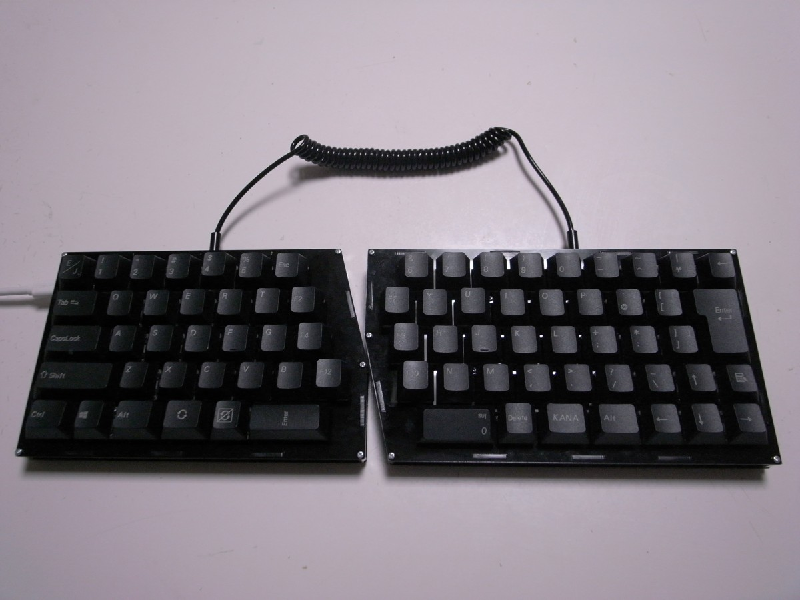
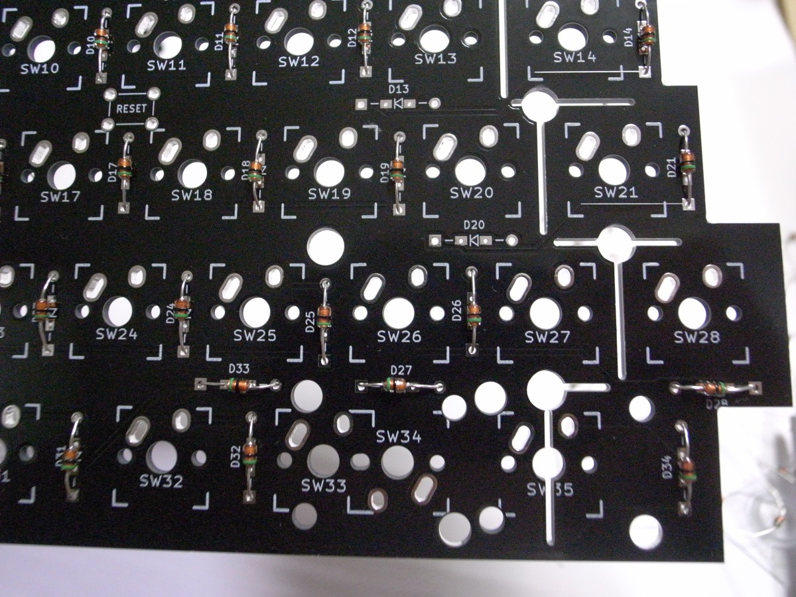
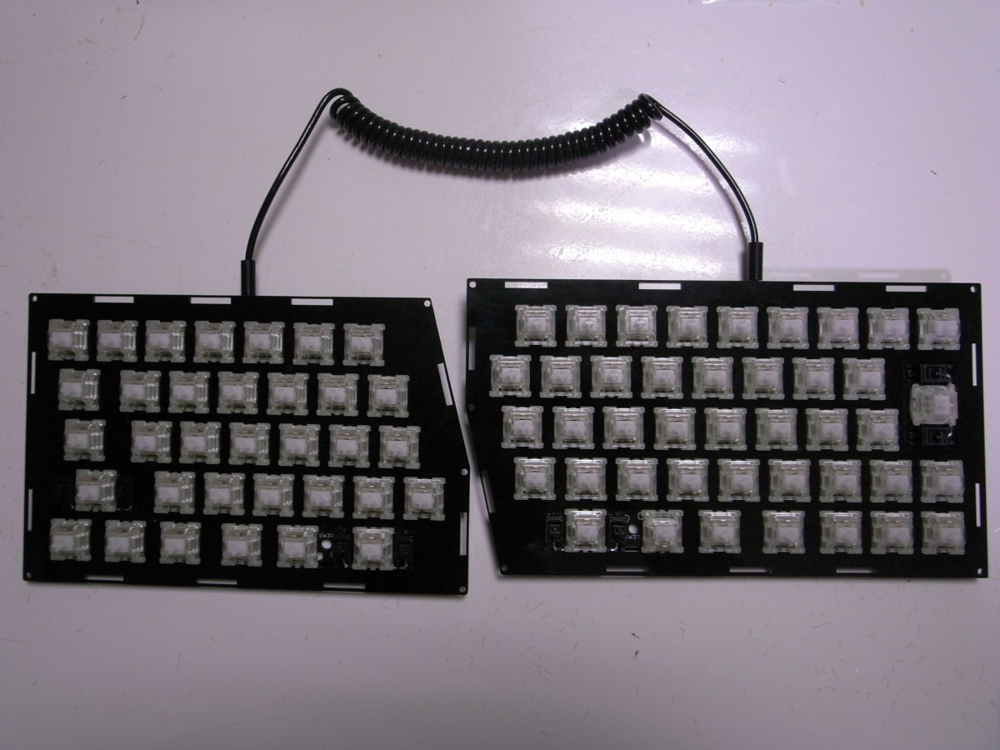

# Nin76 Build Log

2019/06/26

JIS配列の分割型自作キーボードキット[Nin76](https://masahikosawada.github.io//keyboards/nin76.html)の[試作機](https://masahi-shop.booth.pm/items/1370844)を組みました。

[組み立てガイド](https://slides.com/masahikosawada/nin76/#/)はスライドになっており、スマートフォンをマニュアル代わりに手元に置いて作業ができて便利でした。

基本的にはガイドのとおり組んでいけば支障ありませんが、個人的にポイントと思った点を覚えているうちに残しておきます。なお、あくまで試作機での話なので、今後もし量産機が出たら、最新のガイドをよく読んで作ってください。

## 追加であるとよいかもしれない道具

### マスキングテープ

ダイオードをハンダ付けする際に、足の開きが甘いと浮いた状態でハンダ付けしてしまうことがあるので、マスキングテープで固定するとなおよいと思います。

こんな感じで使います。

### リードベンダー

ダイオードのスペースが結構長めに取ってあるので、ダイオードの足を手で曲げたり何かをリードベンダー代わりにして曲げたりすると、上手にきれいに曲げるのが難しいです。

トッププレートの下になるので、完成後は見えません。それでもきれいに作りたい場合は、リードベンダーで足を曲げたほうがよさそうです。

### エキポシ接着剤

USBコネクタのモゲ対策に使います。

100円ショップにも売っています。

## 組み立ての留意点

### Pro Microのモゲ対策とファームウェア書き込み

Pro MicroはUSBコネクタがモゲやすいので、Pro Microにエポキシ接着剤を盛って、簡単にはもげないようにしておくとよいです。

参考1:[ProMicroのモゲ防止ついでにQMK_Firmwareを書き込む - Qiita](https://qiita.com/hdbx/items/2f3e4ddfcadda2a5578e)
参考2:[もげ予防 - Self-Made Keyboards in Japan](https://scrapbox.io/self-made-kbds-ja/%E3%82%82%E3%81%92%E4%BA%88%E9%98%B2)

接着剤を付け始める前にMicro USBコネクタを横から見てください。側面に穴が開いています。この穴に接着剤が入ると端子が入らなくなったり、入りにくくなったりします。

この穴を避けて、つまようじなどで接着剤を付けていきます。

乾いたら、Pro Microを基板に取り付ける前にファームウェアを先に書き込んでおけば段取りよく進められると思います。ファームウェア書き込み済みのPro Microなら不要です。

### ダイオードの取り付け方向の確認

ハンダ付けする前に、もう一度向きを正しく付けているか、見直ししたほうがよいと思います。後に進めば進むほどリカバリーが困難です。縦方向に付ける場合は向きが揃っていますが、横方向に付ける場合は場所によって向きが違います。

例えばSW25と26の下のダイオードは同じ向きで、SW28の下のダイオードはそれらとは逆向きです。

### ダイオードの取り付け漏れの確認

ダイオードの取り付け漏れがないか確認したほうがよいです。私の場合、確認したにもかかわらず一個抜けていて、入力テストの段階で気が付き、後付けしました。

左手側34個、右手側42個ハンダ付けできていればOKです。

## リセットスイッチとTRRSコネクタの取り付け順

組み立てガイドでは、リセットスイッチ→TRRSコネクタの順にハンダ付けするように書いてありますが、リセットスイッチのほうが背が高いので、TRRSコネクタから先にハンダ付けしたほうが基板から浮きにくくてよいと思います。

## コンスルーピンヘッダは使わない

試作機ではPro Micro にコンスルーピンヘッダが付属しています。

が、試作機のPCBはコンスルーピンヘッダに対応する穴径ではなく固定できません。

試作機では、組み立てガイドどおりに普通のピンヘッダを、指定されたタイミングで取り付けないとちょっと詰みます。

### スイッチの動作確認はケース組み立て前に

ケースの箱組をしたあとにスイッチのハンダ付け不良が見つかると、ケースをバラさないといけないので、スイッチとPro Microをハンダ付けした時点で、取り付けた全てのスイッチが反応するか、組み立てガイドに書かれている[Keyboard Tester](https://www.keyboardtester.com/)などで確認しておいたほうがよいです。

### 右手側Pro Microとケースの干渉対策（試作機のみ必要）

試作機は、右手側Pro Microとケースの側面のパーツが組み立てにくいということが購入時の注意点として書かれていました。

確かにそのとおりで、Pro Microを写真のようにちょっとカッターで削ると収まりました。

### ケースの側面パーツの向き

基本的に上下パーツにはまる側面パーツをはめていけばよいだけですが、TRRSコネクタのところは側面パーツを下からはめると側面パーツとTRRSジャックが干渉してケースがたわみます。

ここは上からはめましょう。

Micro USBコネクタ部分は、側面パーツを上から下からどちらからはめても支障ありませんが、ここも上からはめたほうがきれいに見えるかなあと思います。

## 良いと思ったポイント

- 最初にも書きましたが、組み立てガイドがスマートフォンに最適化されていて作業中に参照しやすかったです。
- キースイッチをトッププレートに全部はめてからPCBに付けようすると、ハンダ付けのために基板を裏返したときにスイッチが何個か外れてしまう経験があったので、組み立てガイドに書かれていた隅のキースイッチだけトッププレートにはめてハンダ付けする方式はやりやすかったです。
- 表面実装ではないダイオードを使っていて、LEDバックライトもなく、ハンダ付けが易しめです！

JIS配列の自作キーボードキットとして、このNin76や天高工房さんの[Otaku Sprit](https://skyhigh-works.booth.pm/items/1425423)、すにさんがちょうど[開発中のもの](https://twitter.com/ysni_pub/status/1143503432029892609)などが出てきて、個人的に嬉しい限りです。

[一覧へ](../)