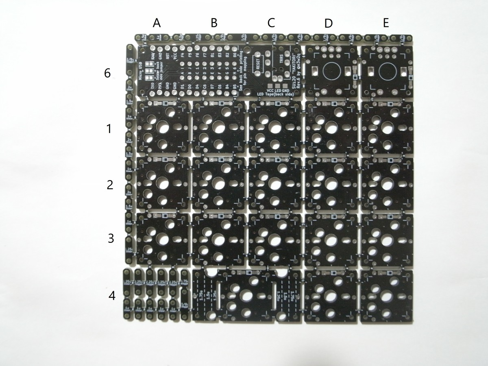

# SU120で好みのキー配置を行う

2019/09/16

SU120では基板間をビスケットで接続することである程度自由なキー配置が可能です。まだドキュメントが未整備なので（すみません）、要点をまとめておきます。

## 基板をつなぐネジ

### 要点

ネジ長5mmのM1.4ネジとナットを併用してください。ネジ頭は皿ネジ以外を選択してください。最近の基板ならナット無しでネジ長3mmのM1.4ネジだけで固定できる場合があります。

### 補足など

基板をつなぐためのネジ穴はキースイッチを配置する部分の四隅、キースイッチを配置する19.05mm角の四角の頂点から縦横1/8(2.38125mm)だけ内側にあります。

これより内側だとソケットとビスケットが干渉します。

また、頂点から縦横1/8ずつ内側という位置は、row-staggeredで0.25U、0.5Uずつずらす組み方をする際に、ビスケットの汎用性が高いという利点があります。

この位置で使える最大のネジがM1.4サイズのネジでした。ナットを使ってもキースイッチにギリギリ干渉しません。

M2ネジのネジ穴は、最初1.3mmで、途中から1.28mmで設計していました。このネジ穴の大きさだと、ナットを使わずにM1.4ネジのネジ山の固定力のみで基板を繋ごうとしたとき、Aliexpressで送料無料100個1ドルぐらいのネジだとゆるくてきちんと固定できないという問題がありました（複数のショップのもので確認）。

そのため、最新のガーバーファイルでは、ネジ穴を1.26mmにし、AliexpressのネジでもM1.4ネジだけで固定できるようになっています。ウィルコやヒロスギのネジだとネジ締めにちょっと力が要るようになってしまいましたが……。

ネジ頭は、皿ネジではなく、基板との接地面が大きい鍋ネジなどを使ってください。皿ネジは長さの測り方が違うという注意点もあるので、選択しないようにしてください。

なお、穴径を1.26mmにしたと言っても、基板の発注先のドリルの状況や調達したネジの具合により、届いた基板で試してみるとネジだけではゆるくて固定できない、ということも十分ありえますので、まずはネジ長5mmのネジとM1.4用のナットを調達されることをおすすめします。

ネジだけで固定する場合、通常の1.6mm厚の基板の場合、基板厚1.6mm+ビスケット厚1.6mm＝3.2mmを繋ぐことになりますので、ネジ帳は最低3mmのものを使ってください。

ネジ長3mmの場合、基板からはみ出しません。

## ビスケット

### まとめ

| 印字&nbsp;&nbsp;&nbsp;&nbsp;&nbsp;&nbsp;&nbsp;&nbsp;&nbsp;&nbsp;&nbsp;&nbsp;&nbsp;&nbsp;&nbsp;&nbsp; |   |   | 数量 | 概要&nbsp;&nbsp;&nbsp;&nbsp;&nbsp;&nbsp;&nbsp;&nbsp;&nbsp;&nbsp;&nbsp;&nbsp;&nbsp;&nbsp;&nbsp;&nbsp;&nbsp;&nbsp;&nbsp;&nbsp;&nbsp;&nbsp;&nbsp;&nbsp;&nbsp;&nbsp;&nbsp;&nbsp;&nbsp;&nbsp;&nbsp;&nbsp; | JISレイアウトでの接続例 |
| ------------ | ------------------------------------------------------ | ---- | ---------------- | ---------------- | ---------------- |
| 1u linear    |  |  | 5 | 1U間を接続 |   |
| 1.25u linear |  |   | 2 | 1Uと1.25Uを接続 |  |
| 1.5u linear 1u linear |  |  | 1 | 1Uと1.5Uを接続 1.25U同士を接続 切れ目で切り離すと1u linearとして使える |   |
| 2u linear 1.5u linear 1u linear |  |  | 1 | 1Uとスタビライザー無しの2Uを接続 0.5U空けたキー配置にも使用 切れ目で切り離すと1.5u linearまたは1u linearとして使える |   |
| 1/8u stagger    |  |  | 6    | 1Uを0.125u(1/8u)ずらして接続 |   |
| 0.25u stagger    |  |  | 4    | 1Uを0.25u(1/4u)ずらして接続 1Uを0.5u(1/2u)ずらして接続する場合にも使用 |   |
| 3/8u stagger    |  |  | 1    | 1Uを0.375u(3/8u)ずらして接続 |   |
| 0.5u stagger 0.25u stagger    |  |  | 1 | 1Uを0.5u(1/2u)ずらして接続 切れ目で切り離すと0.25u staggerとして使える |  |
| 5/8u stagger 3/8u stagger    |  |  | 1 | 1Uを0.625u(5/8u)ずらして接続 切れ目で切り離すと3/8u staggerとして使える |  |
| 0.75u stagger 3/8u stagger |  |  | 1 | 1Uを0.75u(3/4u)ずらして接続 切れ目で切り離すと3/8u staggerとして使える |  |

### 補足など

カット位置に線を入れてありますので、ここをニッパーで切ってください。飛んでいかないように手を添えてください。

## 配線

基板をビスケットで繋いだあと、配線を繋ぎます。

縦方向はCOLと印字されたスルーホール（下図のオレンジ色のマル印）が導通するようにします。基板をビスケットで繋いでいる場合は、ダイオードの足などで繋いではんだ付けしてください。

横方向も同様に、ROWと印字されたスルーホール（下図の青色のマル印）が導通するようにします。

縦横の導通が確認できたら、次はPro Microと縦横のラインを接続します。まず、基板の表を見てください。

基板の表側から見て、横がA B C D E F G H I J、縦が1 2 3 4 5 6となります（最大で横10縦6、ロータリーエンコーダー2個を使う場合は最大で横6、縦6）。MS Excelの番地の付け方と同じです。

基板を裏返して、Pro Micro裏のシルク印刷の番地と該当行・該当列をポリウレタン銅線（UEW線）などで結線します。このとき、Pro Microと該当行・該当列は、どのスルーホールに繋いでもよいです。

例えば、Pro MicroのCという印字のスルーホール（オレンジ色の四角）と繋ぐのは、C列のスルーホール（オレンジ色のマル）のどれでも構いません。

Pro Microの3という印字のスルーホール（青色の四角）と繋ぐのは、3行目のスルーホール（青色のマル）のどれでも構いません。

Rev.6は基板の状態でPro Microの下から1行目、2行目…と配線されています。

[一覧へ](../)