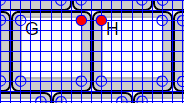

# SU120で好みのキー配置を行う

2019/09/15

SU120では基板間をビスケットで接続することである程度自由なキー配置が可能です。まだドキュメントが未整備なので（すみません）、ポイントとなりそうなことをまとめておきます。

## 基板をつなぐネジ

### 要点

M1.4ネジを使用。ネジ頭は皿ネジ以外で。ネジ長は、最近の基板なら3mmでよいはずですが、ゆるい場合は5mmネジとナットを併用してください。

### 補足など

基板をつなぐためのネジ穴はキースイッチを配置する部分の四隅、キースイッチを配置する19.05mm角の四角の頂点から縦横1/8(2.38125mm)だけ内側にあります。

これより内側だとソケットとビスケットが干渉します。

また、頂点から縦横1/8ずつ内側という位置は、row-staggeredで0.25U、0.5Uずつずらす組み方をする際に、ビスケットの汎用性が高いという利点があります。

この位置で使える最大のネジがM1.4サイズのネジでした。ナットを使ってもキースイッチにギリギリ干渉しません。

M2ネジのネジ穴は、最初1.3mmで設計していました。ウィルコやヒロスギのネジならきちんと締まるのですが、Aliexpressで送料無料100個1ドルぐらいのネジだとゆるくてきちんと固定できないという問題がありました（複数のショップのもの）。

そのため、最新のガーバーファイルでは、ネジ穴を1.26mmにし、Aliexpressのネジでも固定できるようになっています。ウィルコやヒロスギのネジだとネジ締めにちょっと力が要るようになってしまいましたが……。

ネジ頭は、皿ネジではなく、基板との接地面が大きい鍋ネジなどを使ってください。皿ネジは長さの測り方が違うという注意点もあるので、選択しないようにしてください。

ネジ長は、通常の1.6mm厚の基板の場合、基板厚1.6mm+ビスケット厚1.6mm＝3.2mmを繋ぐことになりますので、最低3mmのものを使ってください。

ネジ長3mmの場合、基板からはみ出しません。

なお、穴径を1.26mmにしたと言っても、基板の発注先のドリルの状況や調達したネジの具合により、試してみるとネジだけではゆるくて固定できない、ということも考えられます。その場合は、ネジ長5mmのネジと、M1.4用のナットを組み合わせて固定してください。

## ビスケット

### まとめ

| 印字         |   |                                                     | 数量 | 概要             |              |
| ------------ | ------------------------------------------------------ | ---- | ---------------- | ---------------- | ---------------- |
| 1u linear    |  |  | 5    | 1U間を接続 |  |
| 1.25u linear |  |                                                          | 2     | 1Uと1.25Uを接続                 |                  |
| 1.5u linear 1u linear |  |                                                          | 1     | 1Uと1.5Uを接続 切れ目で切り離すと1u linearとして使える |  |
| 2u linear 1.5u linear 1u linear |  |                                                          | 1     | 1Uと2Uを接続 切れ目で切り離すと1.5u linearまたは1u linearとして使える |  |
| 1/8u stagger    |  |  | 6    | 1Uを0.125u(1/8u)ずらして接続 |  |
| 0.25u stagger    |  |  | 4    | 1Uを0.25u(1/4u)ずらして接続 1Uを0.5u(1/2u)ずらして接続する場合も使用 |  |
| 3/8u stagger    |  |  | 1    | 1Uを0.375u(3/8u)ずらして接続 |  |
| 0.5u stagger 0.25u stagger    |  |  | 1    | 1Uを0.5u(1/2u)ずらして接続 切れ目で切り離すと0.25u staggerとして使える |  |
| 5/8u stagger 3/8u stagger    |  |  | 1    | 1Uを0.625u(5/8u)ずらして接続 切れ目で切り離すと3/8u staggerとして使える |  |
| 0.75u stagger 3/8u stagger    |  |  | 1    | 1Uを0.75u(3/4u)ずらして接続 切れ目で切り離すと3/8u staggerとして使える |  |

### 補足など

カット位置に線を入れてありますので、ここをニッパーで切っていきます。飛んでいかないように手を添えて切ってください。

[一覧へ](../)