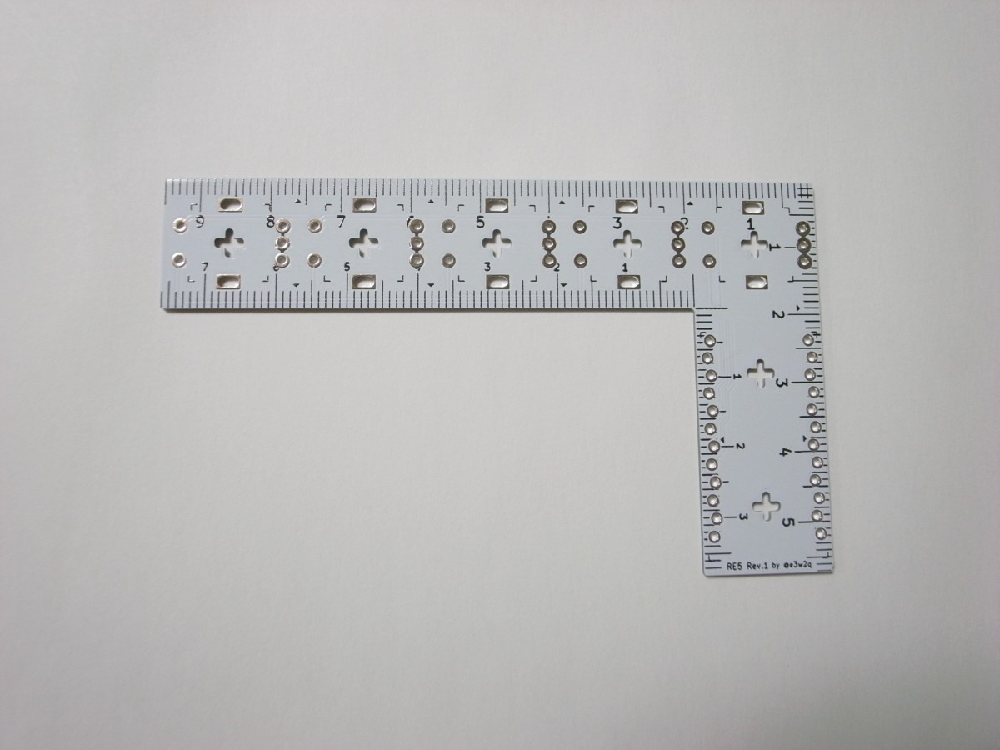
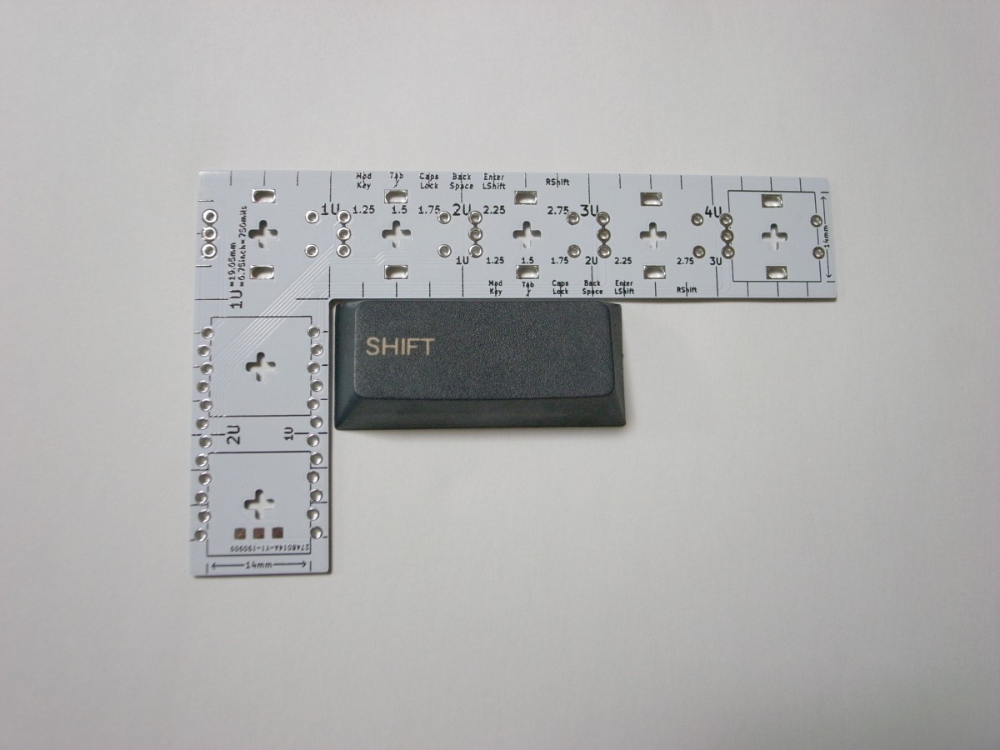
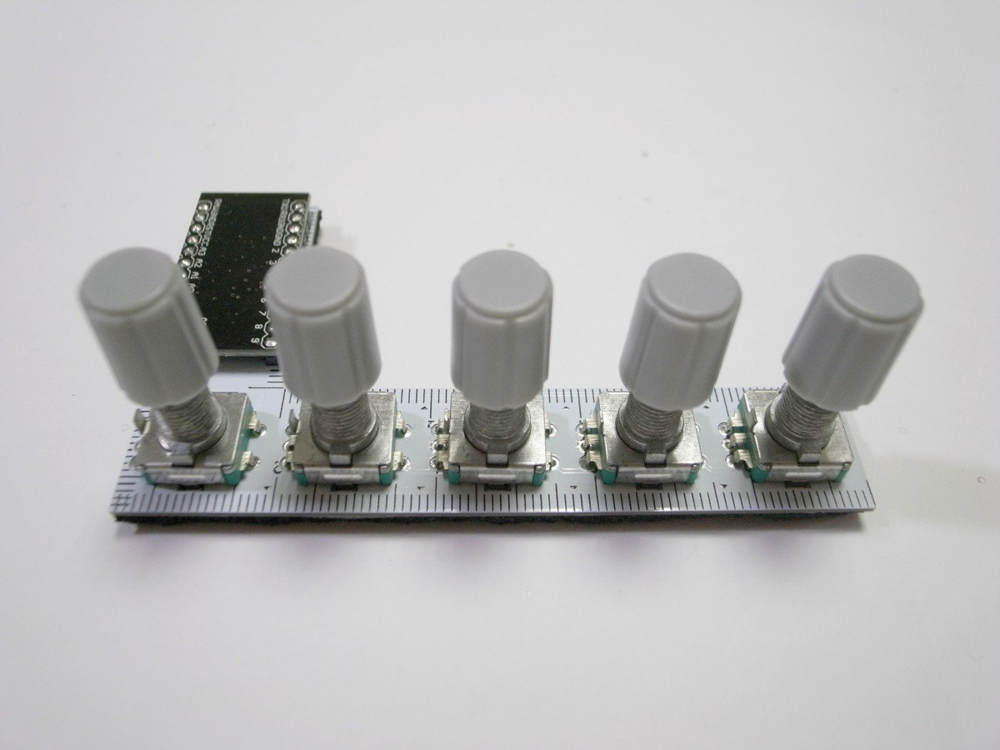

# 自作マクロパッドRE5を公開しました

2019/09/20

## 概要

- 指矩（さしがね）として使えます。

- キーキャップの大きさを測れます。

- 5つのロータリーエンコーダーが載ったマクロパッドとして使えます。

## きっかけ

[SU120](https://github.com/e3w2q/su120-keyboard)の試作を繰り返している中で、ある基板設計業者から返金の代わりに10cm角以内で再発注する権利が付与されたので、何を発注しようか考えていました。

折しもサリチル酸さんが[定規型マクロパッドPCBのグループバイをされていたり](https://salicylic-acid3.hatenablog.com/entry/pcb-ruler-gb)、◤◢◤◢◤◢◤◢さんが[monoruleというキーボードものさしを開発されていたり](https://twitter.com/yynmt_/status/1148578187405750273)した時期で、

- 定規は既にあるので指矩にしよう
- キースイッチを置くものは既にあるのでロータリーエンコーダーを置こう

という発想で作りました。

## 補足など

PCBのデータはこちらに載せています。配線の制約条件が少なく、楽しく書けました。

https://github.com/e3w2q/re5-macropad/tree/master/pcb

ビルドガイドはこちらです。

https://github.com/e3w2q/re5-macropad-doc/blob/master/readme_jp.md

基板とPro Microとロータリーエンコーダーとキャップとすべりどめと、シンプルなパーツで構成されています。

ビルドガイド用の写真を撮り、手順を確認しながら作ってみましたが、それでも作り始めてから動作確認まで1時間かかりませんでした（QMK Firmwareは導入済みの状態）。

基板のまま指矩として使ってもいいですし、組んでもろもろの操作に利用することもできますし、興味を持ってもらえましたら幸いです。

もしお好みのキーマップができましたら、ぜひpull requestで教えてください。

[一覧へ](../)