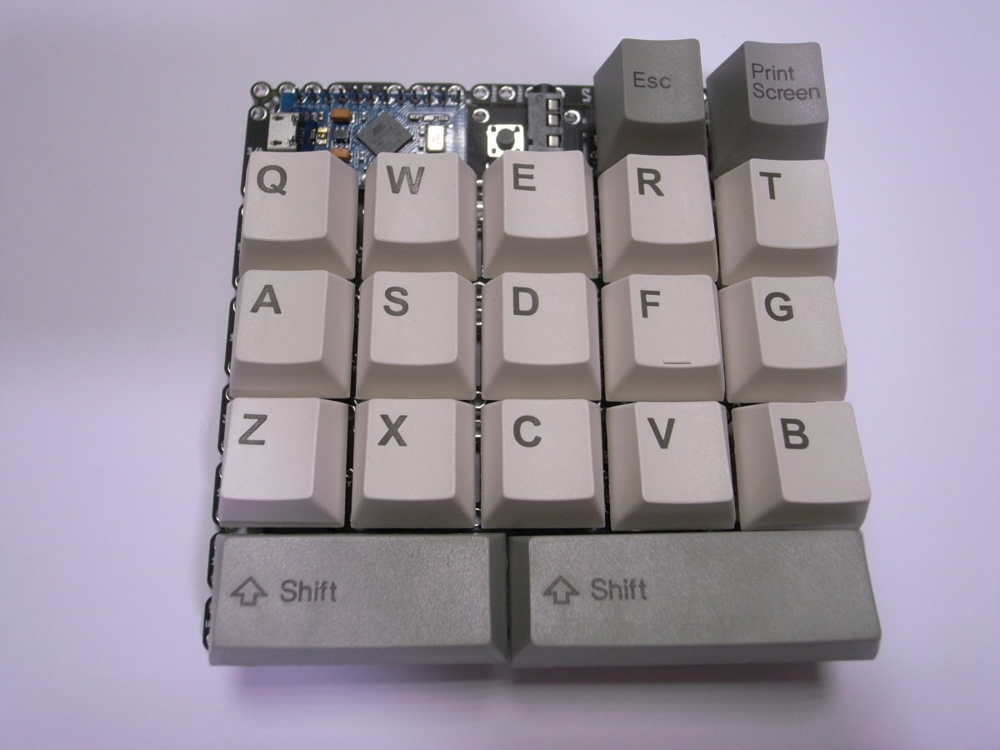

# レイアウトを試行錯誤しやすくするために作った自作キーボード用基板の開発で試行錯誤した話
2019/12/03

この記事は[キーボード #1 Advent Calendar 2019](https://adventar.org/calendars/4117)の3日目の記事です。

昨日の記事はkymokさんの[4uスペースバーを作る](https://github.com/kymok/4u_spacebar_buildlog/blob/master/Making_a_4u_spacebar_ja.md)でした。明日の記事はsirojakeさんの自作ステムについてです。

## まとめ

いろいろ試行できる自作キーボード基板がほしくて試行錯誤して[SU120](https://github.com/e3w2q/su120-keyboard)を作りました。

## きっかけ

[自作キーボード Advent Calendar 2018](https://adventar.org/calendars/2954)で自作キーボードに興味を持ち、年末年始に分割型の自作キーボードキットを買って組み立てました。
まずはJISレイアウトで分割型のキーボードが使いたい、そしてJISのままではなくレイアウトをいろいろ試行したいと思ったのですが、当時はJISレイアウトの分割型キットがありませんでした。
自分でいろいろ試行できる基板を作りたいと思い、年明けからKiCadで設計を始めました。

## SU128

最初に考えたのは、キーボードとして成立するためには最低限何が必要なんだろう、ということでした。ボトムプレートは当然無くてもいいとして、トッププレートが不可欠なのか、そうでもないのかというのがまずわかりませんでした（組み立てたキーボードキットにはトッププレートがあった）。

自作キーボードの例をネットで探して、[トビーネットさんの寿司キーボード](https://twitter.com/toby_net/status/1027880023749885952)を見つけて、トッププレート無しでもいいんだ、と思ったことを覚えています。

KiCadの使い方は、[KiCadで雑に基板を作る チュートリアル](https://www.slideshare.net/soburi/kicad-53622272)とai03さんの[PCB Guide Part 1 - Pre... | Keyboard Wiki @ ai03.me](https://wiki.ai03.me/books/pcb-design/page/pcb-guide-part-1---preparations)を見て学びました。

設計にあたって、ものすごく眺めたのは[ogatatuさんのCherry-Mx-Bitboard](https://github.com/ogatatsu/Cherry-Mx-Bitboard)です。

キースイッチのフットプリントは[foostanさんが公開されているもの](https://github.com/foostan/kbd)を使い、スタビライザーは[ai03さんのVoyager](https://github.com/ai03-2725/Voyager)を参考にさせていただきました。

基板を繋げるネジ穴は、[Gharkin](http://www.40percent.club/2016/11/gherkin.html)のネジ穴の配置とサイズを参考にして、各スイッチの外周にM2ネジ穴を配置しました。

コントローラーは、自分にとってよくわからないArduinoではなく、かろうじて触った経験のあるRaspberry Pi Zero (W)を採用しました。

[yskohtさんの去年のAdvent Calenderの記事](http://yskoht.hatenablog.com/entry/2018/12/25/034120)で、HelixのコントローラをRaspberry Piに置き換えられたのを読んで、がんばればできそう、と思ったのも理由の一つです。

Zero Wにすることで、キーマップをWifi経由で共有ディレクトリに置いてすぐに反映できれば便利だと考えていて、その他にも誤入力のログ（BackSpaceの押した回数で判定）をRaspberry Piに貯めて、どのキーを押し間違えやすいか可視化したいとも思っていました。

分割型でRaspberry Piを両手側に付けると相互の通信が大変そうだったので、Raspberry Piは片側だけとし、Slaveとの接続はRJ45を2口用意し、計16の信号線でそのままMaster側で処理するようにしました。

1U以外のキーキャップも使えるように、最下行は2.25U、2.75Uの2キーとし、0.25U単位で変更できるようにカット用の溝を入れました。

Raspberry PiのGPIOピンを24使って、最大8×16の計128キーが使えます。SU128と命名しました。SUは「州」です。最初はPreonという名前でちまちま作っていたのですが、後でPreonicというキーボードがあることを知って変更しました。

1/13着手。4/5完成。4/6発注。

基板が届いて、テスターで想定どおり通電したときはほっとしました。

2週間ほどかけてRubyでちまちまスクリプトを書き、キーマトリクスを走査してキースイッチの状態を取得できるようになりました。

しかし、Raspberry PiをUSBキーボードとして振る舞わせるため、USBの規格に沿った記述をちゃんと書くことと、キーボードとして使うためのレイヤーなどのほしい機能をイチから書こうとするとかなり大変なことになると気が付き、自作キーボードでよく使われているPro Microで作り直そう、と方針転換しました。

このころ、魔王様の無限の可能性のプレ配線済みの[ネクサス](https://swanmatch.booth.pm/items/1279346)、ソケット版の[アルタナ](https://swanmatch.booth.pm/items/1313334)、

odさんの[ジグザグないわゆる”無限の可能性”](https://twitter.com/od_1969/status/1111613408221118464)、

しかみやさんの[無限の可能性 ソルダジャンパー版](https://shikamiya.booth.pm/items/1383145)

などの1Uタイプの基板がいろいろ出てきていたころで、自分と同じような発想で、ビスケットで接続するタイプの自作キーボード基板も出てくるのではと思っていました。

## SU120 Rev.1

コントローラーをRaspberry PiからPro Microに変更した最初の基板です。

キーマトリクス用にPro MicroのGPIOを16使い、最大キー数は6×10×両手の計120キーとなりました。最大キー数に合わせ、名前をSU120としました。

Pro Microは[BDN9](https://keeb.io/products/bdn9-3x3-9-key-macropad-rotary-encoder-support)を参考にして、コンスルーピンヘッダを使わなくても取り外しが可能なように[zigzagのフットプリント](https://github.com/keebio/Keebio-Parts.pretty)を採用しました。

ダイオードは、[トビーネットさんのva4](https://twitter.com/toby_net/status/1094233643210305536)を拝見して、表面実装とスルーホールの両方に対応するようにしました。

また、[鴨南蛮さんのManta60](https://twitter.com/ralfdegen/status/1118404725580255232)のソケットにビアを打つ工夫を取り入れさせていただきました。

5/22完成。5/23発注。

## SU120 Rev.2

Rev.1で組んでみて、M2ネジでの基板接続では最低でも2ピース並んだ状態で接続するしかないことに気が付きました。

例えば下の写真では、縦方向にはビスケットで繋げられますが、横方向には繋げられません。

1ピースでも接続できるようにしたい、しかしキースイッチとの干渉を考えるとM2ネジより小さいネジにしないと収まらない、ということで、試験的に少量のM1.4用ビスケットとM1.4ネジ穴を配置しました。

基板1枚のみで使うことを考慮し、Pro Microを表にして刺すのではなく裏にして刺すように接続ピンを入れ替えました。

また、Pro Micro部をリバーシブルで使えるように修正しました。ジャンパーのハンダ付けにより、どちらの面を使うか決める仕組みです。通常、リバーシブル基板ではPro Microをちょっとずらしたフットプリントを配置するのですが、サイズの都合上、同じスルーホールをリバーシブルで使えるように工夫しました。

6/3完成、発注。

## SU120 Rev.3

M1.4ネジ&ビスケットでの接続が良かったのでビスケットをM2からM1.4に切り替えました。

それまで接続用のビスケットの種類と数は何となく設定していましたが、基板4枚でJISとUSの60%キーボード、HHKBレイアウト、有名どころのColumnar Staggerdの分割キーボードレイアウトが組めるように種類を数を増やしました。

ソケットのビアを4箇所から中央1箇所に変更しました。

6/20完成。

## SU120 Rev.4

スイッチ外周のM2とM1.4のネジ穴が近く、どちらも使うと干渉する状態だったのでM2ネジ穴を格子の交点に移しました。併せて、多くのサンドイッチマウントのPCBで採用されているようにM2スペーサー用の穴に切り替えました。

Pro Micro部のジャンパーが表側だとPro Microに干渉したので、裏側に変更しました。

基板製造業者から、slot（基板カット用の溝）が狭いよ！と指摘を受けたので幅が1mm以上になるように修正しました。

7/4完成、発注。

## SU120 Rev.5

M1.4ネジで留めたときにゆるみやすかったので、ネジ穴のサイズを1.3から1.28に変更しました。

2Uのデザインをちょっとだけ変更。

このころようやくPCBペライチを脱しようと思って、トッププレートも作成してみました。

7/22完成。7/23発注。

## SU120 Rev.6

ロータリーエンコーダーを簡単に試せる基板がほしくなったので、余らせがちな右上の2キーをロータリーエンコーダーに変更しました。

PCBにM2スペーサーを貫通させてトッププレートを保持する構造では、ボトムプレートがないと安定性がよくないことにここで気が付きました。トッププレートを付けてもボトムプレート無しで組めるようにしたかったので、M2スペーサー穴をM2ネジ穴に変更し、トッププレートがある場合はPCBマウント、トレイマウント的に支えることにしました。

M1.4ネジがゆるい場合があったので、ネジ穴のサイズを1.28から1.26に変更しました。

ビスケットを切り離しやすいようにランナーの幅をちょっとだけ狭めました。

トッププレートにもビスケットを付け、パターンで絵を書きました。表は千鳥で裏は三つ組手です。

9/2完成。9/3発注。

## SU120 Rev.7

ロータリーエンコーダー2つの接続するGPIOピンを入れ替え、Pro Microに近いほうのロータリーエンコーダーだけ残したときに6×8キーが配置できるようにしました。

ウィルコ、ヒロスギのM1.4ネジではネジ穴がキツすぎる場合があったので、サイズを1.26から1.28に戻しました。これにより、国内ネジだとナット無しで、Aliexpressの安いネジだとナット有りでちょうど固定できるようになったので、いいバランスになったと思います。

トッププレートをビスケットで接続しようとするとキースイッチに干渉したので、トッププレートからはM1.4ネジ穴を無くしました。

10/2完成、10/11発注。

## SU120 Rev.8（年内予定）

[Pro Micro部の位置合わせをやりやすくするため](https://twitter.com/illness072/status/1190788346454298624)M1.4ネジ穴を追加します。

ロータリーエンコーダーを切り離して手配線するときにGNDとの接続が必要になるので、Pro Micro部にGNDのスルーホールを追加します。

あと細かい話ですが、ダイオードを表に付けると、Chocスイッチのトッププレートと干渉したり、[スタビライザーと干渉](https://twitter.com/ryuichio1/status/1186549869244059648)したりとあまり良いことがないので、原則表に付けないように表側のシルクを消すつもりです。

## おわりに

SU120のいいところは、こんなレイアウトのキーボードが作りたい、と思ったときに基板設計や3Dプリンタ無しで、ドライバーとニッパーとハンダごてで作れるところです。

これまで数名の興味を持たれた方にSU120でキーボードを組んでもらえて、ありがたいなあと思っています。

自作キーボードの最近のトレンドである制音、高級路線からは離れた下道コースですが、興味を持っていただけたら幸いです。

この記事は[Nin76](https://masahikosawada.github.io//keyboards/nin76.html)と[Momo120](https://github.com/e3w2q/su120-keyboard-doc/blob/master/momo120/readme_jp.md)を使って書きました。

[一覧へ](../)