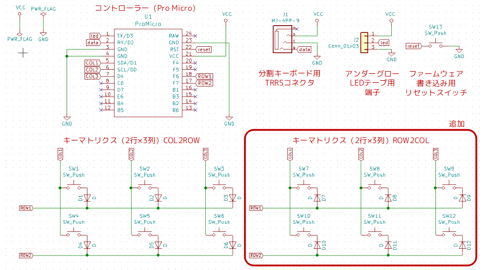

# Duplex Matrixを自作キーボードで使うには
2019/12/23

この記事は[キーボード #2 Advent Calendar 2019](https://adventar.org/calendars/4332)の23日目の記事です。

次の記事は????????神????????さんのトラックボールマウスを分解してArduino Microで動かした話です。

## Duplex Matrixとは

Duplex Matrixとは、キーボードの状態のスキャンの仕方を工夫することで、コントローラーで把握できるキー数を2倍にするというものです。

より汎用的な2乗マトリクスというものもあります<a href="#foot1">[1]</a>。


[あぷろ](https://twitter.com/elfmimi)さんが2019/5/1に[Self-Made Keyboards in Japan Discord Server](https://scrapbox.io/self-made-kbds-ja/Self-Made_Keyboards_in_Japan)の#photo-shareに最初に投稿されました（着想は2019年11月とのこと）。

最近では、天下一キーボードわいわい会Vol.3で[かーくんさんが販売された](https://twitter.com/kakunkb/status/1199512313822240770)[わんわんわんきーぼーど](https://github.com/qmk/qmk_firmware/tree/master/keyboards/thedogkeyboard)にもこの方法が使われています。

[PRここから] 例えば拙作の[SU120](https://github.com/e3w2q/su120-keyboard)では2つのコントローラーを使うと120キーまでのキーボードを作れますが、Duplex Matrix法を使えばなんと倍の240キーのキーボードが作れてしまいます。[PRここまで]


というネタは置いておいて、このDuplex Matrix法を自分の理解できる範囲で整理してみました。C言語は正直雰囲気しかわからないので、間違っている部分があれば、ご指摘いただけると幸いです。

## 基本のキーマトリクススキャン

本題のDuplex Matrix法の説明に入る前に、基本のマトリクススキャンについて触れておきます。

多くの自作キーボードでは、限られたGPIO数でたくさんのキーの状態を取得するために、キースイッチをマトリクス状に配線して、何行目、何列目の通電状態が変わったかを判定します。

### 基本の回路

下図は、自作キーボード（片側2行×3列の分割キーボード）の回路図の例です。


この例では、例えばSW2のキーが押されたときに、COL2からROW1に流れる電流の状態が変化します。

ダイオードは、キーが同時押しされたときに正しく判別するために必要となります。このあたりの詳しい話は[キーボード自作のススメ](https://www.slideshare.net/Retrieva_jp/ss-86955149)の24スライド目以降にわかりやすく説明されています。

### 基本のファームウェア

話を戻して、この回路図に対応したファームウェアをQMK Firmwareで作成してみます。

QMK Firmwareのインストールは[Getting Started - QMK](https://beta.docs.qmk.fm/newbs/newbs_getting_started)を参照してください。

QMK Firmwareのインストールの後、プロジェクトのひな形を作成します。

```bash
$ ./util/new_keyboard.sh
Generating a new QMK keyboard directory

Keyboard Name: 2x3test
Keyboard Type [avr]:
Your Name [e3w2q]:
```

回路図に合うようにプロジェクトを修正します。[修正点はここに載せています](https://github.com/e3w2q/qmk_firmware/commit/75feae784f16063fcb511fa320448eeebfb23902)。config.hのキーマトリクスに関する部分は以下のようになります。

```c
/* key matrix size */
#define MATRIX_ROWS 2*2 // 行数 右手側と左手側があるので、*2
#define MATRIX_COLS 3   // 列数
```

```c
/* COL2ROW, ROW2COL*/
#define DIODE_DIRECTION COL2ROW // COL（列）のピンからROW（行）のピンに電流が流れるようにダイオードを付けた場合はCOL2ROW、逆向きの場合はROW2COL
```

これをPro Microに書き込んで、回路図のとおりに配線すると、片手2x3の分割キーボードとなります。

### 基本のキーマトリクススキャンはどこで行われているか

通常、自作キーボードを設計する場合はここまでの知識で十分なのですが、今回は深堀りして、マトリクススキャンが行われているコードまで辿ってみます。

[Makefile](https://github.com/qmk/qmk_firmware/blob/master/Makefile#L449)

```makefile
    MAKE_CMD := $$(MAKE) -r -R -C $(ROOT_DIR) -f build_keyboard.mk $$(MAKE_TARGET)
```

↓

[build_keyboard.mk](https://github.com/qmk/qmk_firmware/blob/master/build_keyboard.mk#L346)

```makefile
include common_features.mk
```

↓

[common_features.mk](https://github.com/qmk/qmk_firmware/blob/master/common_features.mk#L362-L369)

```makefile
# Include the standard or split matrix code if needed
ifneq ($(strip $(CUSTOM_MATRIX)), yes)
    ifeq ($(strip $(SPLIT_KEYBOARD)), yes)
        QUANTUM_SRC += $(QUANTUM_DIR)/split_common/matrix.c
    else
        QUANTUM_SRC += $(QUANTUM_DIR)/matrix.c
    endif
endif
```

↓

分割キーボードでrules.mkにおいて「SPLIT_KEYBOARD = yes」と設定していれば[quantum/split_common/matrix.c](https://github.com/qmk/qmk_firmware/blob/master/quantum/split_common/matrix.c)

そうでない一体型キーボードであれば[quantum/matrix.c](https://github.com/qmk/qmk_firmware/blob/master/quantum/matrix.c)

このmatrix.cの、matrix_scan()という関数が、マトリクススキャンを行っている大元のコードです。

```c
uint8_t matrix_scan(void) {
    bool changed = false;

#if defined(DIRECT_PINS) || (DIODE_DIRECTION == COL2ROW)
    // Set row, read cols
    for (uint8_t current_row = 0; current_row < MATRIX_ROWS; current_row++) {
        changed |= read_cols_on_row(raw_matrix, current_row);
    }
#elif (DIODE_DIRECTION == ROW2COL)
    // Set col, read rows
    for (uint8_t current_col = 0; current_col < MATRIX_COLS; current_col++) {
        changed |= read_rows_on_col(raw_matrix, current_col);
    }
#endif

    debounce(raw_matrix, matrix, MATRIX_ROWS, changed);

    matrix_scan_quantum();
    return (uint8_t)changed;
}
```

COL2ROWの場合なら、一行（row）ずつ、その行の各列(col)の状態を読んでいます（read_cols_on_row）。

## Duplex Matrix法によるマトリクススキャン

### Duplex Matrix法の回路

では、先ほどの片手2x3の回路を、使うGPIOピン数は変えずに、Duplex Matrix法を使って二倍のキー数を判別できるようにしてみます。



既存のCOL2ROWのキーマトリクス（2行×3列＝6キー）をコピーして、ダイオードの向きだけ変更したROW2COLのキーマトリクス（2行×3列＝6キー）を増やしました（片手側計12キー）。

回路図の修正は、実はこれだけです。

COLからROW方向にのみスキャンしていたキーマトリクスに、ROWからCOL方向にスキャンするキーマトリクスを加えたものが、Duplex Matrixなのです。

### Duplex Matrix法のファームウェア

QMK Firmwareの標準設定では、config.hのDIODE_DIRECTIONをCOL2ROW、またはROW2COLと設定することで、matrix.cの_matrix_scan関数でCOLからROW方向、またはROWからCOL方向のスキャンが行われます。

Duplex Matrix法では、**COLからROW方向のスキャン**と**ROWからCOL方向のスキャン**を**両方**行いたいので、自分でmatrix.cを用意する必要があります。

まずは、rules.mkで以下を記載します。

```makefile
CUSTOM_MATRIX = yes
```

これにより、標準のmatrix.cの読み込みが止まります。

[QMK Firmwareのドキュメント](Lets you replace the default matrix scanning routine with your own code. You will need to provide your own implementations of matrix_init() and matrix_scan().)に

> ```
> CUSTOM_MATRIX
> ```
>
>
> Lets you replace the default matrix scanning routine with your own code. You will need to provide your own implementations of matrix_init() and matrix_scan().

と書いてありますので、自前でmatrix_init()とmatrix_scan()を実装する必要があります。

rules.mkにさらに以下を追加し、自前のmatrix.cが読み込まれるようにします。

```makefile
SRC += matrix.c
```

matrix.cはゼロから書くのではなく、分割キーボードであれば[quantum/split_common/matrix.c](https://github.com/qmk/qmk_firmware/blob/master/quantum/split_common/matrix.c)を、そうでない一体型キーボードであれば[quantum/matrix.c](https://github.com/qmk/qmk_firmware/blob/master/quantum/matrix.c)をコピーしてベースとするとよいです。

今回は分割キーボードなので、[quantum/split_common/matrix.c](https://github.com/qmk/qmk_firmware/blob/master/quantum/split_common/matrix.c)を利用します。

matrix.cの修正に入る前に、config.hを修正します。今回は列を2倍（横方向に2倍）することにします。

```diff
 /* key matrix size */
 #define MATRIX_ROWS 2*2 // 行数 右手側と左手側があるので、*2
-#define MATRIX_COLS 3   // 列数
+#define MATRIX_COLS 3*2 // 列数 Duplex Matrix法により、*2
```

```diff
 #define MATRIX_ROW_PINS { F6, F7 }     // 各行に割り当てるピン番号
-#define MATRIX_COL_PINS { D1, D0, D4 } // 各列に割り当てるピン番号
+#define MATRIX_COL_PINS { D1, D0, D4, D1, D0, D4 } // 各列に割り当てるピン番号
```

DIODE_DIRECTIONは、通常、COL2ROWまたはROW2COLを設定しますが、独自にマトリクススキャンを行う場合のために[CUSTOM_MATRIXという値](https://github.com/qmk/qmk_firmware/blob/master/quantum/config_common.h#L19-L22)の定義が用意されています。

matrix.cの書き方次第でDIODE_DIRECTIONを無視することもできるのですが、今回はDIODE_DIRECTIONをCUSTOM_MATRIXとしておきます。

```diff
 /* COL2ROW, ROW2COL*/
-#define DIODE_DIRECTION COL2ROW
+#define DIODE_DIRECTION CUSTOM_MATRIX
```

https://discordapp.com/channels/376937950409392130/381074986208591884/572998059793842187

https://discordapp.com/channels/376937950409392130/418326189644709889/573354228701986828


## おわりに

SU120のいいところは、こんなレイアウトのキーボードが作りたい、と思ったときに基板設計や3Dプリンタ無しで、ドライバーとニッパーとハンダごてで作れるところです。


これまで数名の興味を持たれた方にSU120でキーボードを組んでもらえて、ありがたいなあと思っています。

自作キーボードの最近のトレンドである制音、高級路線からは離れた下道コースですが、興味を持っていただけたら幸いです。

この記事は[Nin76](https://masahikosawada.github.io//keyboards/nin76.html)と[Momo120](https://github.com/e3w2q/su120-keyboard-doc/blob/master/momo120/readme_jp.md)を使って書きました。

<p id="foot1">[1] Here is my first footnote.</p>
<p id="foot2">[2] Another footnote.</p>


[一覧へ](../)