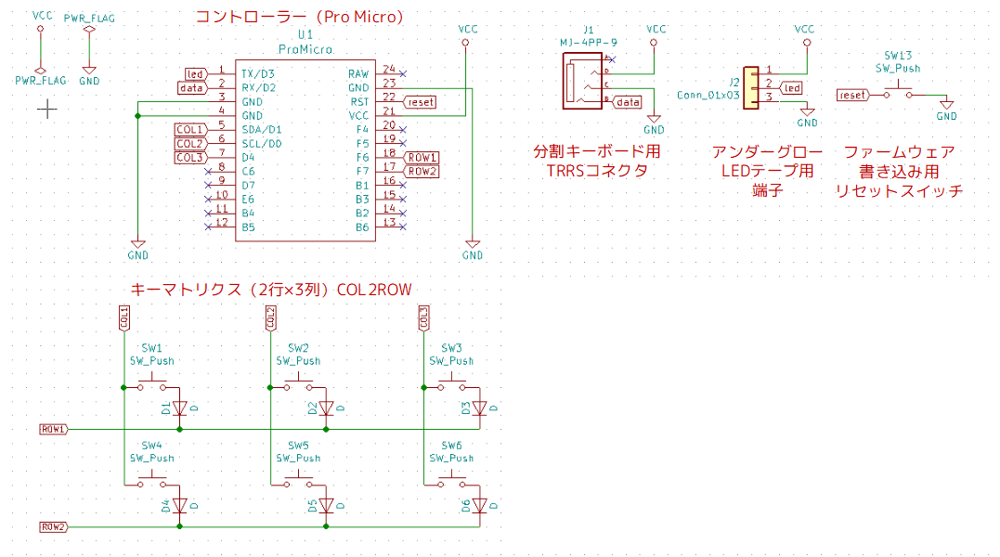
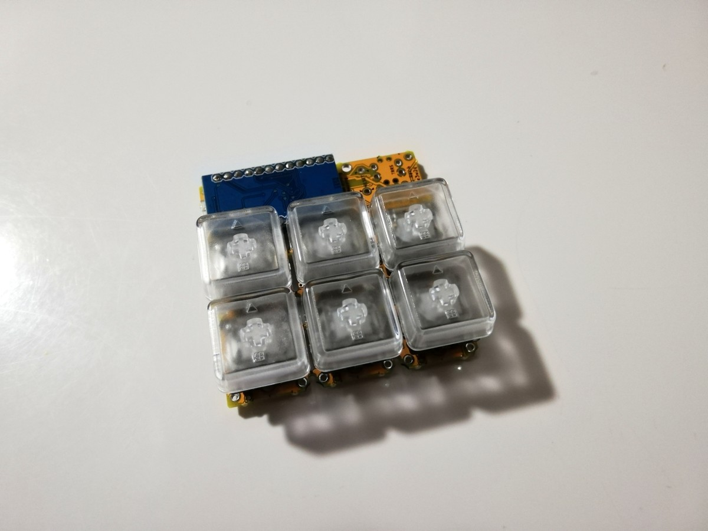
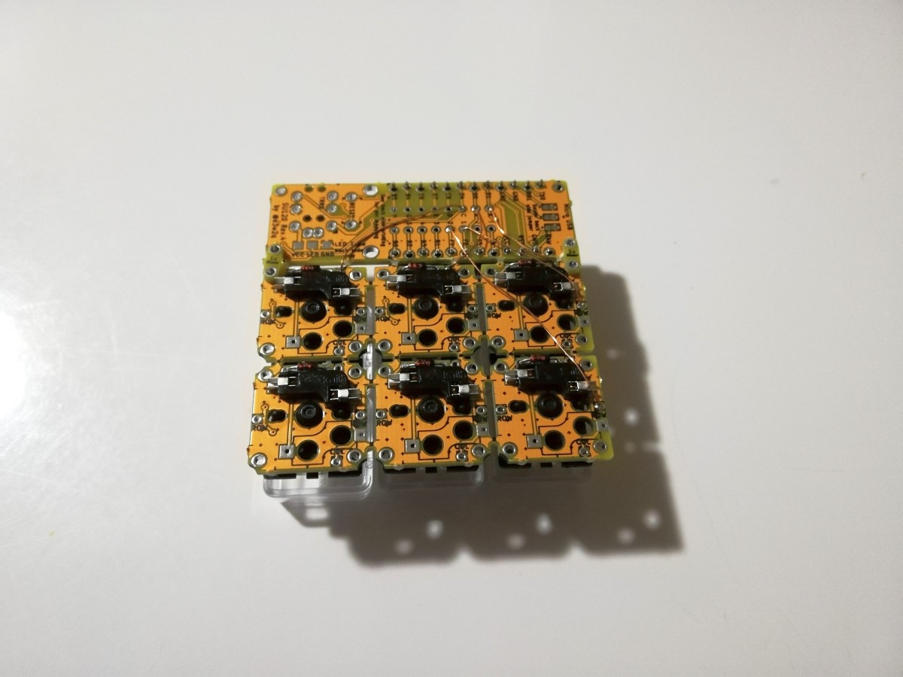
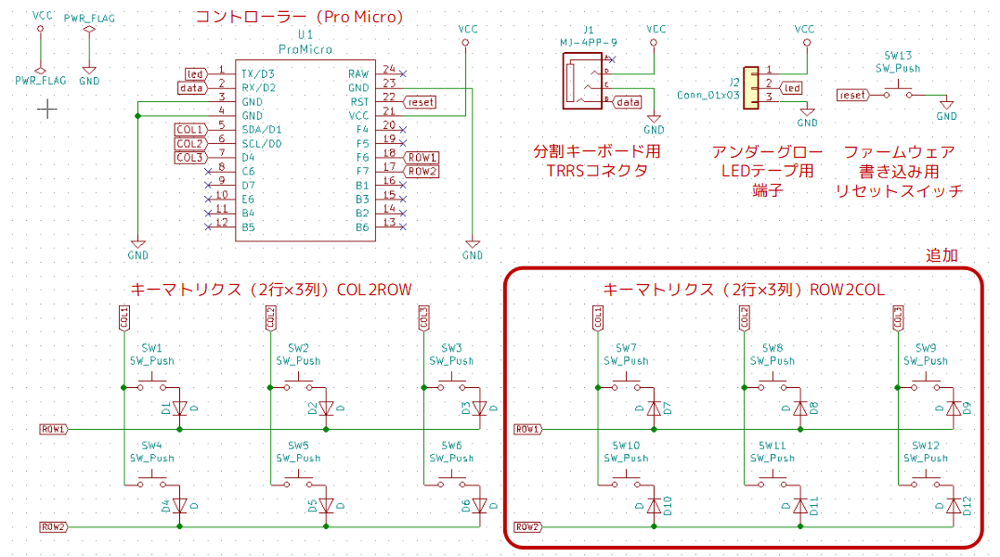
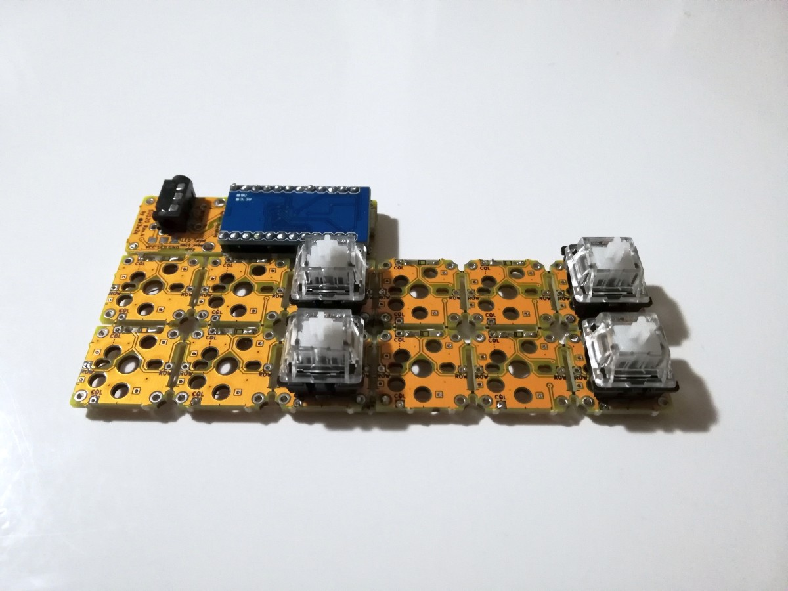
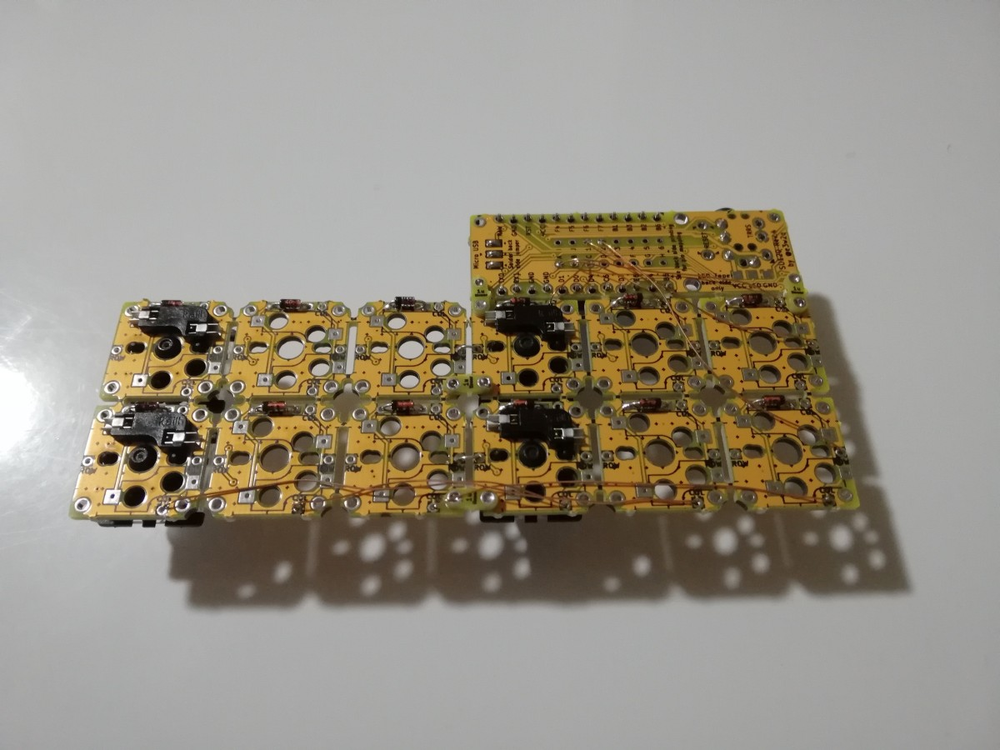
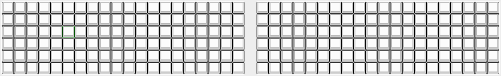
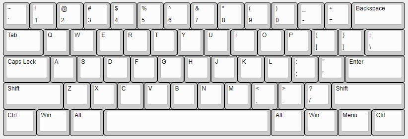

# Duplex-Matrixを自作キーボードで使う方法
2019/12/23 初回投稿

2021/02/21 QMK Firmwareの最新の書き方に沿って修正

この記事は[キーボード #2 Advent Calendar 2019](https://adventar.org/calendars/4332)の23日目の記事です。

昨日の記事はblock_cube_libさんの[HHKBから自作キーボードに乗り換えた話](https://block-cube-lib.github.io/posts/keyboard-advent-calendar-2019/)でした。次の記事は????????神????????さんのトラックボールマウスを分解してArduino Microで動かした話です。

## Duplex-Matrix（倍マトリクス）とは

Duplex-Matrix（倍マトリクス）とは、キーボードの状態のスキャンの仕方を工夫することで、コントローラーで把握できるキー数を2倍にするというものです。

国内の自作キーボードコミュニティにおいては、[あぷろ](https://twitter.com/elfmimi)さんが2018/11/10に[Self-Made Keyboards in Japan Discord Server](https://scrapbox.io/self-made-kbds-ja/Self-Made_Keyboards_in_Japan)に着想を投稿<a href="#foot1">[1]</a>し、その後2019/5/1に実装例が投稿<a href="#foot2">[2]</a>され、認知されるようになりました。

2019/11/30の天下一キーボードわいわい会Vol.3で[かーくんさん](https://twitter.com/kakunkb/status/1199512313822240770)が販売された[わんわんわんきーぼーど](https://github.com/qmk/qmk_firmware/tree/master/keyboards/thedogkeyboard)にこの方法が使われました。

2021年2月時点では、国内の自作キーボードキットではかーくんさんの[わんわんわんきーぼーど](https://github.com/qmk/qmk_firmware/tree/master/keyboards/thedogkeyboard)、[Angel64](https://github.com/qmk/qmk_firmware/tree/master/keyboards/angel64)、[Choc太郎](https://github.com/qmk/qmk_firmware/tree/master/keyboards/choc_taro)に使われています。

また、サリチル酸さんの[Naked64SF v2にも採用されたと記事に書いてありました](https://salicylic-acid3.hatenablog.com/entry/naked64sf-verification#%E8%BF%BD%E5%8A%A0%E6%A9%9F%E8%83%BD)し、ゆかりさんの

このDuplex-Matrixを自分の理解できる範囲で整理してみました。C言語のきちんとした知識を持っていないので、間違っている部分があればご指摘いただけると幸いです。

## 基本のキーマトリクススキャン

本題のDuplex-Matrixの説明に入る前に、基本のマトリクススキャンについて触れておきます。

多くの自作キーボードでは、限られたGPIO数でたくさんのキーの状態を取得するために、キースイッチをマトリクス状に配線して、何行目、何列目の通電状態が変わったかを判定します。

### 基本の回路

下図は、自作キーボード（片側2行×3列の分割キーボード）の回路図の例です。



この例では、例えばSW2のキーが押されたときに、COL2からROW1に流れる電流の状態が変化します。

ダイオードは、キーが同時押しされたときに正しく判別するために必要となります。以下の記事が詳しいです。

- IKeJIさんの[キーボードのマトリクス方式の分類](https://blog.ikejima.org/make/keyboard/2019/12/14/keyboard-circuit.html)の[マトリクスの項](https://blog.ikejima.org/make/keyboard/2019/12/14/keyboard-circuit.html#%E3%83%9E%E3%83%88%E3%83%AA%E3%82%AF%E3%82%B9)
- [キーボード自作のススメ](https://www.slideshare.net/Retrieva_jp/ss-86955149)の24スライド目以降
- ゆかりさんの[オリジナルキーボードを作ってみる その7「キーマトリックス」 - ゆかりメモ](http://eucalyn.hatenadiary.jp/entry/original-keyboard-07)

### 基本の回路の実装

自作キーボード試作用基板の[SU120](https://github.com/e3w2q/su120-keyboard)で実装してみた例です。





### 基本のファームウェア

この回路図に対応したファームウェアをQMK Firmwareで作成してみます。

QMK Firmwareのインストールについては、[はじめに - QMK Firmware](https://docs.qmk.fm/#/ja/newbs_getting_started)を参照してください。

QMK Firmwareのインストールの後、プロジェクトのひな形を作成します。

```bash
$ ./util/new_keyboard.sh
Generating a new QMK keyboard directory

Keyboard Name: 2x3test
Keyboard Type [avr]:
Your Name [e3w2q]:
```

回路図に合うようにプロジェクトを修正します。config.hのキーマトリクスに関する部分は以下のようになります。

```c
/* key matrix size */
#define MATRIX_ROWS 2*2 // 行数 右手側と左手側があるので、*2
#define MATRIX_COLS 3   // 列数
```

```c
/* COL2ROW, ROW2COL*/
#define DIODE_DIRECTION COL2ROW // COL（列）のピンからROW（行）のピンに電流が流れるようにダイオードを付けた場合はCOL2ROW、逆向きの場合はROW2COL
```

[修正点の全体はここに載せています](https://github.com/e3w2q/qmk_firmware/commit/75feae784f16063fcb511fa320448eeebfb23902)。

これをPro Microに書き込んで、回路図のとおりに配線すると、片手2x3の分割キーボードとなります。

### 基本のキーマトリクススキャンはどこで行われているか

通常、自作キーボードを設計する場合はここまでの知識で十分なのですが、今回は深堀りして、マトリクススキャンが行われているコードまで辿ってみます。

[Makefile](https://github.com/qmk/qmk_firmware/blob/master/Makefile#L389)

```makefile
    MAKE_CMD := $$(MAKE) -r -R -C $(ROOT_DIR) -f build_keyboard.mk $$(MAKE_TARGET)
```

↓

[build_keyboard.mk](https://github.com/qmk/qmk_firmware/blob/master/build_keyboard.mk#L312)

```makefile
include common_features.mk
```

↓

[common_features.mk](https://github.com/qmk/qmk_firmware/blob/master/common_features.mk#L406-L427)

```makefile
VALID_CUSTOM_MATRIX_TYPES:= yes lite no

CUSTOM_MATRIX ?= no

ifneq ($(strip $(CUSTOM_MATRIX)), yes)
    ifeq ($(filter $(CUSTOM_MATRIX),$(VALID_CUSTOM_MATRIX_TYPES)),)
        $(error CUSTOM_MATRIX="$(CUSTOM_MATRIX)" is not a valid custom matrix type)
    endif

    # Include common stuff for all non custom matrix users
    QUANTUM_SRC += $(QUANTUM_DIR)/matrix_common.c

    # if 'lite' then skip the actual matrix implementation
    ifneq ($(strip $(CUSTOM_MATRIX)), lite)
        # Include the standard or split matrix code if needed
        ifeq ($(strip $(SPLIT_KEYBOARD)), yes)
            QUANTUM_SRC += $(QUANTUM_DIR)/split_common/matrix.c
        else
            QUANTUM_SRC += $(QUANTUM_DIR)/matrix.c
        endif
    endif
endif
```

ここをかいつまんで説明すると、

- rules.mkにおいて「CUSTOM_MATRIX = yes」と書かれているなら、QMKのマトリクススキャンコードは全く読み込まれず、自分で全て実装する必要あり。
- rules.mkにおいて「CUSTOM_MATRIX = lite」と書かれているなら、QMKの基本のマトリクススキャンコード（[quantum/matrix_common.c](https://github.com/qmk/qmk_firmware/blob/master/quantum/matrix_common.c)）が読み込まれるので、足りない部分のみ自分で実装する必要あり。
- rules.mkにおいてCUSTOM_MATRIXが定義されていなかったり、CUSTOM_MATRIXが定義されていてもyesでもliteでもない場合はQMKの標準のマトリクススキャンコードが読み込まれる。具体的には、
  - まずQMKの基本のマトリクススキャンコード（matrix_common.c）が読み込まれる
  - さらに、rules.mkにおいて「SPLIT_KEYBOARD = yes」なら[quantum/split_common/matrix.c](https://github.com/qmk/qmk_firmware/blob/master/quantum/split_common/matrix.c)が、
  - そうでない一体型キーボードであれば[quantum/matrix.c](https://github.com/qmk/qmk_firmware/blob/master/quantum/matrix.c)が読み込まれる。

このmatrix.cの、matrix_scan()という関数が、マトリクススキャンを行っている大元のコードです。

```c
uint8_t matrix_scan(void) {
    bool changed = false;

#if defined(DIRECT_PINS) || (DIODE_DIRECTION == COL2ROW)
    // Set row, read cols
    for (uint8_t current_row = 0; current_row < MATRIX_ROWS; current_row++) {
        changed |= read_cols_on_row(raw_matrix, current_row);
    }
#elif (DIODE_DIRECTION == ROW2COL)
    // Set col, read rows
    for (uint8_t current_col = 0; current_col < MATRIX_COLS; current_col++) {
        changed |= read_rows_on_col(raw_matrix, current_col);
    }
#endif

    debounce(raw_matrix, matrix, MATRIX_ROWS, changed);

    matrix_scan_quantum();
    return (uint8_t)changed;
}
```

COL2ROWの場合なら、一行（row）ずつ、その行の各列(col)の状態を読んでいます（read_cols_on_row）。

### CUSTOM_MATRIX = lite とは

2020年1月にQMK Firmwareに追加されたフラグで、前項にも書いたとおり

- rules.mkにおいて「CUSTOM_MATRIX = yes」と書かれているなら、QMKのマトリクススキャンコードは全く読み込まれず、自分で全て実装する必要あり。
- rules.mkにおいて「CUSTOM_MATRIX = lite」と書かれているなら、QMKの基本のマトリクススキャンコード（[quantum/matrix_common.c](https://github.com/qmk/qmk_firmware/blob/master/quantum/matrix_common.c)）が読み込まれるので、足りない部分のみ自分で実装する必要あり。

というものです。

詳しくは以下のドキュメントをご覧ください。

[カスタムマトリックス](https://docs.qmk.fm/#/ja/custom_matrix)

2021/02/02時点、QMK本家に取り込まれているDuplex-Matrixを使った国内キーボードでは、かーくんさんの[Choc太郎](https://github.com/qmk/qmk_firmware/tree/master/keyboards/choc_taro)で使われています。

## Duplex-Matrixによるマトリクススキャン

### Duplex-Matrixの回路

では、先ほどの片手2x3の回路を、使うGPIOピン数は変えずに、Duplex-Matrixを使って二倍のキー数を判別できるようにしてみます。



既存のCOL2ROWのキーマトリクス（2行×3列＝6キー）をコピーして、ダイオードの向きだけ変更したROW2COLのキーマトリクス（2行×3列＝6キー）を増やしました（片手側は計6キーから計12キーに）。

回路図の修正は、これだけです。とてもシンプル。

COLからROW方向にのみスキャンしていたキーマトリクスに、ROWからCOL方向にスキャンするキーマトリクスを加えたものが、Duplex-Matrixなのです。

### Duplex-Matrixの回路の実装

[SU120](https://github.com/e3w2q/su120-keyboard)で実装した例です。





（手持ちのソケットが尽きたので、キー入力のテストはピンセットで行いました）

## Duplex-Matrixのファームウェアの作り方

ここからはファームウェアの作り方をいくつか挙げます。

#### その1 あぷろさんのPull Request中のコードを参考にする

自作キーボードコミュニティでDuplex-Matrixを最初に実装されたあぷろさんが、QMK FirmwareでDuplex-Matrixを使えるようにするPull Requestを2020年2月に投げておられます。

[[Core] Add bidirectional and duplex matrix code by elfmimi · Pull Request #8160 · qmk/qmk_firmware · GitHub](https://github.com/qmk/qmk_firmware/pull/8160)

2021年2月時点でまだ取り込まれていませんが、このコードを自分のキーボードディレクトリに置いて使う方法が考えられます。

試してみるとエラーが出て、私にはエラーの修正が難しかったので検証は途中で止まっていますが、途中まで試したことを書いておきます。

まずは、rules.mkで以下を記載します。

```makefile
CUSTOM_MATRIX = yes
```

これにより、標準のmatrix.cの読み込みが止まります。

rules.mkにさらに以下を追加し、自前のmatrix.cが読み込まれるようにします。

```makefile
SRC += matrix.c
```

matrix.cはあぷろさんのPull Requestのコードを参考にします。

[[Core] Add bidirectional and duplex matrix code by elfmimi · Pull Request #8160 · qmk/qmk_firmware · GitHub](https://github.com/qmk/qmk_firmware/pull/8160/files)

一体型キーボードなら、ここの[quantum/matrix.c](https://github.com/qmk/qmk_firmware/pull/8160/files#diff-be9c2ed6e58bd98d9312919e67c16c97e1dea944abebd8170479a0a706f78cc3) 、分割キーボードなら[quantum/split_common/matrix.c](https://github.com/qmk/qmk_firmware/pull/8160/files#diff-bd09835ccc2e8ed74ebc20b070b44c5ffd080a50855617245f90ca91b4320a09)を持ってきます。

config.hを修正します。あぷろさんのコードの場合、MATRIX_ROWSを2倍し、DIODE_DIRECTIONでBOTHWAYSを指定することにより、Duplex-Matrixが使用できます。

```c
/* key matrix size */
#define MATRIX_ROWS 2*2*2 // 行数 Duprex Matrixにより*2 右手側と左手側があるのでさらに*2
#define MATRIX_COLS 3 // 列数

/*
 * Keyboard Matrix Assignments
 *
 * Change this to how you wired your keyboard
 * COLS: AVR pins used for columns, left to right
 * ROWS: AVR pins used for rows, top to bottom
 * DIODE_DIRECTION: COL2ROW = COL = Anode (+), ROW = Cathode (-, marked on diode)
 *                  ROW2COL = ROW = Anode (+), COL = Cathode (-, marked on diode)
 *
 */
#define MATRIX_ROW_PINS { F6, F7 }     // 各行に割り当てるピン番号
#define MATRIX_COL_PINS { D1, D0, D4 } // 各列に割り当てるピン番号
#define UNUSED_PINS

/* COL2ROW, ROW2COL*/
#define DIODE_DIRECTION BOTHWAYS
```

私はここでエラーが出てきちんと追跡できなくて動作確認までいきませんでしたが、一体型と分割型のコードがちゃんと用意されているので、プログラムがわかる方にはおすすめしたいです。

#### その2 かーくんさんのファームウェアを参考にする

かーくんさんの[わんわんわんきーぼーど](https://github.com/qmk/qmk_firmware/tree/master/keyboards/thedogkeyboard)、[Angel64](https://github.com/qmk/qmk_firmware/tree/master/keyboards/angel64)、[Choc太郎](https://github.com/qmk/qmk_firmware/tree/master/keyboards/choc_taro)でDuplex-Matrixが使われていますが、中でもChoc太郎のコードはCUSTOM_MATRIX = liteを使用しているので中身を追いやすいと思います。ただし、いずれのキーボードも一体型なので分割型キーボードで使うには一工夫必要となります。

<blockquote class="twitter-tweet" data-conversation="none"><p lang="ja" dir="ltr">直接matrix.cを書き換えて使う場合、CUSTOM_MATRIX = liteが用意されたのでそれ使うと最低限の書き換えだけでDuplex使えるぐらい<br><br>ref: <a href="https://t.co/lWXu4yNFmo">https://t.co/lWXu4yNFmo</a></p>&mdash; かーくん⌨️ (@kakunkb) <a href="https://twitter.com/kakunkb/status/1356447172888125441?ref_src=twsrc%5Etfw">February 2, 2021</a></blockquote> <script async src="https://platform.twitter.com/widgets.js" charset="utf-8"></script>
rules.mkには以下のように記載されています。

```makefile
CUSTOM_MATRIX = lite
SRC += matrix.c
```

キーボードディレクトリに置くmatrix.cは以下のようになっています。

[qmk_firmware/matrix.c at master · qmk/qmk_firmware · GitHub](https://github.com/qmk/qmk_firmware/blob/master/keyboards/choc_taro/matrix.c)

config.hでMATRIX_ROWSを2倍して、Duplex-Matrixを使用します。

```c
/* key matrix size */
#define MATRIX_ROWS 16
#define MATRIX_COLS 5
/*
 * Keyboard Matrix Assignments
 *
 * Change this to how you wired your keyboard
 * COLS: AVR pins used for columns, left to right
 * ROWS: AVR pins used for rows, top to bottom
 * DIODE_DIRECTION: COL2ROW = COL = Anode (+), ROW = Cathode (-, marked on diode)
 *                  ROW2COL = ROW = Anode (+), COL = Cathode (-, marked on diode)
 *
 */
#define MATRIX_ROW_PINS { F4, F5, F6, F7, B1, B3, B2, B6 }
#define MATRIX_COL_PINS { D4, C6, D7, E6, B4 }
```

#### その3 m.teiさんのファームウェアを参考にする

m.teiさんの[symmetric70_proto](https://github.com/qmk/qmk_firmware/tree/master/keyboards/handwired/symmetric70_proto)でもDuplex-Matrixが使われていると教えてもらいました。

rules.mkには以下のように記載されています。

```makefile
CUSTOM_MATRIX = lite
SRC += matrix.c
```

キーボードディレクトリに置くmatrix.cは以下のようになっています。

[qmk_firmware/matrix.c at 254764481f00b12b2aec905080660a1bbdeec8bf · qmk/qmk_firmware · GitHub](https://github.com/qmk/qmk_firmware/blob/254764481f00b12b2aec905080660a1bbdeec8bf/keyboards/handwired/symmetric70_proto/matrix.c)

<blockquote class="twitter-tweet" data-conversation="none"><p lang="ja" dir="ltr">僕は、quantum/matrix.c を自分のキーボードディレクトリにコピーしてきて改造しました。<br>こんな感じ<a href="https://t.co/w1wPmG1PGD">https://t.co/w1wPmG1PGD</a><br><br>どう改造したかは、matrix.c.patch みればわかります。</p>&mdash; m.tei / ishii (@mtei) <a href="https://twitter.com/mtei/status/1356673900290088960?ref_src=twsrc%5Etfw">February 2, 2021</a></blockquote> <script async src="https://platform.twitter.com/widgets.js" charset="utf-8"></script>
config.hは以下のように書かれています。かーくんさんと違う書き方です。

```c
#define MATRIX_ROW_PINS { D4, C6, D7, E6, B4 }
#define MATRIX_COL_PINS { F4,F4,F5,F5, F6,F6,F7,F7,  B6,B6,B2,B2, B3,B3,B1,B1 }
#define UNUSED_PINS

#define MATRIX_MUL_SEL  {  0, 1, 0, 1,  0, 1, 0, 1,   1, 0, 1, 0,  1, 0, 1, 0 }
/* use 74HC157: quadruple 2-line to 1-line data selectors / multiplexers */
#define MATRIX_MUL_SELECT  B5 /* 74HC157 pin1:~A/B */

/* COL2ROW, ROW2COL */
#define DIODE_DIRECTION COL2ROW
```

#### その4 


QMK Firmwareの標準設定では、config.hのDIODE_DIRECTIONをCOL2ROW、またはROW2COLと設定することで、matrix.cの_matrix_scan関数でCOLからROW方向、またはROWからCOL方向のスキャンが行われます。

Duplex-Matrixでは、**COLからROW方向のスキャン**と**ROWからCOL方向のスキャン**を**両方**行いたいので、自分でマトリクススキャンを書く必要があります。

まずは、rules.mkで以下を記載します。

```makefile
CUSTOM_MATRIX = yes
```

これにより、標準のmatrix.cの読み込みが止まります。

[QMK Firmwareのドキュメント](https://docs.qmk.fm/#/getting_started_make_guide?id=rulesmk-options)に

> ```
> CUSTOM_MATRIX
> ```
>
>
> Lets you replace the default matrix scanning routine with your own code. You will need to provide your own implementations of matrix_init() and matrix_scan().

と書いてあるとおり、自前でmatrix_init()とmatrix_scan()を実装する必要があります。

rules.mkにさらに以下を追加し、自前のmatrix.cが読み込まれるようにします。

```makefile
SRC += matrix.c
```

matrix.cの前に、config.hを修正します。今回は列を2倍（横方向に2倍）することにします。

```diff
 /* key matrix size */
 #define MATRIX_ROWS 2*2 // 行数 右手側と左手側があるので、*2
-#define MATRIX_COLS 3   // 列数
+#define MATRIX_COLS 3*2 // 列数 Duplex-Matrix法により、*2
```

```diff
 #define MATRIX_ROW_PINS { F6, F7 }     // 各行に割り当てるピン番号
-#define MATRIX_COL_PINS { D1, D0, D4 } // 各列に割り当てるピン番号
+#define MATRIX_COL_PINS { D1, D0, D4, D1, D0, D4 } // 各列に割り当てるピン番号
```

DIODE_DIRECTIONは、通常、COL2ROWまたはROW2COLを設定しますが、独自にマトリクススキャンを行う場合のために[CUSTOM_MATRIXという値](https://github.com/qmk/qmk_firmware/blob/master/quantum/config_common.h#L19-L22)の定義が用意されています。

matrix.cの書き方次第でDIODE_DIRECTIONを無視することもできるのですが、今回はDIODE_DIRECTIONをCUSTOM_MATRIXとしておきます。

```diff
 /* COL2ROW, ROW2COL*/
-#define DIODE_DIRECTION COL2ROW
+#define DIODE_DIRECTION CUSTOM_MATRIX
```

列数が増えたので、2x3test.h、keymaps/default/keymap.cも手直ししておきましょう。

[ここまでの修正についてはここにまとめて載せています](https://github.com/e3w2q/qmk_firmware/commit/4f9630a07dc268771f6d62e96d5f3ab151a64c72)。

### Duplex-Matrixのファームウェア(2)

次にmatrix.cを用意します。

matrix.cはゼロから書くのではなく、分割キーボードであれば[quantum/split_common/matrix.c](https://github.com/qmk/qmk_firmware/blob/master/quantum/split_common/matrix.c)を、そうでない一体型キーボードであれば[quantum/matrix.c](https://github.com/qmk/qmk_firmware/blob/master/quantum/matrix.c)をコピーしてベースとするとよいです。

今回は分割キーボードなので、[quantum/split_common/matrix.c](https://github.com/qmk/qmk_firmware/blob/master/quantum/split_common/matrix.c)を利用します。

書き換えの基本的な考え方は以下のとおりです。

デフォルトmatrix.cではDIRECT_PINS、COL2ROW、ROW2COLのマトリクススキャンしか書かれていないので、CUSTOM_MATRIX用の分岐を入れます。

```diff
 #ifdef DIRECT_PINS
 //...
 #elif (DIODE_DIRECTION == COL2ROW)
 //...
 #elif (DIODE_DIRECTION == ROW2COL)
 //...
+#elif (DIODE_DIRECTION == CUSTOM_MATRIX)
+//...
 #endif
```

COL2ROWのスキャンを行ってからROW2COLのスキャンを行うようにします。COL2ROWのスキャンは、元の列の範囲（今回なら1～3列目）で行い、ROW2COLのスキャンは、増やした列の範囲（今回なら4～6列目）で行います。

```diff
+    // Set row, read cols
+    for (uint8_t current_row = 0; current_row < ROWS_PER_HAND; current_row++) {
+        changed |= read_cols_on_row(raw_matrix, current_row);
+    }
+    // Set col, read rows
+    for (uint8_t current_col = MATRIX_COLS/2; current_col < MATRIX_COLS; current_col++) {
+        changed |= read_rows_on_col(raw_matrix, current_col);
+    }
```

正直、matrix.cをDuplex-Matrix用に修正する作業がなかなかうまくいかず一番大変だったのですが、コードをたくさん貼っても面白くないので、[デフォルトのmatrix.cからの変更点についてはここにまとめて載せました](https://github.com/e3w2q/qmk_firmware/commit/762fe3e0a7cbea768245a75520f06ff5a2f00b9f)。

## おわりに

これで、通常のキーマトリクスに必要なピン数の1/2のピン数でキーマトリクススキャンを行えるようになりました！

例えば拙作の[SU120](https://github.com/e3w2q/su120-keyboard)では2つのPro Microを使うと120キーまでのキーボードを作れるというものですが、Duplex-Matrixを使えばなんと倍の240キーのキーボードが作れてしまいます。



まあ、ここまでのキー数は不要としても、1つのPro Microでフルキーボードのキー数を使えるのは魅力的ですよね。

また、ロータリーエンコーダーを使うとピン数が足りなくなりがちになるので、そういう際にも便利です。

サンプルコードの全体は以下に載せています。

[https://github.com/e3w2q/qmk_firmware/tree/2x3test/keyboards/2x3test](https://github.com/e3w2q/qmk_firmware/tree/2x3test/keyboards/2x3test)

皆さんの自作キーボード設計の一助となれば幸いです。

この記事は、あぷろさんの着想、かーくんさんの[わんわんわんきーぼーどのQMK Firmwareソースコード](https://github.com/qmk/qmk_firmware/tree/master/keyboards/thedogkeyboard)を読んで得た知識をもとに書きました。あぷろさん、かーくんさん、ありがとうございました。

## 補足:その他の特殊なマトリクスについて

記事を書くにあたって、Self-Made Keyboards in Japan Discord ServerでDuplex-Matrixの初出を尋ねたところ、ここで説明したDuplex-Matrixのほかのマトリクス回路のお話も聞くことができました。

### チャーリープレックス

1995年にMaxim Integrated社のCharlie Allen氏が考案したLEDマトリクスのコントロール方法。各ピンの間にLEDを2つ付けるもの（それぞれ逆向き）。Nピンで、(N-1)*Nのマトリクスを制御できます。

[https://en.wikipedia.org/wiki/Charlieplexing](https://en.wikipedia.org/wiki/Charlieplexing)

### 2乗マトリクス

チャーリープレックスをキーマトリクスに適用したもの。各ピンの間にスイッチ＋ダイオードを2つ付けるもの（ダイオードはそれぞれ逆向き）。Nピンで、(N-1)*Nのマトリクスを取得できるので、Duplex-Matrixよりさらに多くのキースイッチを付けられます。IKeJIさんの[キーボードのマトリクス方式の分類](https://blog.ikejima.org/make/keyboard/2019/12/14/keyboard-circuit.html)の[2乗マトリクスの項](https://blog.ikejima.org/make/keyboard/2019/12/14/keyboard-circuit.html#2%E4%B9%97%E3%83%9E%E3%83%88%E3%83%AA%E3%82%AF%E3%82%B9)に詳しく載っています。

国内自作キーボードコミュニティでは、IKeJIさんが[2017年10月3日にTwitterで触れ](https://twitter.com/ikeji/status/915069191119544321)、[2018年に電卓で実装された](https://www.ikejima.org/projects/2018021-calc.html)のが初出のようです。

### 海外キーボードコミュニティでの"Duplex Matrix"

マトリクスを組み替えることで使用するピン数を削減するもの。

[https://wiki.ai03.me/books/pcb-design/page/matrices-and-duplex-matrix](https://wiki.ai03.me/books/pcb-design/page/matrices-and-duplex-matrix)

例えばUS60%キーボード（61キー）を素直にマトリクスで組もうとすると、5行×14列=最大70キーとなり、ピンは5+14=19必要となります。



マトリクスの組み方を工夫し、列に使うピン数を1/2に、行に使うピン数を2倍にしても同じキー数を実現できます。こうすると10x7=最大70キーはそのままで、必要なピン数は10+7=17となり、使用するピン数が2つ減りました。

もともとai03さんが2017年にWebに掲載した記事の言葉がキーボードコミュニティで定着した（してしまった）とのことです<a href="#foot3">[3]</a>。

<hr />
<p id="foot1">[1] https://discordapp.com/channels/376937950409392130/377073908496465920/510497794843213824</p>
<p id="foot2">[2] https://discordapp.com/channels/376937950409392130/381074986208591884/572998059793842187<br />
https://discordapp.com/channels/376937950409392130/418326189644709889/573354228701986828</p>
<p id="foot3">[3] https://discordapp.com/channels/376937950409392130/635679787905712148/658272879430860833</p>
[一覧へ](../)