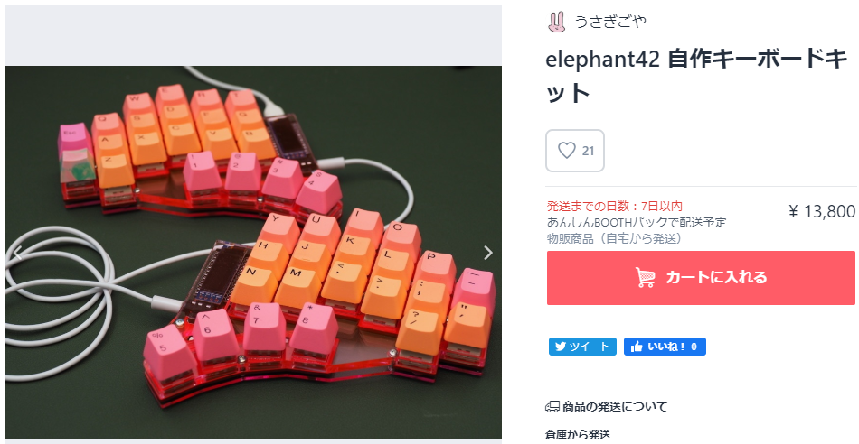
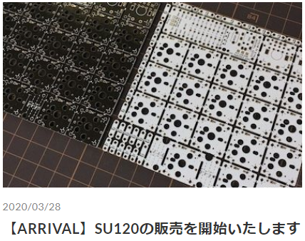
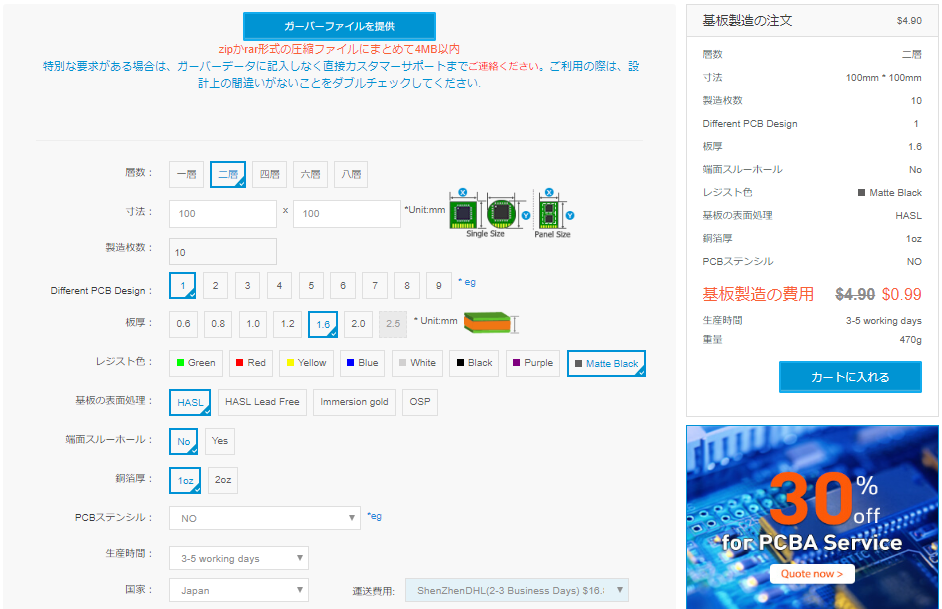

# 自作キーボード基板SU120とは
2020/04/06

## SU120のおすすめポイント

SU120は最大120キーまで拡張可能な自作キーボード基板ですが、どのような使い方ができるのか想像しにくい部分があるため、設計者の考えているポイントを以下に記載します。

### お手頃マクロパッドとして

<blockquote class="twitter-tweet">
あとchocの2uも買った。やっぱ2uの位置は2uのキーキャップだな。しっくりくる。まあこれテンキーなんだけど <a href="https://t.co/21Sespo21R">pic.twitter.com/21Sespo21R</a>
&mdash;   (   ) (@illness072) <a href="https://twitter.com/illness072/status/1191222676078989312?ref_src=twsrc%5Etfw" width="100%">November 4, 2019</a></blockquote> 
<blockquote class="twitter-tweet">
<a href="https://twitter.com/hashtag/%E8%87%AA%E4%BD%9C%E3%83%86%E3%83%B3%E3%82%AD%E3%83%BC?src=hash&amp;ref_src=twsrc%5Etfw">#自作テンキー</a> OR15やっと完成。キー割当てをOLEDで、レイヤーをアンダーグローで表示。音量などを回して変更するのは気持ちいい。 <a href="https://t.co/Bhx8HuV5Yj">pic.twitter.com/Bhx8HuV5Yj</a>
&mdash; ALTAX (@ALTAX8) <a href="https://twitter.com/ALTAX8/status/1213356161266667520?ref_src=twsrc%5Etfw">January 4, 2020</a></blockquote> 

自作キーボードに興味を持ったときに、なかなか一気にお金をかけるリスクをとることが難しい場合もあると思います。私もそうでした。

SU120はできるだけ最低限の要素でキーボードとして成立するように設計しているので、一般的な自作キーボードの総費用と比較すると、お手頃な出費でテンキー、マクロパッドなどを組むことができます。

15キーマクロパッドのパーツをTALP KEYBOARDで揃える場合

| パーツ                      | 商品ページリンク                                             | 数量     | 金額      |
| --------------------------- | ------------------------------------------------------------ | -------- | --------- |
| SU120（マクロパッドセット） | [SU120（マクロパッドセット）](https://talpkeyboard.stores.jp/items/5e7eda9b2a9a4265048aed0f) | 1セット  | 550円     |
| Pro Micro                   | [Pro Micro ATmega32U4 5V/16MHz/MicroUSB2(互換品) ](https://talpkeyboard.stores.jp/items/5b24504ba6e6ee7ec60063e3) | 1個      | 550円     |
| スイッチソケット            | [Kailh PCBソケット(MXスイッチ用/10Piece)](https://talpkeyboard.stores.jp/items/5e02c5405b120c792616bcf9) | 2セット  | 300円     |
| キースイッチ                | [キースイッチ](https://talpkeyboard.stores.jp/?category_id=59cf8860ed05e668db003f5d) 5ピンのものを推奨 | 15個分   | 1,400円～ |
| キーキャップ                | [DSAキーキャップ](https://talpkeyboard.stores.jp/?category_id=59e2acfaed05e644fd004008) [キーキャップセット](https://talpkeyboard.stores.jp/?category_id=59be183f428f2d49120007b1) | 15キー分 | 660円～   |
| Micro USBケーブル           | [ケーブル](https://talpkeyboard.stores.jp/?category_id=5df828e87f16477b03950e7b) | 1本      | 300円～   |
| 送料                        |                                                              |          | 300円     |
| 計                          |                                                              |          | 4,060円～ |

なお、一般的な自作キーボードキットの価格は、部品費用、キッティング費用、試作費や研究開発費を考慮すると、決して高くありません（むしろ安価な場合も多々あります）。

SU120は基板ペライチですが、一般的な自作キーボードキットはケースなども含めて販売されており、打鍵感、見た目の美しさなど、製作者の工夫がこらされています。

SU120を使って物足りなさを感じたら、自分にあったキットを探してみてください。もちろん、SU120をベースに改造いただくのも大歓迎です！

### 任意サイズのテンキーや格子配列キーボードとして

テンキーを自作するメリットのひとつは、入力されるキーを自由にカスタマイズできる点です。ファームウェアをカスタマイズすることにより、

- ワンキーで「00」「000」を入力する
- NumLockキーを外す
- NumLockオンオフで入力が変わってしまうテンキーの数字キーではなく、普通の数字が入力されるようにする

などが可能となります。

いろいろなサイズの自作キットが販売されているので、合いそうなものがあればそれを買えばいいですし、

- [Keyboard | 遊舎工房](https://yushakobo.jp/product-category/keyboard/)
- [25KEYS - BOOTH](https://25keys.booth.pm/)

合うものが見つからなければ、SU120で、好きなサイズ（コントローラー1つあたり最大6×10まで）のテンキーや格子配列キーボードを作成することができます。

<blockquote class="twitter-tweet">
<a href="https://twitter.com/hashtag/SU120?src=hash&amp;ref_src=twsrc%5Etfw">#SU120</a> で55%（？）キーボード作ってみました。PCBのみは1回やってみたかったのですが、思ったより悪くない（精神衛生上以外は）。そしてUSBコネクタの位置はやっぱり邪魔くさかったので要改善。 <a href="https://t.co/0baJHFjIMv">pic.twitter.com/0baJHFjIMv</a>
&mdash; ryuichio (@ryuichio1) <a href="https://twitter.com/ryuichio1/status/1186655304051613697?ref_src=twsrc%5Etfw">October 22, 2019</a></blockquote> 
<blockquote class="twitter-tweet">
elecrow に発注したPCB待ってる間にひとつ試作版キーボードが完成してしまった。折りたたみ式ロープロortholinearの44キー。蝶番の軸パーツを引っこ抜くと分離も可能。軸パーツ自体も小物入れに・・・なるはずだったがサイズ的に大したものは入らないなこりゃ <a href="https://t.co/3V5z0U7afT">pic.twitter.com/3V5z0U7afT</a>
&mdash;   (   ) (@illness072) <a href="https://twitter.com/illness072/status/1196688512197677059?ref_src=twsrc%5Etfw">November 19, 2019</a></blockquote> 
<blockquote class="twitter-tweet">
やっぱり寂しいのでピカらせてみた。 キーキャップももうこれでいいかな <a href="https://t.co/TBZVfOWNKO">pic.twitter.com/TBZVfOWNKO</a>
&mdash; はなち (@haswellep) <a href="https://twitter.com/haswellep/status/1228556950289272833?ref_src=twsrc%5Etfw">February 15, 2020</a></blockquote> 
<blockquote class="twitter-tweet">
自分のタイピング癖に合わせた左右非対称キーボードを作るの進捗です。マットグレーのアクリルで作ってみたらミリタリー色が強くなったので更に強くしてみました。ロシア語表記のSAが欲しいです。脱線してます。<a href="https://twitter.com/hashtag/%E8%87%AA%E4%BD%9C%E3%82%AD%E3%83%BC%E3%83%9C%E3%83%BC%E3%83%89?src=hash&amp;ref_src=twsrc%5Etfw">#自作キーボード</a> <a href="https://t.co/SWKajXtIze">pic.twitter.com/SWKajXtIze</a>
&mdash; TALP KEYBOARD (@TalpKeyboard) <a href="https://twitter.com/TalpKeyboard/status/1234395893220048896?ref_src=twsrc%5Etfw">March 2, 2020</a></blockquote> 

### 自作キーボードの試作のお供として

SU120を設計したのは、自分がEnd game（理想のキーボード）までいろいろ試行錯誤するために、手軽に自由なレイアウトを試せるキーボード基板がほしかったからです。

SU120は基板に添付のビスケットを組み合わせることでいろいろなレイアウトを組むことができますので、皆様のEnd game到達の過程においてお手伝いができるかと思います。

#### elephant42

<blockquote class="twitter-tweet">
両手ぶんねじ止め完了。プロマイクロ部までふくめたケース出力もはじめた。あとはケース底部デザインと実際の配線だな。うんうん先は長いぞっと <a href="https://t.co/LJgvUClfq1">pic.twitter.com/LJgvUClfq1</a>
&mdash;   (   ) (@illness072) <a href="https://twitter.com/illness072/status/1190906588057333761?ref_src=twsrc%5Etfw">November 3, 2019</a></blockquote> 
<blockquote class="twitter-tweet">
<a href="https://twitter.com/hashtag/elephant42?src=hash&amp;ref_src=twsrc%5Etfw">#elephant42</a> ケースrev.6。開口部の位置と厚さを調整。またケースなしでサンドイッチマウントもできるようにした。ケース設計はとりあえずこれでFIXとして、このサイズと各種位置関係から基板設計をやっていこうかな。 <a href="https://t.co/89nmag6hjA">pic.twitter.com/89nmag6hjA</a>
&mdash;   (   ) (@illness072) <a href="https://twitter.com/illness072/status/1192222524324511745?ref_src=twsrc%5Etfw">November 6, 2019</a></blockquote> 

なお、完成したキーボードキットは現在以下で販売されています！

[elephant42 自作キーボードキット - うさぎごや - BOOTH](https://booth.pm/ja/items/1775017)

#### colice

<blockquote class="twitter-tweet">
<a href="https://twitter.com/hashtag/colice?src=hash&amp;ref_src=twsrc%5Etfw">#colice</a> プロト、恥ずかしながら、中はこんな感じで、プロト感満載です。 インジケータLEDはケースのテスト用に、一旦外してあります。  一応（？）トップマウントになっています。 <a href="https://t.co/BEhWbGk1i7">pic.twitter.com/BEhWbGk1i7</a>
&mdash; Takeshi Nishio (@jpskenn) <a href="https://twitter.com/jpskenn/status/1234820354649939970?ref_src=twsrc%5Etfw">March 3, 2020</a></blockquote> 
<blockquote class="twitter-tweet">
<a href="https://twitter.com/hashtag/colice?src=hash&amp;ref_src=twsrc%5Etfw">#colice</a> のキープレートv0.2への換装完了。 初期版と比較して、カラムスタガとロースタガのギャップが無くなり、薬指と小指のキーが近くなって良い。 ケースはハイプロフレームを一部削ったり切ったりして対応させたので、プロト感がさらに強まった。 <a href="https://t.co/25e9wZOTyX">pic.twitter.com/25e9wZOTyX</a>
&mdash; Takeshi Nishio (@jpskenn) <a href="https://twitter.com/jpskenn/status/1240260979214041088?ref_src=twsrc%5Etfw">March 18, 2020</a></blockquote> 

## SU120の入手方法

これまではほしい方が基板製造業者に直接発注し、パーツも別途入手するしかありませんでしたが、TALP KEYBOARDさんでSU120の取り扱いが始まりましたので、より手軽に入手することができます。

### TALP KEYBOARDで入手

[【ARRIVAL】SU120の販売を開始いたします](https://talpkeyboard.stores.jp/news/5e7ef1d09df163298ccc0521)

基板単体の販売と、セットが3種類ありますが、おすすめのは以下のとおりです。

- 基板単体だけだとダイオードなどのパーツやネジを別途買い揃える必要があるので、セット版のほうが便利
- 15キー程度でよいなら[マクロパッドセット](https://talpkeyboard.stores.jp/items/5e7eda9b2a9a4265048aed0f)、30キー程度までなら[テンキーセット](https://talpkeyboard.stores.jp/items/5e7edd409df16332e2cbf945)、テンキー・ファンクションキー無し程度のキー数までなら[分割キーボードセット](https://talpkeyboard.stores.jp/items/5e7ede422a9a4210748af1eb)をベースに
- 必要なら基板単体を買い足せばよいのですが、+50円でダイオードも付いてくる[マクロパッドセット](https://talpkeyboard.stores.jp/items/5e7eda9b2a9a4265048aed0f)も選択肢に

なお、セット版を買う場合、ほかに必要なパーツは以下のとおりです。

| パーツ            | TALP KEYBOARD商品ページ                                      | 遊舎工房商品ページ |
| ----------------- | ------------------------------------------------------------ | ------------------ |
| Pro Micro         | [Pro Micro ATmega32U4 5V/16MHz/MicroUSB2(互換品) ](https://talpkeyboard.stores.jp/items/5b24504ba6e6ee7ec60063e3) | [Pro Micro （コンスルー付き）](https://yushakobo.jp/shop/promicro-spring-pinheader/)              |
| スイッチソケット  | [Kailh PCBソケット(MXスイッチ用/10Piece)](https://talpkeyboard.stores.jp/items/5e02c5405b120c792616bcf9) | [スイッチ用PCBソケット（10個入り）](https://yushakobo.jp/shop/a01ps/)              |
| キースイッチ 5ピンのものを推奨      | [キースイッチ](https://talpkeyboard.stores.jp/?category_id=59cf8860ed05e668db003f5d) | [Switches](https://yushakobo.jp/product-category/switches/)          |
| キーキャップ      | [DSAキーキャップ](https://talpkeyboard.stores.jp/?category_id=59e2acfaed05e644fd004008) [キーキャップセット](https://talpkeyboard.stores.jp/?category_id=59be183f428f2d49120007b1) | [Keycaps](https://yushakobo.jp/product-category/keycaps/)            |
| Micro USBケーブル | [ケーブル](https://talpkeyboard.stores.jp/?category_id=5df828e87f16477b03950e7b) | [USBケーブル Micro B 1m](https://yushakobo.jp/shop/usb_cable_micro_b/)[自作ケーブルキット](https://yushakobo.jp/shop/self-made-cable/)           |
| TRRSケーブル              |                                                              | [TRRSケーブル 1m](https://yushakobo.jp/shop/trrs_cable/) [自作ケーブルキット](https://yushakobo.jp/shop/self-made-cable/)             |

安く上げたい場合は100円ショップなどでMicro USBケーブル、TRRSケーブル（AUXオーディオ接続コード）を調達する手もあります。

### 製造業者に発注

[ELECROW基板製造サービス](https://www.elecrow.com/pcb-manufacturing.html)から注文します。

アップロードするガーバーファイルは以下の中から必要なものを使ってください。

| 概要                                    | URL                                                          | 寸法      |
| --------------------------------------- | ------------------------------------------------------------ | --------- |
| 基板                                    | https://github.com/e3w2q/su120-keyboard/blob/master/pcb/su120-gerber.zip?raw=true | 99×99mm   |
| 汎用トッププレート                      | https://github.com/e3w2q/su120-keyboard/blob/master/plate-pcb/su120-plate-gerber.zip?raw=true | 99×99mm   |
| 120キー格子配列分割キーボード用プレート | https://github.com/e3w2q/su120-keyboard/blob/master/plate120-pcb/su120-plate120-gerber.zip?raw=true | 133×190mm |

100×100mm以下の場合は、5枚も10枚も費用は変わらないので、10枚にするとよいかもしれません。

レジスト色はお好みの色を選択してください。

[一覧へ](../)